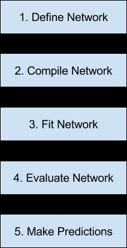
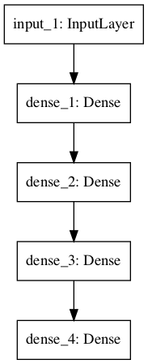
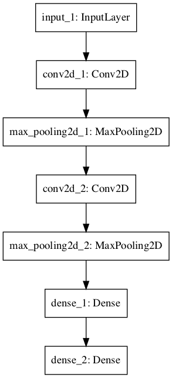

# Lab: How to Develop Deep Learning Models With Keras

How to Develop Deep Learning Models
With Keras
Deep learning neural networks are very easy to create and evaluate in Python with Keras, but
you must follow a strict model life-cycle. In this tutorial you will discover the step-by-step
life-cycle for creating, training and evaluating deep learning neural networks in Keras and how
to make predictions with a trained model. You will also discover how to use the functional API
that provides more flexibility when designing models. After reading this tutorial you will know:
- How to define, compile, fit and evaluate a deep learning neural network in Keras.
- How to select default loss functions for regression and classification predictive modeling
problems.
- How to use the functional API to develop standard Multilayer Perceptron, convolutional
and recurrent neural networks.

Let’s get started.

**Note:** It is assumed that you have a basic familiarity with deep learning and Keras.
Nevertheless, this tutorial should provide a refresher for the Keras Sequential API, and perhaps
an introduction to the Keras functional API. See the Appendix B for installation instructions,
if needed.

### Tutorial Overview
This tutorial is divided into three parts; they are:
1. Keras Model Life-Cycle
2. Keras Functional Models
3. Standard Network Models

#### Pre-reqs:
- Google Chrome (Recommended)

#### Lab Environment
Notebooks are ready to run. All packages have been installed. There is no requirement for any setup.

**Note:** Elev8ed Notebooks (powered by Jupyter) will be accessible at the port given to you by your instructor. Password for jupyterLab : `1234`

All Notebooks are present in `work/generative-adversarial-networks` folder. To copy and paste: use **Control-C** and to paste inside of a terminal, use **Control-V**

You can access jupyter lab at `<host-ip>:<port>/lab/workspaces/lab1_Deep_Learning_Models`

# Keras Model Life-Cycle

Below is an overview of the 5 steps in the neural network model life-cycle in Keras:
1. Define Network.
2. Compile Network.
3. Fit Network.
4. Evaluate Network.
5. Make Predictions.



Let's take a look at each step in turn using the easy-to-use Keras Sequential API.


Step 1. Define Network

The first step is to define your neural network. Neural networks are defined in Keras as a
sequence of layers. The container for these layers is the Sequential class. The first step is to
create an instance of the Sequential class. Then you can create your layers and add them in
the order that they should be connected. For example, we can do this in two steps:

```
model = Sequential()
model.add(Dense(2))
```

But we can also do this in one step by creating an array of layers and passing it to the
constructor of the Sequential class.

```
layers = [Dense(2)]
model = Sequential(layers)
```

The first layer in the network must define the number of inputs to expect. The way that this
is specified can differ depending on the network type, but for a Multilayer Perceptron model
this is specified by the input dim attribute. For example, a small Multilayer Perceptron model
with 2 inputs in the visible layer, 5 neurons in the hidden layer and one neuron in the output
layer can be defined as:

```
model = Sequential()
model.add(Dense(5, input_dim=2))
model.add(Dense(1))
```

Think of a Sequential model as a pipeline with your raw data fed in at the bottom and
predictions that come out at the top. This is a helpful conception in Keras as concerns that were
traditionally associated with a layer can also be split out and added as separate layers, clearly
showing their role in the transform of data from input to prediction. For example, activation
functions that transform a summed signal from each neuron in a layer can be extracted and
added to the Sequential as a layer-like object called the Activation class.

```
model = Sequential()
model.add(Dense(5, input_dim=2))
model.add(Activation('relu'))
model.add(Dense(1))
model.add(Activation('sigmoid'))
```

The choice of activation function is most important for the output layer as it will define the
format that predictions will take. For example, below are some common predictive modeling
problem types and the structure and standard activation function that you can use in the output
layer:
- Regression: Linear activation function, or linear, and the number of neurons matching
the number of outputs.
- Binary Classification (2 class): Logistic activation function, or sigmoid, and one
neuron the output layer.
- Multiclass Classification (>2 class): Softmax activation function, or softmax, and
one output neuron per class value, assuming a one hot encoded output pattern.

Step 2. Compile Network

Once we have defined our network, we must compile it. Compilation is an efficiency step. It
transforms the simple sequence of layers that we defined into a highly efficient series of matrix
transforms in a format intended to be executed on your GPU or CPU, depending on how Keras
is configured. Think of compilation as a precompute step for your network. It is always required
after defining a model.
Compilation requires a number of parameters to be specified, specifically tailored to training
your network. Specifically, the optimization algorithm to use to train the network and the loss
function used to evaluate the network that is minimized by the optimization algorithm. For
example, below is a case of compiling a defined model and specifying the stochastic gradient
descent (sgd) optimization algorithm and the mean squared error (mean squared error) loss
function, intended for a regression type problem.

```
model.compile(optimizer='sgd', loss='mean_squared_error')
```

Alternately, the optimizer can be created and configured before being provided as an argument
to the compilation step.

```
algorithm = SGD(lr=0.1, momentum=0.3)
model.compile(optimizer=algorithm, loss='mean_squared_error')
```

The type of predictive modeling problem imposes constraints on the type of loss function
that can be used. For example, below are some standard loss functions for different predictive
model types:
- Regression: Mean Squared Error or mean squared error.
- Binary Classification (2 class): Logarithmic Loss, also called cross entropy or
binary crossentropy.
- Multiclass Classification (>2 class): Multiclass Logarithmic Loss or
categorical crossentropy.

The most common optimization algorithm is stochastic gradient descent, but Keras also
supports a suite of other state-of-the-art optimization algorithms that work well with little or
no configuration. Perhaps the most commonly used optimization algorithms because of their
generally better performance are:
- Stochastic Gradient Descent, or sgd, that requires the tuning of a learning rate and
momentum.
- Adam, or adam, that requires the tuning of learning rate.
- RMSprop, or rmsprop, that requires the tuning of learning rate.

Finally, you can also specify metrics to collect while fitting your model in addition to the
loss function. Generally, the most useful additional metric to collect is accuracy for classification
problems. The metrics to collect are specified by name in an array. For example:

```
model.compile(optimizer='sgd', loss='mean_squared_error', metrics=['accuracy'])
```

Step 3. Fit Network

Once the network is compiled, it can be fit, which means adapt the weights on a training dataset.
Fitting the network requires the training data to be specified, both a matrix of input patterns, X,
and an array of matching output patterns, y. The network is trained using the backpropagation
algorithm and optimized according to the optimization algorithm and loss function specified
when compiling the model.
The backpropagation algorithm requires that the network be trained for a specified number
of epochs or exposures to the training dataset. Each epoch can be partitioned into groups
of input-output pattern pairs called batches. This defines the number of patterns that the
network is exposed to before the weights are updated within an epoch. It is also an efficiency
optimization, ensuring that not too many input patterns are loaded into memory at a time. A
minimal example of fitting a network is as follows:

```
history = model.fit(X, y, batch_size=10, epochs=100)
```

Once fit, a history object is returned that provides a summary of the performance of the
model during training. This includes both the loss and any additional metrics specified when
compiling the model, recorded each epoch. Training can take a long time, from seconds to hours
to days depending on the size of the network and the size of the training data.
By default, a progress bar is displayed on the command line for each epoch. This may create
too much noise for you, or may cause problems for your environment, such as if you are in an
interactive notebook or IDE. You can reduce the amount of information displayed to just the
loss each epoch by setting the verbose argument to 2. You can turn off all output by setting
verbose to 0. For example:

```
history = model.fit(X, y, batch_size=10, epochs=100, verbose=0)
```

Step 4. Evaluate Network

Once the network is trained, it can be evaluated. The network can be evaluated on the training
data, but this will not provide a useful indication of the performance of the network as a
predictive model, as it has seen all of this data before. We can evaluate the performance of
the network on a separate dataset, unseen during testing. This will provide an estimate of the
performance of the network at making predictions for unseen data in the future.
The model evaluates the loss across all of the test patterns, as well as any other metrics
specified when the model was compiled, like classification accuracy. A list of evaluation metrics
is returned. For example, for a model compiled with the accuracy metric, we could evaluate it
on a new dataset as follows:

```
loss, accuracy = model.evaluate(X, y)
```

As with fitting the network, verbose output is provided to give an idea of the progress of
evaluating the model. We can turn this off by setting the verbose argument to 0.

```
loss, accuracy = model.evaluate(X, y, verbose=0)
```

Step 5. Make Predictions

Once we are satisfied with the performance of our fit model, we can use it to make predictions
on new data. This is as easy as calling the predict() function on the model with an array of
new input patterns. For example:

```
predictions = model.predict(X)
```


The predictions will be returned in the format provided by the output layer of the network.
In the case of a regression problem, these predictions may be in the format of the problem
directly, provided by a linear activation function. For a binary classification problem, the
predictions may be an array of probabilities for the first class that can be converted to a 1 or 0
by rounding.
For a multiclass classification problem, the results may be in the form of an array of
probabilities (assuming a one hot encoded output variable) that may need to be converted to a
single class output prediction using the argmax() NumPy function. Alternately, for classification
problems, we can use the predict classes() function that will automatically convert uncrisp
predictions to crisp integer class values.

```
predictions = model.predict_classes(X)
```

As with fitting and evaluating the network, verbose output is provided to give an idea of the
progress of the model making predictions. We can turn this off by setting the verbose argument
to 0.

```
predictions = model.predict(X, verbose=0)
```


Keras Functional Models

The sequential API allows you to create models layer-by-layer for most problems. It is limited
in that it does not allow you to create models that share layers or have multiple inputs or
outputs. The functional API in Keras is an alternate way of creating models that offers a lot
more flexibility, including creating more complex models.
It specifically allows you to define multiple input or output models as well as models that
share layers. More than that, it allows you to define ad hoc acyclic network graphs. Models are
defined by creating instances of layers and connecting them directly to each other in pairs, then
defining a Model that specifies the layers to act as the input and output to the model. Let's
look at the three unique aspects of Keras functional API in turn:

Defining Input

Unlike the Sequential model, you must create and define a standalone Input layer that specifies
the shape of input data. The input layer takes a shape argument that is a tuple that indicates the
dimensionality of the input data. When input data is one-dimensional, such as for a Multilayer
Perceptron, the shape must explicitly leave room for the shape of the mini-batch size used
when splitting the data when training the network. Therefore, the shape tuple is always defined
with a hanging last dimension (2,), this is the way you must define a one-dimensional tuple in
Python, for example:

```
from keras.layers import Input
visible = Input(shape=(2,))
```

Connecting Layers

The layers in the model are connected pairwise. This is done by specifying where the input
comes from when defining each new layer. A bracket or functional notation is used, such that
after the layer is created, the layer from which the input to the current layer comes from is
specified. Let's make this clear with a short example. We can create the input layer as above,
then create a hidden layer as a Dense that receives input only from the input layer.

```
from keras.layers import Input
from keras.layers import Dense
visible = Input(shape=(2,))
hidden = Dense(2)(visible)
```

Note it is the visible after the creation of the Dense layer that connects the input layer's
output as the input to the Dense hidden layer. It is this way of connecting layers piece by piece
that gives the functional API its flexibility. For example, you can see how easy it would be to
start defining ad hoc graphs of layers.

Creating the Model

After creating all of your model layers and connecting them together, you must define the model.
As with the Sequential API, the model is the thing you can summarize, fit, evaluate, and use to
make predictions. Keras provides a Model class that you can use to create a model from your
created layers. It requires that you only specify the input and output layers. For example:

```
from keras.models import Model
from keras.layers import Input
from keras.layers import Dense
visible = Input(shape=(2,))
hidden = Dense(2)(visible)
model = Model(inputs=visible, outputs=hidden)
```

Now that we know all of the key pieces of the Keras functional API, let's work through
defining a suite of different models and build up some practice with it. Each example is
executable and prints the structure and creates a diagram of the graph. I recommend doing
this for your own models to make it clear what exactly you have defined. My hope is that
these examples provide templates for you when you want to define your own models using the
functional API in the future.


Standard Network Models

When getting started with the functional API, it is a good idea to see how some standard
neural network models are defined. In this section, we will look at defining a simple Multilayer
Perceptron, convolutional neural network, and recurrent neural network. These examples will
provide a foundation for understanding the more elaborate examples later.


# Multilayer Perceptron

In this section, we define a Multilayer Perceptron model for binary classification. The model
has 10 inputs, 3 hidden layers with 10, 20, and 10 neurons, and an output layer with 1 output.
Rectified linear activation functions are used in each hidden layer and a sigmoid activation
function is used in the output layer, for binary classification.

##### Run Notebook
Click notebook `1_functional_mlp.ipynb` in jupterLab UI and run jupyter notebook.

```
# Multilayer Perceptron
from keras.utils import plot_model
from keras.models import Model
from keras.layers import Input
from keras.layers import Dense
visible = Input(shape=(10,))
hidden1 = Dense(10, activation='relu')(visible)
hidden2 = Dense(20, activation='relu')(hidden1)
hidden3 = Dense(10, activation='relu')(hidden2)
output = Dense(1, activation='sigmoid')(hidden3)
model = Model(inputs=visible, outputs=output)
# summarize layers
model.summary()
# plot graph
plot_model(model, to_file='multilayer_perceptron_graph.png')

```

Running the example prints the structure of the network.

```
_________________________________________________________________
Layer (type)
Output Shape
Param #
=================================================================
input_1 (InputLayer)
(None, 10)
0
_________________________________________________________________
dense_1 (Dense)
(None, 10)
110
_________________________________________________________________
dense_2 (Dense)
(None, 20)
220
_________________________________________________________________
dense_3 (Dense)
(None, 10)
210
_________________________________________________________________
dense_4 (Dense)
(None, 1)
11
=================================================================
Total params: 551
Trainable params: 551
Non-trainable params: 0
_________________________________________________________________
```

A plot of the model graph is also created and saved to file.




Note, creating plots of Keras models requires that you install pydot and pygraphviz (the
graphviz library and the Python wrapper). Instructions for installing these libraries vary for
different systems. If this is a challenge for you (e.g. you're on windows), consider commenting
out the calls to plot model() when you see them.

Convolutional Neural Network

In this section, we will define a convolutional neural network for image classification. The model
receives black and white 64 x 64 images as input, then has a sequence of two convolutional and
pooling layers as feature extractors, followed by a fully connected layer to interpret the features
and an output layer with a sigmoid activation for two-class predictions.

##### Run Notebook
Click notebook `2_functional_cnn.ipynb` in jupterLab UI and run jupyter notebook.

```
# Convolutional Neural Network
from keras.utils import plot_model
from keras.models import Model
from keras.layers import Input
from keras.layers import Dense
from keras.layers.convolutional import Conv2D
from keras.layers.pooling import MaxPooling2D
visible = Input(shape=(64,64,1))
conv1 = Conv2D(32, kernel_size=4, activation='relu')(visible)
pool1 = MaxPooling2D(pool_size=(2, 2))(conv1)
conv2 = Conv2D(16, kernel_size=4, activation='relu')(pool1)
pool2 = MaxPooling2D(pool_size=(2, 2))(conv2)
hidden1 = Dense(10, activation='relu')(pool2)
output = Dense(1, activation='sigmoid')(hidden1)
model = Model(inputs=visible, outputs=output)
# summarize layers
model.summary()
# plot graph
plot_model(model, to_file='convolutional_neural_network.png')
```

Running the example summarizes the model layers.
```
_________________________________________________________________
Layer (type)
Output Shape
Param #
=================================================================
input_1 (InputLayer)
(None, 64, 64, 1)
0
_________________________________________________________________
conv2d_1 (Conv2D)
(None, 61, 61, 32)
544
_________________________________________________________________
max_pooling2d_1 (MaxPooling2 (None, 30, 30, 32) 0
_________________________________________________________________
conv2d_2 (Conv2D)
(None, 27, 27, 16)
8208
_________________________________________________________________
max_pooling2d_2 (MaxPooling2 (None, 13, 13, 16) 0
_________________________________________________________________
dense_1 (Dense)
(None, 13, 13, 10)
170
_________________________________________________________________
dense_2 (Dense)
(None, 13, 13, 1)
11
=================================================================
Total params: 8,933
Trainable params: 8,933
Non-trainable params: 0
_________________________________________________________________
```

A plot of the model graph is also created and saved to file.




# Recurrent Neural Network

In this section, we will define a long short-term memory recurrent neural network for sequence
classification. The model expects 100 time steps of one feature as input. The model has a single
LSTM hidden layer to extract features from the sequence, followed by a fully connected layer to
interpret the LSTM output, followed by an output layer for making binary predictions.

##### Run Notebook
Click notebook `3_functional_rnn.ipynb` in jupterLab UI and run jupyter notebook.

```
# Recurrent Neural Network
from keras.utils import plot_model
from keras.models import Model
from keras.layers import Input
from keras.layers import Dense
from keras.layers.recurrent import LSTM
visible = Input(shape=(100,1))
hidden1 = LSTM(10)(visible)
hidden2 = Dense(10, activation='relu')(hidden1)
output = Dense(1, activation='sigmoid')(hidden2)
model = Model(inputs=visible, outputs=output)
# summarize layers
model.summary()
# plot graph
plot_model(model, to_file='recurrent_neural_network.png')
```

Running the example summarizes the model layers.
```
_________________________________________________________________
Layer (type)
Output Shape
Param #
=================================================================
input_1 (InputLayer)
(None, 100, 1)
0
_________________________________________________________________
lstm_1 (LSTM)
(None, 10)
480
_________________________________________________________________
dense_1 (Dense)
(None, 10)
110
_________________________________________________________________
dense_2 (Dense)
(None, 1)
11
=================================================================
Total params: 601
Trainable params: 601
Non-trainable params: 0
_________________________________________________________________
```

A plot of the model graph is also created and saved to file.


### Exercise
Try above notebooks with different number of `epochs` and see the results.

# Further Reading

This section provides more resources on the topic if you are looking go deeper.
- Keras documentation for Sequential Models.
https://keras.io/models/sequential/
- Keras documentation for Functional Models.
https://keras.io/models/model/
- Getting started with the Keras Sequential model.
https://keras.io/models/model/
- Getting started with the Keras functional API.
https://keras.io/models/model/
- Keras documentation for optimization algorithms.
https://keras.io/optimizers/
- Keras documentation for loss functions.
https://keras.io/losses/

# Summary

In this tutorial, you discovered the step-by-step life-cycle for creating, training and evaluating
deep learning neural networks in Keras and how to use the functional API that provides more
flexibility when deigning models. Specifically, you learned:
- How to define, compile, fit and evaluate a deep learning neural network in Keras.
- How to select standard defaults for regression and classification predictive modeling
problems.
- How to use the functional API to develop standard Multilayer Perceptron, convolutional
and recurrent neural networks.

# Next
In the next part, you will discover how you can prepare text data ready for modeling.

