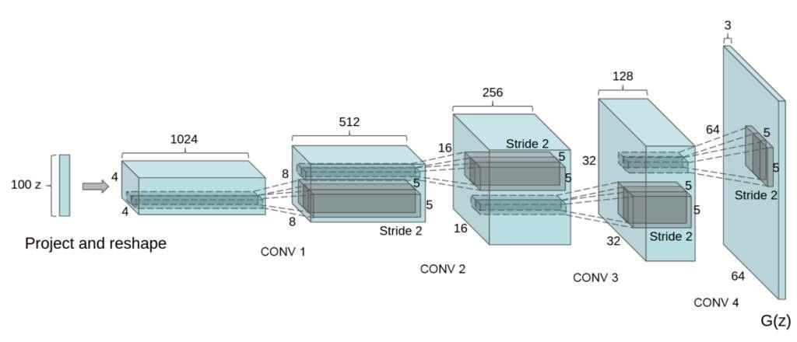
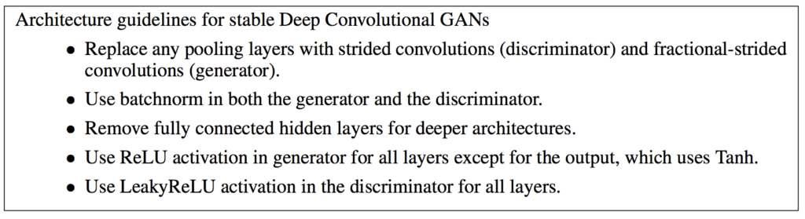

# Lab : Introduction to neural learning: gradient descent

#### Pre-reqs:
- Google Chrome (Recommended)

#### Lab Environment
Notebooks are ready to run. All packages have been installed. There is no requirement for any setup.

**Note:** Elev8ed Notebooks (powered by Jupyter) will be accessible at the port given to you by your instructor. Password for jupyterLab : `1234`

All Notebooks are present in `work/generative-adversarial-networks` folder. To copy and paste: use **Control-C** and to paste inside of a terminal, use **Control-V**

You can access jupyter lab at `<host-ip>:<port>/lab/workspaces/`


## How to Implement GAN Hacks to Train Stable Models

Generative Adversarial Networks, or GANs, are challenging to train. This is because the
architecture involves both a generator and a discriminator model that compete in a zero-sum
game. It means that improvements to one model come at the cost of a degrading of performance
in the other model. The result is a very unstable training process that can often lead to
failure, e.g. a generator that generates the same image all the time or generates nonsense. As
such, there are a number of heuristics or best practices (called GAN hacks) that can be used
when configuring and training your GAN models. These heuristics have been hard won by
practitioners testing and evaluating hundreds or thousands of combinations of configuration
operations on a range of problems over many years.

Some of these heuristics can be challenging to implement, especially for beginners. Further,
some or all of them may be required for a given project, although it may not be clear which
subset of heuristics should be adopted, requiring experimentation. This means a practitioner
must be ready to implement a given heuristic with little notice. In this tutorial, you will discover
how to implement a suite of best practices or GAN hacks that you can copy-and-paste directly
into your GAN project. After reading this tutorial, you will know:

- The simultaneous training of generator and discriminator models in GANs is inherently
unstable.

- How to implement seven best practices for the deep convolutional GAN model architecture
from scratch.

- How to implement four additional best practices from Soumith Chintala’s GAN Hacks
presentation and list.


## Tutorial Overview

This tutorial is divided into four parts; they are:
1. Challenge of Training GANs

2. Heuristics for Training Stable GANs

3. Deep Convolutional GANs (DCGANs).

4. Soumith Chintala’s GAN Hacks.


## Challenge of Training GANs

GANs are difficult to train. The reason they are difficult to train is that both the generator
model and the discriminator model are trained simultaneously in a game. This means that
improvements to one model come at the expense of the other model. The goal of training two
models involves finding a point of equilibrium between the two competing concerns.

Training GANs consists in finding a Nash equilibrium to a two-player non-cooperative
game. [
...] Unfortunately, finding Nash equilibria is a very difficult problem. Algorithms exist for specialized cases, but we are not aware of any that are feasible to
apply to the GAN game, where the cost functions are non-convex, the parameters
are continuous, and the parameter space is extremely high-dimensional

— Improved Techniques for Training GANs, 2016.

It also means that every time the parameters of one of the models are updated, the nature
of the optimization problem that is being solved is changed. This has the effect of creating a
dynamic system.

But with a GAN, every step taken down the hill changes the entire landscape a little.
It’s a dynamic system where the optimization process is seeking not a minimum,
but an equilibrium between two forces.

— Page 306, Deep Learning with Python, 2017.

In neural network terms, the technical challenge of training two competing neural networks
at the same time is that they can fail to converge.

The largest problem facing GANs that researchers should try to resolve is the issue
of non-convergence.

— NIPS 2016 Tutorial: Generative Adversarial Networks, 2016.

Instead of converging, GANs may suffer from one of a small number of failure modes. A
common failure mode is that instead of finding a point of equilibrium, the generator oscillates
between generating specific examples in the domain.

In practice, GANs often seem to oscillate, [
...] meaning that they progress from
generating one kind of sample to generating another kind of sample without eventually
reaching an equilibrium.

— NIPS 2016 Tutorial: Generative Adversarial Networks, 2016.


Perhaps the most challenging model failure is the case where multiple inputs to the generator
result in the generation of the same output. This is referred to as mode collapse, and may
represent one of the most challenging issues when training GANs.

Mode collapse, also known as the scenario, is a problem that occurs when the
generator learns to map several different input z values to the same output point.

— NIPS 2016 Tutorial: Generative Adversarial Networks, 2016.

GAN failure modes are further covered in Chapter 10. Finally, there are no good objective
metrics for evaluating whether a GAN is performing well during training. E.g. reviewing loss
is not sufficient. Instead, the best approach is to visually inspect generated examples and use
subjective evaluation.

Generative adversarial networks lack an objective function, which makes it difficult
to compare performance of different models. One intuitive metric of performance
can be obtained by having human annotators judge the visual quality of samples.

— Improved Techniques for Training GANs, 2016.


## Heuristics for Training Stable GANs

GANs are difficult to train. At the time of writing, there is no good theoretical foundation as to
how to design and train GAN models, but there is established literature of heuristics, or hacks,
that have been empirically demonstrated to work well in practice. As such, there are a range
of best practices to consider and implement when developing a GAN model. Perhaps the two
most important sources of suggested configuration and training parameters are:

- Alec Radford, et al’s 2015 paper that introduced the DCGAN architecture.

- Soumith Chintala’s 2016 presentation and associated GAN Hacks list.

In this tutorial, we will explore how to implement the most important best practices from
these two sources.


## Deep Convolutional GANs (DCGANs)

Perhaps one of the most important steps forward in the design and training of stable GAN
models was the 2015 paper by Alec Radford, et al. titled Unsupervised Representation Learning
with Deep Convolutional Generative Adversarial Networks. In the paper, they describe the Deep
Convolutional GAN, or DCGAN, approach to GAN development that has become the de facto
standard.

Stabilization of GAN learning remains an open problem. Fortunately, GAN learning
performs well when the model architecture and hyperparameters are carefully selected.
Radford et al. (2015) crafted a deep convolutional GAN (DCGAN) that performs
very well for image synthesis tasks 




The findings in this paper were hard earned, developed after extensive empirical trial and
error with different model architectures, configurations, and training schemes. Their approach
remains highly recommended as a starting point when developing new GANs, at least for
image-synthesis-based tasks.


... after extensive model exploration we identified a family of architectures that
resulted in stable training across a range of datasets and allowed for training higher
resolution and deeper generative models.

— Unsupervised Representation Learning with Deep Convolutional Generative Adversarial
Networks, 2015.


Below provides a summary of the GAN architecture recommendations from the paper.



Generative Adversarial Networks. Taken from: Unsupervised Representation Learning with
Deep Convolutional Generative Adversarial Networks.

We will look at how to implement seven best practices for the DCGAN model architecture
in this section.


## Downsample Using Strided Convolutions

The discriminator model is a standard convolutional neural network model that takes an image
as input and must output a binary classification as to whether it is real or fake. It is standard
practice with deep convolutional networks to use pooling layers to downsample the input and
feature maps with the depth of the network. This is not recommended for the DCGAN, and
instead, they recommend downsampling using strided convolutions.
This involves defining a convolutional layer as per normal, but instead of using the default
two-dimensional stride of (1,1) to change it to (2,2). This has the effect of downsampling the
input, specifically halving the width and height of the input, resulting in output feature maps with
one quarter the area. The example below demonstrates this with a single hidden convolutional
layer that uses downsampling strided convolutions by setting the strides argument to (2,2).
The effect is the model will downsample the input from 64 × 64 to 32 × 32.

```
# example of downsampling with strided convolutions
from keras.models import Sequential
from keras.layers import Conv2D
# define model
model = Sequential()
model.add(Conv2D(64, (3,3), strides=(2,2), padding='same', input_shape=(64,64,3)))
# summarize model
model.summary()

```

Running the example shows the shape of the output of the convolutional layer, where the
feature maps have one quarter of the area.

```
_________________________________________________________________
Layer (type)
Output Shape
Param #
=================================================================
conv2d_1 (Conv2D)
(None, 32, 32, 64)
1792
=================================================================
Total params: 1,792
Trainable params: 1,792
Non-trainable params: 0
_________________________________________________________________

```

## Upsample Using Strided Convolutions

The generator model must generate an output image given a random point from the latent space
as input. The recommended approach for achieving this is to use a transpose convolutional
layer with a strided convolution. This is a special type of layer that performs the convolution
operation in reverse. Intuitively, this means that setting a stride of 2 × 2 will have the opposite
effect, upsampling the input instead of downsampling it in the case of a normal convolutional
layer.
By stacking a transpose convolutional layer with strided convolutions, the generator model is
able to scale a given input to the desired output dimensions. The example below demonstrates
this with a single hidden transpose convolutional layer that uses upsampling strided convolutions

by setting the strides argument to (2,2). The effect is the model will upsample the input from
64 × 64 to 128 × 128.

```
# example of upsampling with strided convolutions
from keras.models import Sequential
from keras.layers import Conv2DTranspose
# define model
model = Sequential()
model.add(Conv2DTranspose(64, (4,4), strides=(2,2), padding='same', input_shape=(64,64,3)))
# summarize model
model.summary()

```

Running the example shows the shape of the output of the convolutional layer, where the
feature maps have quadruple the area.

```
_________________________________________________________________
Layer (type)
Output Shape
Param #
=================================================================
conv2d_transpose_1 (Conv2DTr (None, 128, 128, 64) 3136
=================================================================
Total params: 3,136
Trainable params: 3,136
Non-trainable params: 0
_________________________________________________________________

```

## Use Leaky ReLU

The rectified linear activation unit, or ReLU for short, is a simple calculation that returns the
value provided as input directly, or the value 0.0 if the input is 0.0 or less. It has become a best
practice when developing deep convolutional neural networks generally. The best practice for
GANs is to use a variation of the ReLU that allows some values less than zero and learns where
the cut-off should be in each node. This is called the leaky rectified linear activation unit, or
the LeakyReLU layer.

A negative slope can be specified for the LeakyReLU and the default value of 0.2 is recommended. Originally, ReLU was recommend for use in the generator model and LeakyReLU was
recommended for use in the discriminator model, although more recently, the LeakyReLU may
be recommended in both models. The example below demonstrates using the LeakyReLU with
the default slope of 0.2 after a convolutional layer in a discriminator model.

```
# example of using leakyrelu in a discriminator model
from keras.models import Sequential
from keras.layers import Conv2D
from keras.layers import LeakyReLU
# define model
model = Sequential()
model.add(Conv2D(64, (3,3), strides=(2,2), padding='same', input_shape=(64,64,3)))
model.add(LeakyReLU(0.2))
# summarize model
model.summary()

```


Running the example demonstrates the structure of the model with a single convolutional
layer followed by the activation layer.

```
_________________________________________________________________
Layer (type)
Output Shape
Param #
=================================================================
conv2d_1 (Conv2D)
(None, 32, 32, 64)
1792
_________________________________________________________________
leaky_re_lu_1 (LeakyReLU) (None, 32, 32, 64)
0
=================================================================
Total params: 1,792
Trainable params: 1,792
Non-trainable params: 0
_________________________________________________________________

```


## Use Batch Normalization

Batch normalization standardizes the activations from a prior layer to have a zero mean and
unit variance. This has the effect of stabilizing the training process. Batch normalization is used
after the activation of convolution and transpose convolutional layers in the discriminator and
generator models respectively. It is added to the model after the hidden layer, but before the
activation, such as LeakyReLU. The example below demonstrates adding a BatchNormalization
layer after a Conv2D layer in a discriminator model but before the activation.

```
# example of using batch norm in a discriminator model
from keras.models import Sequential
from keras.layers import Conv2D
from keras.layers import BatchNormalization
from keras.layers import LeakyReLU
# define model
model = Sequential()
model.add(Conv2D(64, (3,3), strides=(2,2), padding='same', input_shape=(64,64,3)))
model.add(BatchNormalization())
model.add(LeakyReLU(0.2))
# summarize model
model.summary()

```

Running the example shows the desired usage of batch norm between the outputs of the
convolutional layer and the activation function.

```
_________________________________________________________________
Layer (type)
Output Shape
Param #
=================================================================
conv2d_1 (Conv2D)
(None, 32, 32, 64)
1792
_________________________________________________________________
batch_normalization_1 (Batch (None, 32, 32, 64) 256
_________________________________________________________________
leaky_re_lu_1 (LeakyReLU) (None, 32, 32, 64)
0
=================================================================
Total params: 2,048
Trainable params: 1,920

Non-trainable params: 128
_________________________________________________________________

```

## Use Gaussian Weight Initialization

Before a neural network can be trained, the model weights (parameters) must be initialized
to small random variables. The best practice for DCAGAN models reported in the paper is
to initialize all weights using a zero-centered Gaussian distribution (the normal or bell-shaped
distribution) with a standard deviation of 0.02. The example below demonstrates defining a
random Gaussian weight initializer with a mean of 0 and a standard deviation of 0.02 for use in
a transpose convolutional layer in a generator model. The same weight initializer instance could
be used for each layer in a given model.

```
# example of gaussian weight initialization in a generator model
from keras.models import Sequential
from keras.layers import Conv2DTranspose
from keras.initializers import RandomNormal
# define model
model = Sequential()
init = RandomNormal(mean=0.0, stddev=0.02)
model.add(Conv2DTranspose(64, (4,4), strides=(2,2), padding='same',
kernel_initializer=init, input_shape=(64,64,3)))

```

## Use Adam Stochastic Gradient Descent

Stochastic gradient descent, or SGD for short, is the standard algorithm used to optimize
the weights of convolutional neural network models. There are many variants of the training
algorithm. The best practice for training DCGAN models is to use the Adam version of
stochastic gradient descent with the learning rate lr of 0.0002 and the beta1 momentum value
of 0.5 instead of the default of 0.9. The Adam optimization algorithm with this configuration
is recommended when both optimizing the discriminator and generator models. The example
below demonstrates configuring the Adam stochastic gradient descent optimization algorithm
for training a discriminator model.

```
# example of using adam when training a discriminator model
from keras.models import Sequential
from keras.layers import Conv2D
from keras.optimizers import Adam
# define model
model = Sequential()
model.add(Conv2D(64, (3,3), strides=(2,2), padding='same', input_shape=(64,64,3)))
# compile model
opt = Adam(lr=0.0002, beta_1=0.5)
model.compile(loss='binary_crossentropy', optimizer=opt, metrics=['accuracy'])

```


## Scale Images to the Range [-1,1]

It is recommended to use the hyperbolic tangent activation function as the output from the
generator model. As such, it is also recommended that real images used to train the discriminator
are scaled so that their pixel values are in the range [-1,1]. This is so that the discriminator
will always receive images as input, real and fake, that have pixel values in the same range.
Typically, image data is loaded as a NumPy array such that pixel values are 8-bit unsigned
integer (uint8) values in the range [0, 255]. First, the array must be converted to floating point
values, then rescaled to the required range. The example below provides a function that will
appropriately scale a NumPy array of loaded image data to the required range of [-1,1].

```
# example of a function for scaling images
from numpy.random import randint
# scale image data from [0,255] to [-1,1]
def scale_images(images):
# convert from unit8 to float32
images = images.astype('float32')
# scale from [0,255] to [-1,1]
images = (images - 127.5) / 127.5
return images
# define one 28x28 color image
images = randint(0, 256, 28 * 28 * 3)
images = images.reshape((1, 28, 28, 3))
# summarize pixel values
print(images.min(), images.max())
# scale
scaled = scale_images(images)
# summarize pixel scaled values
print(scaled.min(), scaled.max())

```

Running the example contrives a single color image with random pixel values in [0,255]. The
pixel values are then scaled to the range [-1,1] and the minimum and maximum pixel values are
then reported.

```
0 255
-1.0 1.0

```


## Soumith Chintala’s GAN Hacks

Soumith Chintala, one of the co-authors of the DCGAN paper, made a presentation at NIPS
2016 titled How to Train a GAN? summarizing many tips and tricks. The video is available on
YouTube and is highly recommended1 . A summary of the tips is also available as a GitHub
repository titled How to Train a GAN? Tips and tricks to make GANs work 2 . The tips draw

```
1
2

https://www.youtube.com/watch?v=X1mUN6dD8uE
https://github.com/soumith/ganhacks
```

upon the suggestions from the DCGAN paper as well as elsewhere. In this section, we will
review how to implement four additional GAN best practices not covered in the previous section.


## Use a Gaussian Latent Space

The latent space defines the shape and distribution of the input to the generator model used
to generate new images. The DCGAN recommends sampling from a uniform distribution,
meaning that the shape of the latent space is a hypercube. The more recent best practice is
to sample from a standard Gaussian distribution, meaning that the shape of the latent space
is a hypersphere, with a mean of zero and a standard deviation of one. The example below
demonstrates how to generate 500 random Gaussian examples from a 100-dimensional latent
space that can be used as input to a generator model; each point could be used to generate an
image.

```
# example of sampling from a gaussian latent space
from numpy.random import randn
# generate points in latent space as input for the generator
def generate_latent_points(latent_dim, n_samples):
# generate points in the latent space
x_input = randn(latent_dim * n_samples)
# reshape into a batch of inputs for the network
x_input = x_input.reshape((n_samples, latent_dim))
return x_input
# size of latent space
n_dim = 100
# number of samples to generate
n_samples = 500
# generate samples
samples = generate_latent_points(n_dim, n_samples)
# summarize
print(samples.shape, samples.mean(), samples.std())

```

Running the example summarizes the generation of 500 points, each comprised of 100 random
Gaussian values with a mean close to zero and a standard deviation close to 1, e.g. a standard
Gaussian distribution.

```
(500, 100) -0.004791256735601787 0.9976912528950904

```

## Separate Batches of Real and Fake Images

The discriminator model is trained using stochastic gradient descent with mini-batches. The
best practice is to update the discriminator with separate batches of real and fake images rather
than combining real and fake images into a single batch. This can be achieved by updating
the model weights for the discriminator model with two separate calls to the train on batch()
function. The code snippet below demonstrates how you can do this within the inner loop of
code when training your discriminator model.


```
...
# get randomly selected 'real' samples
X_real, y_real = 
```
...
# update discriminator model weights
discriminator.train_on_batch(X_real, y_real)
# generate 'fake' examples
X_fake, y_fake = 
```
...
# update discriminator model weights
discriminator.train_on_batch(X_fake, y_fake)

```

## Use Label Smoothing

It is common to use the class label 1 to represent real images and class label 0 to represent fake
images when training the discriminator model. These are called hard labels, as the label values
are precise or crisp. It is a good practice to use soft labels, such as values slightly more or less
than 1.0 or slightly more than 0.0 for real and fake images respectively, where the variation for
each image is random. This is often referred to as label smoothing and can have a regularizing
effect when training the model. The example below demonstrates defining 1,000 labels for the
positive class (class = 1) and smoothing the label values uniformly into the range [0.7,1.2] as
recommended.

```
# example of positive label smoothing
from numpy import ones
from numpy.random import random
# example of smoothing class=1 to [0.7, 1.2]
def smooth_positive_labels(y):
return y - 0.3 + (random(y.shape) * 0.5)
# generate 'real' class labels (1)
n_samples = 1000
y = ones((n_samples, 1))
# smooth labels
y = smooth_positive_labels(y)
# summarize smooth labels
print(y.shape, y.min(), y.max())

```

Running the example summarizes the min and max values for the smooth values, showing
they are close to the expected values.

```
(1000, 1) 0.7003103006957805 1.1997858934066357

```

There have been some suggestions that only positive-class label smoothing is required and
to values less than 1.0. Nevertheless, you can also smooth negative class labels. The example
below demonstrates generating 1,000 labels for the negative class (class = 0) and smoothing
the label values uniformly into the range [0.0, 0.3] as recommended.

```
# example of negative label smoothing
from numpy import zeros
from numpy.random import random
# example of smoothing class=0 to [0.0, 0.3]
def smooth_negative_labels(y):
return y + random(y.shape) * 0.3
# generate 'fake' class labels (0)
n_samples = 1000
y = zeros((n_samples, 1))
# smooth labels
y = smooth_negative_labels(y)
# summarize smooth labels
print(y.shape, y.min(), y.max())

```

```
(1000, 1) 0.00019305316963429408 0.299785314665858

```

## Use Noisy Labels

The labels used when training the discriminator model are always correct. This means that fake
images are always labeled with class 0 and real images are always labeled with class 1. It is
recommended to introduce some errors to these labels where some fake images are marked as
real, and some real images are marked as fake. If you are using separate batches to update the
discriminator for real and fake images, this may mean randomly adding some fake images to the
batch of real images, or randomly adding some real images to the batch of fake images. If you
are updating the discriminator with a combined batch of real and fake images, then this may
involve randomly flipping the labels on some images. The example below demonstrates this by
creating 1,000 samples of real (class = 1) labels and flipping them with a 5% probability, then
doing the same with 1,000 samples of fake (class = 0) labels.

```
# example of noisy labels
from numpy import ones
from numpy import zeros
from numpy.random import choice
# randomly flip some labels
def noisy_labels(y, p_flip):
# determine the number of labels to flip
n_select = int(p_flip * y.shape[0])
# choose labels to flip
flip_ix = choice([i for i in range(y.shape[0])], size=n_select)
# invert the labels in place
y[flip_ix] = 1 - y[flip_ix]
return y
# generate 'real' class labels (1)
n_samples = 1000
y = ones((n_samples, 1))
```

```
# flip labels with 5% probability
y = noisy_labels(y, 0.05)
# summarize labels
print(y.sum())
# generate 'fake' class labels (0)
y = zeros((n_samples, 1))
# flip labels with 5% probability
y = noisy_labels(y, 0.05)
# summarize labels
print(y.sum())

```

Try running the example a few times. The results show that approximately 50 of the 1s are
flipped to 0s for the positive labels (e.g. 5% of 1,000) and approximately 50 0s are flopped to 1s
in for the negative labels.

```
951.0
49.0

```


## Further Reading

This section provides more resources on the topic if you are looking to go deeper.


## Papers

- Unsupervised Representation Learning with Deep Convolutional Generative Adversarial
Networks, 2015.
https://arxiv.org/abs/1511.06434

- Tutorial: Generative Adversarial Networks, NIPS, 2016.
https://arxiv.org/abs/1701.00160

- Improved Techniques for Training GANs, 2016.
https://arxiv.org/abs/1606.03498


## API

- Keras API.
https://keras.io/

- NumPy Random sampling (numpy.random) API.
https://docs.scipy.org/doc/numpy/reference/routines.random.html

- NumPy Array manipulation routines.
https://docs.scipy.org/doc/numpy/reference/routines.array-manipulation.html


## Articles

- ganhacks: How to Train a GAN? Tips and tricks to make GANs work.
https://github.com/soumith/ganhacks

- Ian Goodfellow, Introduction to GANs, NIPS 2016.
https://www.youtube.com/watch?v=9JpdAg6uMXs

- Soumith Chintala, How to train a GAN, NIPS 2016 Workshop on Adversarial Training.
https://www.youtube.com/watch?v=X1mUN6dD8uE

- Deconvolution and Checkerboard Artifacts, 2016.
https://distill.pub/2016/deconv-checkerboard/


## Summary

In this tutorial, you discovered how to implement a suite of best practices or GAN hacks that
you can copy-and-paste directly into your GAN project. Specifically, you learned:

- The simultaneous training of generator and discriminator models in GANs is inherently
unstable.

- How to implement seven best practices for the deep convolutional GAN model architecture
from scratch.

- How to implement four additional best practices from Soumith Chintala’s GAN Hacks
presentation and list.

