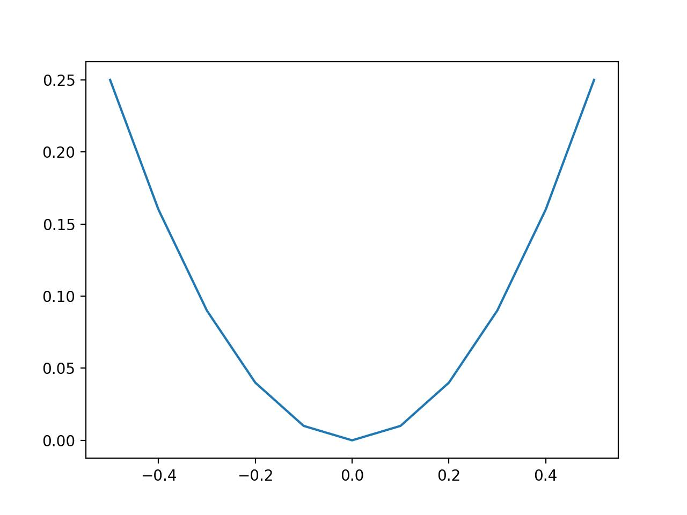
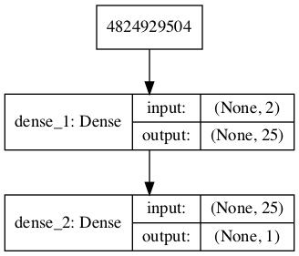
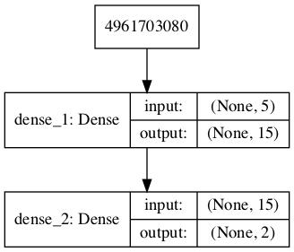
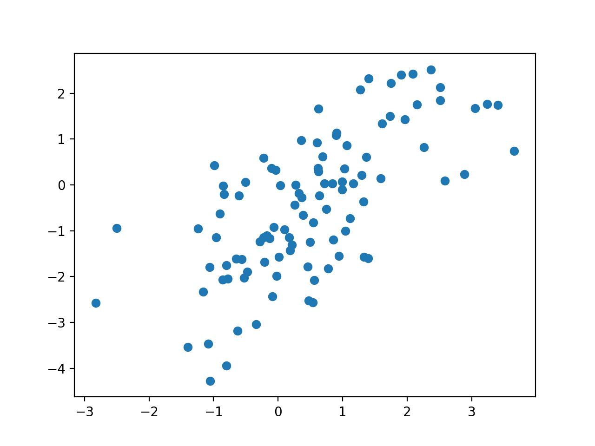
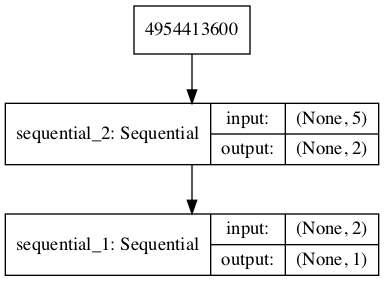
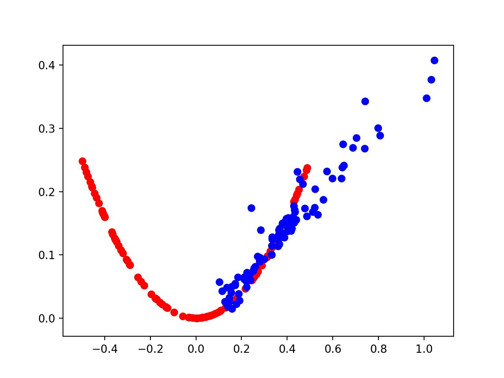
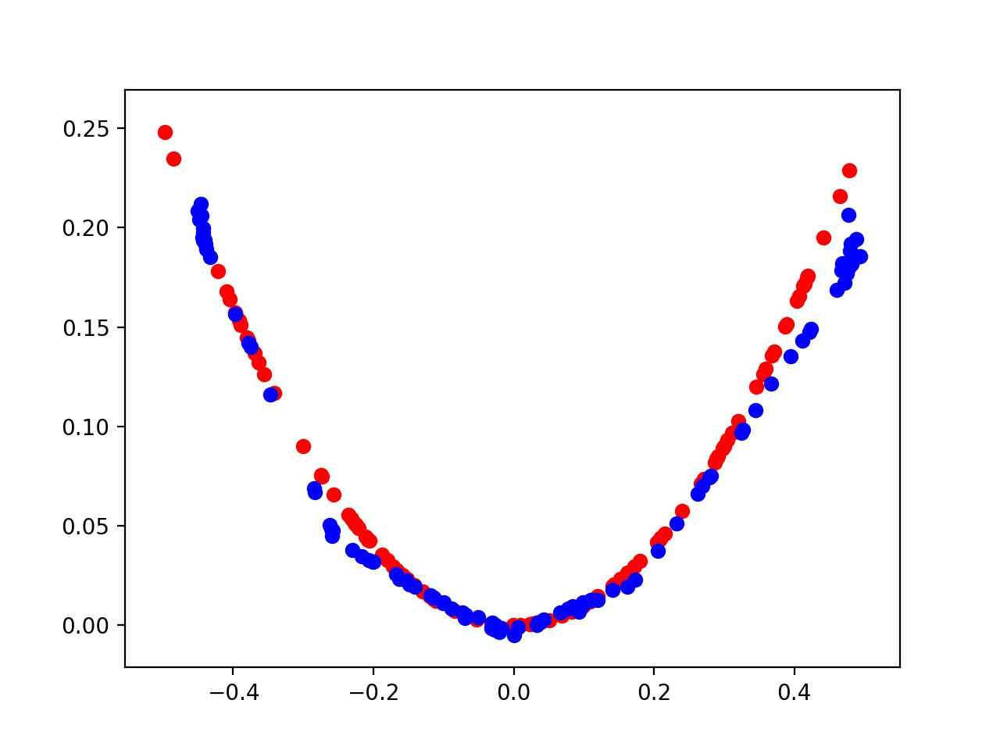

# Lab : Introduction to neural learning: gradient descent

#### Pre-reqs:
- Google Chrome (Recommended)

#### Lab Environment
Notebooks are ready to run. All packages have been installed. There is no requirement for any setup.

**Note:** Elev8ed Notebooks (powered by Jupyter) will be accessible at the port given to you by your instructor. Password for jupyterLab : `1234`

All Notebooks are present in `work/generative-adversarial-networks` folder. To copy and paste: use **Control-C** and to paste inside of a terminal, use **Control-V**

You can access jupyter lab at `<host-ip>:<port>/lab/workspaces/`


## How to Develop a 1D GAN from Scratch

Generative Adversarial Networks, or GANs for short, are a deep learning architecture for training
powerful generator models. A generator model is capable of generating new artificial samples
that plausibly could have come from an existing distribution of samples. GANs are comprised
of both generator and discriminator models. The generator is responsible for generating new
samples from the domain, and the discriminator is responsible for classifying whether samples
are real or fake (generated). Importantly, the performance of the discriminator model is used to
update both the model weights of the discriminator itself and the generator model. This means
that the generator never actually sees examples from the domain and is adapted based on how
well the discriminator performs.

This is a complex type of model both to understand and to train. One approach to better
understand the nature of GAN models and how they can be trained is to develop a model from
scratch for a very simple task. A simple task that provides a good context for developing a
simple GAN from scratch is a one-dimensional function. This is because both real and generated
samples can be plotted and visually inspected to get an idea of what has been learned. A
simple function also does not require sophisticated neural network models, meaning the specific
generator and discriminator models used on the architecture can be easily understood. In this
tutorial, we will select a simple one-dimensional function and use it as the basis for developing
and evaluating a generative adversarial network from scratch using the Keras deep learning
library. After completing this tutorial, you will know:

- The benefit of developing a generative adversarial network from scratch for a simple
one-dimensional function.

- How to develop separate discriminator and generator models, as well as a composite model
for training the generator via the discriminator’s predictive behavior.

- How to subjectively evaluate generated samples in the context of real examples from the
problem domain.

Let’s get started.


## Tutorial Overview

This tutorial is divided into six parts; they are:

1. Select a One-Dimensional Function

2. Define a Discriminator Model

3. Define a Generator Model

4. Training the Generator Model

5. Evaluating the Performance of the GAN

6. Complete Example of Training the GAN


## Select a One-Dimensional Function

The first step is to select a one-dimensional function to model. Something of the form:

y = f (x)


Where x are input values and y are the output values of the function. Specifically, we want
a function that we can easily understand and plot. This will help in both setting an expectation
of what the model should be generating and in using a visual inspection of generated examples
to get an idea of their quality. We will use a simple function of x2 ; that is, the function will
return the square of the input. You might remember this function from high school algebra as
the u-shaped function. We can define the function in Python as follows:

```
# simple function
def calculate(x):
return x * x

```

We can define the input domain as real values between -0.5 and 0.5 and calculate the output
value for each input value in this linear range, then plot the results to get an idea of how inputs
relate to outputs. The complete example is listed below.

```
# demonstrate simple x^2 function
from matplotlib import pyplot
# simple function
def calculate(x):
return x * x
# define inputs
inputs = [-0.5, -0.4, -0.3, -0.2, -0.1, 0, 0.1, 0.2, 0.3, 0.4, 0.5]
# calculate outputs
outputs = [calculate(x) for x in inputs]
# plot the result
pyplot.plot(inputs, outputs)
pyplot.show()

```

##### Run Notebook
Click notebook `01_plot_target_function.ipynb` in jupterLab UI and run jupyter notebook.

Running the example calculates the output value for each input value and creates a plot
of input vs. output values. We can see that values far from 0.0 result in larger output values,
whereas values close to zero result in smaller output values, and that this behavior is symmetrical
around zero. This is the well-known u-shape plot of the X 2 one-dimensional function.



We can generate random samples or points from the function. This can be achieved by
generating random values between -0.5 and 0.5 and calculating the associated output value.
Repeating this many times will give a sample of points from the function, e.g. real samples.
Plotting these samples using a scatter plot will show the same u-shape plot, although comprised
of the individual random samples. The complete example is listed below.
First, we generate
uniformly random values between 0 and 1, then shift them to the range -0.5 and 0.5. We then
calculate the output value for each randomly generated input value and combine the arrays into
a single NumPy array with n rows (100) and two columns.

```
# example of generating random samples from X^2
from numpy.random import rand
from numpy import hstack
from matplotlib import pyplot
# generate randoms sample from x^2
def generate_samples(n=100):
# generate random inputs in [-0.5, 0.5]

### 6.2. Select a One-Dimensional Function
X1 = rand(n) - 0.5
# generate outputs
X2 = X1 * X1
# stack arrays
X1 = X1.reshape(n,
X2 = X2.reshape(n,
return hstack((X1,

72

X^2 (quadratic)

1)
1)
X2))

# generate samples
data = generate_samples()
# plot samples
pyplot.scatter(data[:, 0], data[:, 1])
pyplot.show()

```

##### Run Notebook
Click notebook `02_sample_target_function.ipynb` in jupterLab UI and run jupyter notebook.

Running the example generates 100 random inputs and their calculated output and plots
the sample as a scatter plot, showing the familiar u-shape.


We can use this function as a starting point for generating real samples for our discriminator
function. Specifically, a sample is comprised of a vector with two elements, one for the input
and one for the output of our one-dimensional function. We can also imagine how a generator
model could generate new samples that we can plot and compare to the expected u-shape of

the X 2 function. Specifically, a generator would output a vector with two elements: one for the
input and one for the output of our one-dimensional function.

## Define a Discriminator Model

The next step is to define the discriminator model. The model must take a sample from our
problem, such as a vector with two elements, and output a classification prediction as to whether
the sample is real or fake. This is a binary classification problem.

- Inputs: Sample with two real values.

- Outputs: Binary classification, likelihood the sample is real (or fake).

The problem is very simple, meaning that we don’t need a complex neural network to model
it. The discriminator model will have one hidden layer with 25 nodes and we will use the
ReLU activation function and an appropriate weight initialization method called He weight
initialization. The output layer will have one node for the binary classification using the sigmoid
activation function. The model will minimize the binary cross-entropy loss function, and the
Adam version of stochastic gradient descent will be used because it is very effective. The
define discriminator() function below defines and returns the discriminator model.               The
function parameterizes the number of inputs to expect, which defaults to two.

```
# define the standalone discriminator model
def define_discriminator(n_inputs=2):
model = Sequential()
model.add(Dense(25, activation='relu', kernel_initializer='he_uniform',
input_dim=n_inputs))
model.add(Dense(1, activation='sigmoid'))
# compile model
model.compile(loss='binary_crossentropy', optimizer='adam', metrics=['accuracy'])
return model

```

We can use this function to define the discriminator model and summarize it. The complete
example is listed below.

```
# define the discriminator model
from keras.models import Sequential
from keras.layers import Dense
from keras.utils.vis_utils import plot_model
# define the standalone discriminator model
def define_discriminator(n_inputs=2):
model = Sequential()
model.add(Dense(25, activation='relu', kernel_initializer='he_uniform',
input_dim=n_inputs))
model.add(Dense(1, activation='sigmoid'))
# compile model
model.compile(loss='binary_crossentropy', optimizer='adam', metrics=['accuracy'])
return model
# define the discriminator model

model = define_discriminator()
# summarize the model
model.summary()
# plot the model
plot_model(model, to_file='discriminator_plot.png', show_shapes=True, show_layer_names=True)

```

##### Run Notebook
Click notebook `03_define_discriminator.ipynb` in jupterLab UI and run jupyter notebook.

Running the example defines the discriminator model and summarizes it.

```
_________________________________________________________________
Layer (type)
Output Shape
Param #
=================================================================
dense_1 (Dense)
(None, 25)
75
_________________________________________________________________
dense_2 (Dense)
(None, 1)
26
=================================================================
Total params: 101
Trainable params: 101
Non-trainable params: 0
_________________________________________________________________

```

A plot of the model is also created and we can see that the model expects two inputs and
will predict a single output.

<h5><span style="color:red;">Note:</span></h5> Creating a plot of the model assumes that the pydot and graphviz libraries are
installed. If this is a problem, you can comment out the import statement and the function call
for plot model().



We could start training this model now with real examples with a class label of one and
randomly generated samples with a class label of zero. There is no need to do this, but the
elements we will develop will be useful later, and it helps to see that the discriminator is just a

normal neural network model. First, we can update our generate samples() function from
the prediction section and call it generate real samples() and have it also return the output
class labels for the real samples, specifically, an array of 1 values, where class = 1 means real.

```
# generate n real samples with class labels
def generate_real_samples(n):
# generate inputs in [-0.5, 0.5]
X1 = rand(n) - 0.5
# generate outputs X^2
X2 = X1 * X1
# stack arrays
X1 = X1.reshape(n, 1)
X2 = X2.reshape(n, 1)
X = hstack((X1, X2))
# generate class labels
y = ones((n, 1))
return X, y

```

Next, we can create a copy of this function for creating fake examples. In this case, we will
generate random values in the range -1 and 1 for both elements of a sample. The output class
label for all of these examples is 0. This function will act as our fake generator model.

```
# generate n fake samples with class labels
def generate_fake_samples(n):
# generate inputs in [-1, 1]
X1 = -1 + rand(n) * 2
# generate outputs in [-1, 1]
X2 = -1 + rand(n) * 2
# stack arrays
X1 = X1.reshape(n, 1)
X2 = X2.reshape(n, 1)
X = hstack((X1, X2))
# generate class labels
y = zeros((n, 1))
return X, y

```

Next, we need a function to train and evaluate the discriminator model. This can be achieved
by manually enumerating the training epochs and for each epoch generating a half batch of
real examples and a half batch of fake examples, and updating the model on each, e.g. one
whole batch of examples. The train() function could be used, but in this case, we will use
the train on batch() function directly. The model can then be evaluated on the generated
examples and we can report the classification accuracy on the real and fake samples. The
train discriminator() function below implements this, training the model for 1,000 batches
and using 128 samples per batch (64 fake and 64 real).

```
# train the discriminator model
def train_discriminator(model, n_epochs=1000, n_batch=128):
half_batch = int(n_batch / 2)
# run epochs manually
for i in range(n_epochs):
# generate real examples
X_real, y_real = generate_real_samples(half_batch)

# update model
model.train_on_batch(X_real, y_real)
# generate fake examples
X_fake, y_fake = generate_fake_samples(half_batch)
# update model
model.train_on_batch(X_fake, y_fake)
# evaluate the model
_, acc_real = model.evaluate(X_real, y_real, verbose=0)
_, acc_fake = model.evaluate(X_fake, y_fake, verbose=0)
print(i, acc_real, acc_fake)

```

We can tie all of this together and train the discriminator model on real and fake examples.
The complete example is listed below.

```
# define and fit a discriminator model
from numpy import zeros
from numpy import ones
from numpy import hstack
from numpy.random import rand
from keras.models import Sequential
from keras.layers import Dense
# define the standalone discriminator model
def define_discriminator(n_inputs=2):
model = Sequential()
model.add(Dense(25, activation='relu', kernel_initializer='he_uniform',
input_dim=n_inputs))
model.add(Dense(1, activation='sigmoid'))
# compile model
model.compile(loss='binary_crossentropy', optimizer='adam', metrics=['accuracy'])
return model
# generate n real samples with class labels
def generate_real_samples(n):
# generate inputs in [-0.5, 0.5]
X1 = rand(n) - 0.5
# generate outputs X^2
X2 = X1 * X1
# stack arrays
X1 = X1.reshape(n, 1)
X2 = X2.reshape(n, 1)
X = hstack((X1, X2))
# generate class labels
y = ones((n, 1))
return X, y
# generate n fake samples with class labels
def generate_fake_samples(n):
# generate inputs in [-1, 1]
X1 = -1 + rand(n) * 2
# generate outputs in [-1, 1]
X2 = -1 + rand(n) * 2
# stack arrays
X1 = X1.reshape(n, 1)
X2 = X2.reshape(n, 1)

X = hstack((X1, X2))
# generate class labels
y = zeros((n, 1))
return X, y
# train the discriminator model
def train_discriminator(model, n_epochs=1000, n_batch=128):
half_batch = int(n_batch / 2)
# run epochs manually
for i in range(n_epochs):
# generate real examples
X_real, y_real = generate_real_samples(half_batch)
# update model
model.train_on_batch(X_real, y_real)
# generate fake examples
X_fake, y_fake = generate_fake_samples(half_batch)
# update model
model.train_on_batch(X_fake, y_fake)
# evaluate the model
_, acc_real = model.evaluate(X_real, y_real, verbose=0)
_, acc_fake = model.evaluate(X_fake, y_fake, verbose=0)
print(i, acc_real, acc_fake)
# define the discriminator model
model = define_discriminator()
# fit the model
train_discriminator(model)

```

##### Run Notebook
Click notebook `04_fit_discriminator.ipynb` in jupterLab UI and run jupyter notebook.

Running the example generates real and fake examples and updates the model, then evaluates
the model on the same examples and prints the classification accuracy.

<h5><span style="color:red;">Note:</span></h5> Your specific results may vary given the stochastic nature of the learning algorithm.
Consider running the example a few times and compare the average performance.
In this case, the model rapidly learns to correctly identify the real examples with perfect
accuracy and is very good at identifying the fake examples with 80% to 90% accuracy.

```
...
995
996
997
998
999

1.0
1.0
1.0
1.0
1.0

0.875
0.921875
0.859375
0.9375
0.8125

```

Training the discriminator model is straightforward. The goal is to train a generator model,
not a discriminator model, and that is where the complexity of GANs truly lies.


## Define a Generator Model

The next step is to define the generator model. The generator model takes as input a point
from the latent space and generates a new sample, e.g. a vector with both the input and output

elements of our function, e.g. x and x2 . A latent variable is a hidden or unobserved variable,
and a latent space is a multi-dimensional vector space of these variables. We can define the size
of the latent space for our problem and the shape or distribution of variables in the latent space.

This is because the latent space has no meaning until the generator model starts assigning
meaning to points in the space as it learns. After training, points in the latent space will
correspond to points in the output space, e.g. in the space of generated samples. We will define
a small latent space of five dimensions and use the standard approach in the GAN literature of
using a Gaussian distribution for each variable in the latent space. We will generate new inputs
by drawing random numbers from a standard Gaussian distribution, i.e. mean of zero and a
standard deviation of one.

- Inputs: Point in latent space, e.g. a five-element vector of Gaussian random numbers.

- Outputs: Two-element vector representing a generated sample for our function (x and
x2 ).

The generator model will be small like the discriminator model. It will have a single Dense
hidden layer with fifteen nodes and will use the ReLU activation function and He weight
initialization. The output layer will have two nodes for the two elements in a generated vector
and will use a linear activation function. A linear activation function is used because we know
we want the generator to output a vector of real values and the scale will be [-0.5, 0.5] for the
first element and about [0.0, 0.25] for the second element.
The model is not compiled. The reason for this is that the generator model is not fit directly.
The define generator() function below defines and returns the generator model. The size of
the latent dimension is parameterized in case we want to play with it later, and the output
shape of the model is also parameterized, matching the function for defining the discriminator
model.

```
# define the standalone generator model
def define_generator(latent_dim, n_outputs=2):
model = Sequential()
model.add(Dense(15, activation='relu', kernel_initializer='he_uniform',
input_dim=latent_dim))
model.add(Dense(n_outputs, activation='linear'))
return model

```

We can summarize the model to help better understand the input and output shapes. The
complete example is listed below.

```
# define the generator model
from keras.models import Sequential
from keras.layers import Dense
from keras.utils.vis_utils import plot_model
# define the standalone generator model
def define_generator(latent_dim, n_outputs=2):
model = Sequential()
model.add(Dense(15, activation='relu', kernel_initializer='he_uniform',
input_dim=latent_dim))
model.add(Dense(n_outputs, activation='linear'))

return model
# define the discriminator model
model = define_generator(5)
# summarize the model
model.summary()
# plot the model
plot_model(model, to_file='generator_plot.png', show_shapes=True, show_layer_names=True)

```

##### Run Notebook
Click notebook `05_define_generator.ipynb` in jupterLab UI and run jupyter notebook.

Running the example defines the generator model and summarizes it.
```
_________________________________________________________________
Layer (type)
Output Shape
Param #
=================================================================
dense_1 (Dense)
(None, 15)
90
_________________________________________________________________
dense_2 (Dense)
(None, 2)
32
=================================================================
Total params: 122
Trainable params: 122
Non-trainable params: 0
_________________________________________________________________

```

A plot of the model is also created and we can see that the model expects a five-element
point from the latent space as input and will predict a two-element vector as output.
<h5><span style="color:red;">Note:</span></h5> Creating a plot of the model assumes that the pydot and graphviz libraries are
installed. If this is a problem, you can comment out the import statement and the function call
for plot model().



We can see that the model takes as input a random five-element vector from the latent space
and outputs a two-element vector for our one-dimensional function. This model cannot do much

at the moment. Nevertheless, we can demonstrate how to use it to generate samples. This is
not needed, but again, some of these elements may be useful later. The first step is to generate
new random points in the latent space. We can achieve this by calling the randn() NumPy
function for generating arrays of random numbers drawn from a standard Gaussian.
The array of random numbers can then be reshaped into samples: that is n rows with
five elements per row. The generate latent points() function below implements this and
generates the desired number of points in the latent space that can be used as input to the
generator model.

```
# generate points in latent space as input for the generator
def generate_latent_points(latent_dim, n):
# generate points in the latent space
x_input = randn(latent_dim * n)
# reshape into a batch of inputs for the network
x_input = x_input.reshape(n, latent_dim)
return x_input

```

Next, we can use the generated points as input the generator model to generate new samples,
then plot the samples. The generate fake samples() function below implements this, where
the defined generator and size of the latent space are passed as arguments, along with the
number of points for the model to generate.

```
# use the generator to generate n fake examples and plot the results
def generate_fake_samples(generator, latent_dim, n):
# generate points in latent space
x_input = generate_latent_points(latent_dim, n)
# predict outputs
X = generator.predict(x_input)
# plot the results
pyplot.scatter(X[:, 0], X[:, 1])
pyplot.show()

```

Tying this together, the complete example is listed below.

```
# define and use the generator model
from numpy.random import randn
from keras.models import Sequential
from keras.layers import Dense
from matplotlib import pyplot
# define the standalone generator model
def define_generator(latent_dim, n_outputs=2):
model = Sequential()
model.add(Dense(15, activation='relu', kernel_initializer='he_uniform',
input_dim=latent_dim))
model.add(Dense(n_outputs, activation='linear'))
return model
# generate points in latent space as input for the generator
def generate_latent_points(latent_dim, n):
# generate points in the latent space
x_input = randn(latent_dim * n)

# reshape into a batch of inputs for the network
x_input = x_input.reshape(n, latent_dim)
return x_input
# use the generator to generate n fake examples and plot the results
def generate_fake_samples(generator, latent_dim, n):
# generate points in latent space
x_input = generate_latent_points(latent_dim, n)
# predict outputs
X = generator.predict(x_input)
# plot the results
pyplot.scatter(X[:, 0], X[:, 1])
pyplot.show()
# size of the latent space
latent_dim = 5
# define the discriminator model
model = define_generator(latent_dim)
# generate and plot generated samples
generate_fake_samples(model, latent_dim, 100)

```

##### Run Notebook
Click notebook `06_use_generator_model.ipynb` in jupterLab UI and run jupyter notebook.


Running the example generates 100 random points from the latent space, uses this as input
to the generator and generates 100 fake samples from our one-dimensional function domain. As
the generator has not been trained, the generated points are complete rubbish, as we expect,
but we can imagine that as the model is trained, these points will slowly begin to resemble the
target function and its u-shape.




We have now seen how to define and use the generator model. We will need to use the
generator model in this way to create samples for the discriminator to classify. We have not
seen how the generator model is trained; that is next.

## Training the Generator Model

The weights in the generator model are updated based on the performance of the discriminator
model. When the discriminator is good at detecting fake samples, the generator is updated more
(via a larger error gradient), and when the discriminator model is relatively poor or confused
when detecting fake samples, the generator model is updated less. This defines the zero-sum or
adversarial relationship between these two models. There may be many ways to implement this
using the Keras API, but perhaps the simplest approach is to create a new model that subsumes
or encapsulates the generator and discriminator models. Specifically, a new GAN model can be
defined that stacks the generator and discriminator such that the generator receives as input
random points in the latent space, generates samples that are fed into the discriminator model
directly, classified, and the output of this larger model can be used to update the model weights
of the generator. To be clear, we are not talking about a new third model, just a logical third
model that uses the already-defined layers and weights from the standalone generator and
discriminator models.


Only the discriminator is concerned with distinguishing between real and fake examples;
therefore, the discriminator model can be trained in a standalone manner on examples of each.
The generator model is only concerned with the discriminator’s performance on fake examples.
Therefore, we will mark all of the layers in the discriminator as not trainable when it is part of
the GAN model so that they cannot be updated and overtrained on fake examples.
When training the generator via this subsumed GAN model, there is one more important
change. The generator wants the discriminator to think that the samples output by the generator
are real, not fake. Therefore, when the generator is trained as part of the GAN model, we will
mark the generated samples as real (class = 1). We can imagine that the discriminator will
then classify the generated samples as not real (class = 0) or a low probability of being real
(0.3 or 0.5). The backpropagation process used to update the model weights will see this as a
large error and will update the model weights (i.e. only the weights in the generator) to correct
for this error, in turn making the generator better at generating plausible fake samples. Let’s
make this concrete.

- Inputs: Point in latent space, e.g. a five-element vector of Gaussian random numbers.

- Outputs: Binary classification, likelihood the sample is real (or fake).

The define gan() function below takes as arguments the already-defined generator and
discriminator models and creates the new logical third model subsuming these two models. The
weights in the discriminator are marked as not trainable, which only affects the weights as seen
by the GAN model and not the standalone discriminator model. The GAN model then uses the
same binary cross-entropy loss function as the discriminator and the efficient Adam version of
stochastic gradient descent.

```
# define the combined generator and discriminator model, for updating the generator
def define_gan(generator, discriminator):
# make weights in the discriminator not trainable
discriminator.trainable = False
# connect them
model = Sequential()
# add generator
model.add(generator)
# add the discriminator
model.add(discriminator)
# compile model
model.compile(loss='binary_crossentropy', optimizer='adam')
return model

```

Making the discriminator not trainable is a clever trick in the Keras API. The trainable
property impacts the model when it is compiled. The discriminator model was compiled with
trainable layers, therefore the model weights in those layers will be updated when the standalone
model is updated via calls to train on batch(). The discriminator model was marked as not
trainable, added to the GAN model, and compiled. In this model, the model weights of the
discriminator model are not trainable and cannot be changed when the GAN model is updated
via calls to train on batch(). The complete example of creating the discriminator, generator,
and composite model is listed below.

```
# demonstrate creating the three models in the gan
from keras.models import Sequential
from keras.layers import Dense
from keras.utils.vis_utils import plot_model
# define the standalone discriminator model
def define_discriminator(n_inputs=2):
model = Sequential()
model.add(Dense(25, activation='relu', kernel_initializer='he_uniform',
input_dim=n_inputs))
model.add(Dense(1, activation='sigmoid'))
# compile model
model.compile(loss='binary_crossentropy', optimizer='adam', metrics=['accuracy'])
return model
# define the standalone generator model
def define_generator(latent_dim, n_outputs=2):
model = Sequential()
model.add(Dense(15, activation='relu', kernel_initializer='he_uniform',
input_dim=latent_dim))
model.add(Dense(n_outputs, activation='linear'))
return model
# define the combined generator and discriminator model, for updating the generator
def define_gan(generator, discriminator):
# make weights in the discriminator not trainable
discriminator.trainable = False
# connect them
model = Sequential()
# add generator
model.add(generator)
# add the discriminator
model.add(discriminator)
# compile model
model.compile(loss='binary_crossentropy', optimizer='adam')
return model
# size of the latent space
latent_dim = 5
# create the discriminator
discriminator = define_discriminator()
# create the generator
generator = define_generator(latent_dim)
# create the gan
gan_model = define_gan(generator, discriminator)
# summarize gan model
gan_model.summary()
# plot gan model
plot_model(gan_model, to_file='gan_plot.png', show_shapes=True, show_layer_names=True)

```

##### Run Notebook
Click notebook `07_define_composite_model.ipynb` in jupterLab UI and run jupyter notebook.

Running the example first creates a summary of the composite model. You might get a
UserWarning about not calling the compile() function that you can safely ignore.

```
_________________________________________________________________
Layer (type)
Output Shape
Param #
=================================================================
sequential_2 (Sequential) (None, 2)
122
_________________________________________________________________
sequential_1 (Sequential) (None, 1)
101
=================================================================
Total params: 223
Trainable params: 122
Non-trainable params: 101
_________________________________________________________________

```

A plot of the model is also created and we can see that the model expects a five-element
point in latent space as input and will predict a single output classification label.

<h5><span style="color:red;">Note:</span></h5> Creating a plot of the model assumes that the pydot and graphviz libraries are
installed. If this is a problem, you can comment out the import statement and the function call
for plot model().



Training the composite model involves generating a batch-worth of points in the latent space
via the generate latent points() function in the previous section, and class = 1 labels and
calling the train on batch() function. The train gan() function below demonstrates this,
although it is pretty uninteresting as only the generator will be updated each epoch, leaving the
discriminator with default model weights.

```
# train the composite model
def train_gan(gan_model, latent_dim, n_epochs=10000, n_batch=128):
# manually enumerate epochs
for i in range(n_epochs):
# prepare points in latent space as input for the generator

### 6.6. Evaluating the Performance of the GAN

86

x_gan = generate_latent_points(latent_dim, n_batch)
# create inverted labels for the fake samples
y_gan = ones((n_batch, 1))
# update the generator via the discriminator's error
gan_model.train_on_batch(x_gan, y_gan)

```

Instead, what is required is that we first update the discriminator model with real and
fake samples, then update the generator via the composite model. This requires combining
elements from the train discriminator() function defined in the discriminator section and
the train gan() function defined above. It also requires that the generate fake samples()
function use the generator model to generate fake samples instead of generating random numbers.
The complete train function for updating the discriminator model and the generator (via the
composite model) is listed below.

```
# train the generator and discriminator
def train(g_model, d_model, gan_model, latent_dim, n_epochs=10000, n_batch=128):
# determine half the size of one batch, for updating the discriminator
half_batch = int(n_batch / 2)
# manually enumerate epochs
for i in range(n_epochs):
# prepare real samples
x_real, y_real = generate_real_samples(half_batch)
# prepare fake examples
x_fake, y_fake = generate_fake_samples(g_model, latent_dim, half_batch)
# update discriminator
d_model.train_on_batch(x_real, y_real)
d_model.train_on_batch(x_fake, y_fake)
# prepare points in latent space as input for the generator
x_gan = generate_latent_points(latent_dim, n_batch)
# create inverted labels for the fake samples
y_gan = ones((n_batch, 1))
# update the generator via the discriminator's error
gan_model.train_on_batch(x_gan, y_gan)

```

We almost have everything we need to develop a GAN for our one-dimensional function.
One remaining aspect is the evaluation of the model.


Evaluating the Performance of the GAN

Generally, there are no objective ways to evaluate the performance of a GAN model. In this
specific case, we can devise an objective measure for the generated samples as we know the
true underlying input domain and target function and can calculate an objective error measure.
Nevertheless, we will not calculate this objective error score in this tutorial. Instead, we will use
the subjective approach used in most GAN applications. Specifically, we will use the generator
to generate new samples and inspect them relative to real samples from the domain. First,
we can use the generate real samples() function developed in the discriminator part above
to generate real examples. Creating a scatter plot of these examples will create the familiar
u-shape of our target function.

```
# generate n real samples with class labels
def generate_real_samples(n):
# generate inputs in [-0.5, 0.5]
X1 = rand(n) - 0.5
# generate outputs X^2
X2 = X1 * X1
# stack arrays
X1 = X1.reshape(n, 1)
X2 = X2.reshape(n, 1)
X = hstack((X1, X2))
# generate class labels
y = ones((n, 1))
return X, y

```

Next, we can use the generator model to generate the same number of fake samples. This requires first generating the same number of points in the latent space via the generate latent points()
function developed in the generator section above. These can then be passed to the generator
model and used to generate samples that can also be plotted on the same scatter plot.

```
# generate points in latent space as input for the generator
def generate_latent_points(latent_dim, n):
# generate points in the latent space
x_input = randn(latent_dim * n)
# reshape into a batch of inputs for the network
x_input = x_input.reshape(n, latent_dim)
return x_input

```

The generate fake samples() function below generates these fake samples and the associated class label of 0 which will be useful later.

```
# use the generator to generate n fake examples, with class labels
def generate_fake_samples(generator, latent_dim, n):
# generate points in latent space
x_input = generate_latent_points(latent_dim, n)
# predict outputs
X = generator.predict(x_input)
# create class labels
y = zeros((n, 1))
return X, y

```

Having both samples plotted on the same graph allows them to be directly compared to see
if the same input and output domain are covered and whether the expected shape of the target
function has been appropriately captured, at least subjectively. The summarize performance()
function below can be called any time during training to create a scatter plot of real and
generated points to get an idea of the current capability of the generator model.

```
# plot real and fake points
def summarize_performance(generator, latent_dim, n=100):
# prepare real samples
x_real, y_real = generate_real_samples(n)

# prepare fake examples
x_fake, y_fake = generate_fake_samples(generator, latent_dim, n)
# scatter plot real and fake data points
pyplot.scatter(x_real[:, 0], x_real[:, 1], color='red')
pyplot.scatter(x_fake[:, 0], x_fake[:, 1], color='blue')
pyplot.show()

```

We may also be interested in the performance of the discriminator model at the same time.
Specifically, we are interested to know how well the discriminator model can correctly identify
real and fake samples. A good generator model should make the discriminator model confused,
resulting in a classification accuracy closer to 50% on real and fake examples. We can update the
summarize performance() function to also take the discriminator and current epoch number
as arguments and report the accuracy on the sample of real and fake examples. It will also
generate a plot of synthetic plots and save it to file for later review.

```
# evaluate the discriminator and plot real and fake points
def summarize_performance(epoch, generator, discriminator, latent_dim, n=100):
# prepare real samples
x_real, y_real = generate_real_samples(n)
# evaluate discriminator on real examples
_, acc_real = discriminator.evaluate(x_real, y_real, verbose=0)
# prepare fake examples
x_fake, y_fake = generate_fake_samples(generator, latent_dim, n)
# evaluate discriminator on fake examples
_, acc_fake = discriminator.evaluate(x_fake, y_fake, verbose=0)
# summarize discriminator performance
print(epoch, acc_real, acc_fake)
# scatter plot real and fake data points
pyplot.scatter(x_real[:, 0], x_real[:, 1], color='red')
pyplot.scatter(x_fake[:, 0], x_fake[:, 1], color='blue')
# save plot to file
filename = 'generated_plot_e%03d.png' % (epoch+1)
pyplot.savefig(filename)
pyplot.close()

```

This function can then be called periodically during training. For example, if we choose to
train the models for 10,000 iterations, it may be interesting to check-in on the performance
of the model every 2,000 iterations. We can achieve this by parameterizing the frequency of
the check-in via n eval argument, and calling the summarize performance() function from
the train() function after the appropriate number of iterations. The updated version of the
train() function with this change is listed below.

```
# train the generator and discriminator
def train(g_model, d_model, gan_model, latent_dim, n_epochs=10000, n_batch=128,
n_eval=2000):
# determine half the size of one batch, for updating the discriminator
half_batch = int(n_batch / 2)
# manually enumerate epochs
for i in range(n_epochs):
# prepare real samples
x_real, y_real = generate_real_samples(half_batch)

# prepare fake examples
x_fake, y_fake = generate_fake_samples(g_model, latent_dim, half_batch)
# update discriminator
d_model.train_on_batch(x_real, y_real)
d_model.train_on_batch(x_fake, y_fake)
# prepare points in latent space as input for the generator
x_gan = generate_latent_points(latent_dim, n_batch)
# create inverted labels for the fake samples
y_gan = ones((n_batch, 1))
# update the generator via the discriminator's error
gan_model.train_on_batch(x_gan, y_gan)
# evaluate the model every n_eval epochs
if (i+1) % n_eval == 0:
summarize_performance(i, g_model, d_model, latent_dim)

```


## Complete Example of Training the GAN

We now have everything we need to train and evaluate a GAN on our chosen one-dimensional
function. The complete example is listed below.

```
# train a generative adversarial network on a one-dimensional function
from numpy import hstack
from numpy import zeros
from numpy import ones
from numpy.random import rand
from numpy.random import randn
from keras.models import Sequential
from keras.layers import Dense
from matplotlib import pyplot
# define the standalone discriminator model
def define_discriminator(n_inputs=2):
model = Sequential()
model.add(Dense(25, activation='relu', kernel_initializer='he_uniform',
input_dim=n_inputs))
model.add(Dense(1, activation='sigmoid'))
# compile model
model.compile(loss='binary_crossentropy', optimizer='adam', metrics=['accuracy'])
return model
# define the standalone generator model
def define_generator(latent_dim, n_outputs=2):
model = Sequential()
model.add(Dense(15, activation='relu', kernel_initializer='he_uniform',
input_dim=latent_dim))
model.add(Dense(n_outputs, activation='linear'))
return model
# define the combined generator and discriminator model, for updating the generator
def define_gan(generator, discriminator):
# make weights in the discriminator not trainable
discriminator.trainable = False

# connect them
model = Sequential()
# add generator
model.add(generator)
# add the discriminator
model.add(discriminator)
# compile model
model.compile(loss='binary_crossentropy', optimizer='adam')
return model
# generate n real samples with class labels
def generate_real_samples(n):
# generate inputs in [-0.5, 0.5]
X1 = rand(n) - 0.5
# generate outputs X^2
X2 = X1 * X1
# stack arrays
X1 = X1.reshape(n, 1)
X2 = X2.reshape(n, 1)
X = hstack((X1, X2))
# generate class labels
y = ones((n, 1))
return X, y
# generate points in latent space as input for the generator
def generate_latent_points(latent_dim, n):
# generate points in the latent space
x_input = randn(latent_dim * n)
# reshape into a batch of inputs for the network
x_input = x_input.reshape(n, latent_dim)
return x_input
# use the generator to generate n fake examples, with class labels
def generate_fake_samples(generator, latent_dim, n):
# generate points in latent space
x_input = generate_latent_points(latent_dim, n)
# predict outputs
X = generator.predict(x_input)
# create class labels
y = zeros((n, 1))
return X, y
# evaluate the discriminator and plot real and fake points
def summarize_performance(epoch, generator, discriminator, latent_dim, n=100):
# prepare real samples
x_real, y_real = generate_real_samples(n)
# evaluate discriminator on real examples
_, acc_real = discriminator.evaluate(x_real, y_real, verbose=0)
# prepare fake examples
x_fake, y_fake = generate_fake_samples(generator, latent_dim, n)
# evaluate discriminator on fake examples
_, acc_fake = discriminator.evaluate(x_fake, y_fake, verbose=0)
# summarize discriminator performance
print(epoch, acc_real, acc_fake)
# scatter plot real and fake data points
pyplot.scatter(x_real[:, 0], x_real[:, 1], color='red')


pyplot.scatter(x_fake[:, 0], x_fake[:, 1], color='blue')
# save plot to file
filename = 'generated_plot_e%03d.png' % (epoch+1)
pyplot.savefig(filename)
pyplot.close()
# train the generator and discriminator
def train(g_model, d_model, gan_model, latent_dim, n_epochs=10000, n_batch=128,
n_eval=2000):
# determine half the size of one batch, for updating the discriminator
half_batch = int(n_batch / 2)
# manually enumerate epochs
for i in range(n_epochs):
# prepare real samples
x_real, y_real = generate_real_samples(half_batch)
# prepare fake examples
x_fake, y_fake = generate_fake_samples(g_model, latent_dim, half_batch)
# update discriminator
d_model.train_on_batch(x_real, y_real)
d_model.train_on_batch(x_fake, y_fake)
# prepare points in latent space as input for the generator
x_gan = generate_latent_points(latent_dim, n_batch)
# create inverted labels for the fake samples
y_gan = ones((n_batch, 1))
# update the generator via the discriminator's error
gan_model.train_on_batch(x_gan, y_gan)
# evaluate the model every n_eval epochs
if (i+1) % n_eval == 0:
summarize_performance(i, g_model, d_model, latent_dim)
# size of the latent space
latent_dim = 5
# create the discriminator
discriminator = define_discriminator()
# create the generator
generator = define_generator(latent_dim)
# create the gan
gan_model = define_gan(generator, discriminator)
# train model
train(generator, discriminator, gan_model, latent_dim)

```

##### Run Notebook
Click notebook `08_complete_example.ipynb` in jupterLab UI and run jupyter notebook.

Running the example reports model performance every 2,000 training iterations (batches)
and creates a plot.

<h5><span style="color:red;">Note:</span></h5> Your specific results may vary given the stochastic nature of the learning algorithm.
Consider running the example a few times and compare the average performance.
We can see that the training process is relatively unstable. The first column reports the
iteration number, the second the classification accuracy of the discriminator for real examples,
and the third column the classification accuracy of the discriminator for generated (fake)
examples. In this case, we can see that the discriminator remains relatively confused about real
examples, and performance on identifying fake examples varies.

```
1999
3999
5999
7999
9999

92

0.45 1.0
0.45 0.91
0.86 0.16
0.6 0.41
0.15 0.93

```

We will omit providing the five created plots here for brevity; instead we will look at only
two. The first plot is created after 2,000 iterations and shows real (red) vs. fake (blue) samples.
The model performs poorly initially with a cluster of generated points only in the positive input
domain, although with the right functional relationship.




The second plot shows real (red) vs. fake (blue) after 10,000 iterations. Here we can see that
the generator model does a reasonable job of generating plausible samples, with the input values
in the right domain between [-0.5 and 0.5] and the output values showing the X 2 relationship,
or close to it.





## Extensions

This section lists some ideas for extending the tutorial that you may wish to explore.

- Model Architecture. Experiment with alternate model architectures for the discriminator and generator, such as more or fewer nodes, layers, and alternate activation functions
such as leaky ReLU.

- Data Scaling. Experiment with alternate activation functions such as the hyperbolic
tangent (tanh) and any required scaling of training data.

- Alternate Target Function. Experiment with an alternate target function, such a
simple sine wave, Gaussian distribution, a different quadratic, or even a multi-modal
polynomial function.

If you explore any of these extensions, I’d love to know.


## Further Reading

This section provides more resources on the topic if you are looking to go deeper.

- Keras API.
https://keras.io/

- How can I “freeze” Keras layers?.
https://keras.io/getting-started/faq/#how-can-i-freeze-keras-layers

- MatplotLib API.
https://matplotlib.org/api/

- numpy.random.rand API.
https://docs.scipy.org/doc/numpy/reference/generated/numpy.random.rand.html

- numpy.random.randn API.
https://docs.scipy.org/doc/numpy/reference/generated/numpy.random.randn.html

- numpy.zeros API.
https://docs.scipy.org/doc/numpy/reference/generated/numpy.zeros.html

- numpy.ones API.
https://docs.scipy.org/doc/numpy/reference/generated/numpy.ones.html

- numpy.hstack API.
https://docs.scipy.org/doc/numpy/reference/generated/numpy.hstack.html

## Summary

In this tutorial, you discovered how to develop a generative adversarial network from scratch for
a one-dimensional function. Specifically, you learned:

- The benefit of developing a generative adversarial network from scratch for a simple
one-dimensional function.

- How to develop separate discriminator and generator models, as well as a composite model
for training the generator via the discriminator’s predictive behavior.

- How to subjectively evaluate generated samples in the context of real examples from the
problem domain.


## Next

In the next tutorial, you will develop a deep convolutional GAN for the MNIST handwritten
digit dataset.