# Lab : Introduction to neural learning: gradient descent

#### Pre-reqs:
- Google Chrome (Recommended)

#### Lab Environment
Notebooks are ready to run. All packages have been installed. There is no requirement for any setup.

**Note:** Elev8ed Notebooks (powered by Jupyter) will be accessible at the port given to you by your instructor. Password for jupyterLab : `1234`

All Notebooks are present in `work/generative-adversarial-networks` folder. To copy and paste: use **Control-C** and to paste inside of a terminal, use **Control-V**

You can access jupyter lab at `<host-ip>:<port>/lab/workspaces/`


## How to Explore the Latent Space  When Generating Faces

Generative Adversarial Networks, or GANs, are an architecture for training generative models,
such as deep convolutional neural networks for generating images. The generative model in the
GAN architecture learns to map points in the latent space to generated images. The latent
space has no meaning other than the meaning applied to it via the generative model. Yet, the
latent space has structure that can be explored, such as by interpolating between points and
performing vector arithmetic between points in latent space which have meaningful and targeted
effects on the generated images. In this tutorial, you will discover how to develop a generative
adversarial network for face generation and explore the structure of the latent space and the
effect on generated faces. After completing this tutorial, you will know:

- How to develop a generative adversarial network for generating faces.

- How to interpolate between points in latent space and generate images that morph from
one face to another.

- How to perform vector arithmetic in latent space and achieve targeted effects in the
resulting generated faces.

Let’s get started.

## Tutorial Overview

This tutorial is divided into five parts; they are:

1. Vector Arithmetic in Latent Space

2. Large-Scale CelebFaces Dataset (CelebA)

3. How to Prepare the CelebA Faces Dataset

4. How to Develop a GAN for CelebA

5. How to Explore the Latent Space for Faces

## Vector Arithmetic in Latent Space

The generator model in the GAN architecture takes a point from the latent space as input and
generates a new image. The latent space itself has no meaning. Typically it is a 100-dimensional
hypersphere with each variable drawn from a Gaussian distribution with a mean of zero and
a standard deviation of one. Through training, the generator learns to map points onto the
latent space with specific output images and this mapping will be different each time the model
is trained. The latent space has structure when interpreted by the generator model, and this
structure can be queried and navigated for a given model.
Typically, new images are generated using random points in the latent space. Taken a step
further, points in the latent space can be constructed (e.g. all 0s, all 0.5s, or all 1s) and used as
input or a query to generate a specific image. A series of points can be created on a linear path
between two points in the latent space, such as two generated images. These points can be used
to generate a series of images that show a transition between the two generated images. Finally,
the points in the latent space can be kept and used in simple vector arithmetic to create new
points in the latent space that, in turn, can be used to generate images. This is an interesting
idea, as it allows for the intuitive and targeted generation of images.
The important 2015 paper by Alec Radford, et al. titled Unsupervised Representation
Learning with Deep Convolutional Generative Adversarial Networks introduced a stable model
configuration for training deep convolutional neural network models as part of the GAN
architecture. In the paper, the authors explored the latent space for GANs fit on a number of
different training datasets, most notably a dataset of celebrity faces. They demonstrated two
interesting aspects. The first was the vector arithmetic with faces. For example, a face of a
smiling woman minus the face of a neutral woman plus the face of a neutral man resulted in the
face of a smiling man.

smiling woman − neutral woman + neutral man = smiling man


Specifically, the arithmetic was performed on the points in the latent space for the resulting
faces. Actually on the average of multiple faces with a given characteristic, to provide a more
robust result.


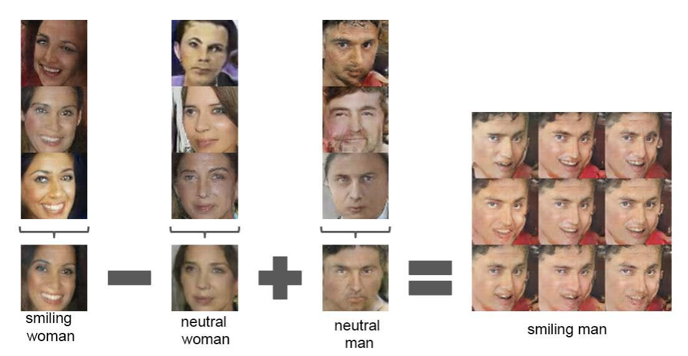


The second demonstration was the transition between two generated faces, specifically by
creating a linear path through the latent dimension between the points that generated two faces
and then generating all of the faces for the points along the path.

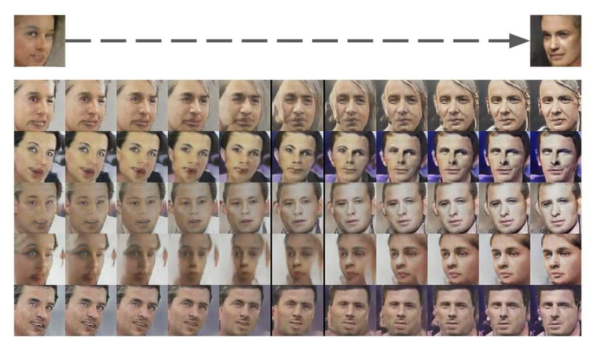


Exploring the structure of the latent space for a GAN model is both interesting for the
problem domain and helps to develop an intuition for what has been learned by the generator
model. In this tutorial, we will develop a GAN for generating photos of faces, then explore the
latent space for the model with vector arithmetic.

## Large-Scale CelebFaces Dataset (CelebA)

The first step is to select a dataset of faces. In this tutorial, we will use the Large-scale
CelebFaces Attributes Dataset, referred to as CelebA. This dataset was developed and published
by Ziwei Liu, et al. for their 2015 paper titled From Facial Parts Responses to Face Detection:
A Deep Learning Approach. The dataset provides about 200,000 photographs of celebrity faces
along with annotations for what appears in given photos, such as glasses, face shape, hats,
hair type, etc. As part of the dataset, the authors provide a version of each photo centered on
the face and cropped to the portrait with varying sizes around 150 pixels wide and 200 pixels
tall. We will use this as the basis for developing our GAN model. The dataset can be easily
downloaded from the Kaggle webpage. You will require an account with Kaggle.
- CelebFaces Attributes (CelebA) Dataset.


Specifically, download the file img align celeba.zip which is about 1.3 gigabytes. To do
this, click on the filename on the Kaggle website and then click the download icon. The download
might take a while depending on the speed of your internet connection. After downloading,
unzip the archive. This will create a new directory named img align celeba/ that contains all
of the images with filenames like 202599.jpg and 202598.jpg. Next, we can look at preparing
the raw images for modeling.


## How to Prepare the CelebA Faces Dataset

The first step is to develop code to load the images. We can use the Pillow library to load a
given image file, convert it to RGB format (if needed) and return an array of pixel data. The
load image() function below implements this.

```
# load an image as an rgb array
def load_image(filename):
# load image from file
image = Image.open(filename)
# convert to RGB, if needed
image = image.convert('RGB')
# convert to array
pixels = asarray(image)
return pixels

```

Next, we can enumerate the directory of images, load each as an array of pixels in turn, and
return an array with all of the images. There are 200K images in the dataset, which is probably
more than we need so we can also limit the number of images to load with an argument. The
load faces() function below implements this.

https://www.kaggle.com/jessicali9530/celeba-dataset


```
# load images and extract faces for all images in a directory
def load_faces(directory, n_faces):
faces = list()
# enumerate files
for filename in listdir(directory):
# load the image
pixels = load_image(directory + filename)
# store
faces.append(pixels)
# stop once we have enough
if len(faces) >= n_faces:
break
return asarray(faces)

```

Finally, once the images are loaded, we can plot them using the imshow() function from the
Matplotlib library. The plot faces() function below does this, plotting images arranged into
in a square.

```
# plot a list of loaded faces
def plot_faces(faces, n):
for i in range(n * n):
# define subplot
pyplot.subplot(n, n, 1 + i)
# turn off axis
pyplot.axis('off')
# plot raw pixel data
pyplot.imshow(faces[i])
pyplot.show()

```

Tying this together, the complete example is listed below.

```
# load and plot faces
from os import listdir
from numpy import asarray
from PIL import Image
from matplotlib import pyplot
# load an image as an rgb numpy array
def load_image(filename):
# load image from file
image = Image.open(filename)
# convert to RGB, if needed
image = image.convert('RGB')
# convert to array
pixels = asarray(image)
return pixels
# load images and extract faces for all images in a directory
def load_faces(directory, n_faces):
faces = list()
# enumerate files
for filename in listdir(directory):

# load the image
pixels = load_image(directory + filename)
# store
faces.append(pixels)
# stop once we have enough
if len(faces) >= n_faces:
break
return asarray(faces)
# plot a list of loaded faces
def plot_faces(faces, n):
for i in range(n * n):
# define subplot
pyplot.subplot(n, n, 1 + i)
# turn off axis
pyplot.axis('off')
# plot raw pixel data
pyplot.imshow(faces[i])
pyplot.show()
# directory that contains all images
directory = 'img_align_celeba/'
# load and extract all faces
faces = load_faces(directory, 25)
print('Loaded: ', faces.shape)
# plot faces
plot_faces(faces, 5)

```

Running the example loads a total of 25 images from the directory, then summarizes the
size of the returned array.

```
Loaded: (25, 218, 178, 3)

```

Finally, the 25 images are plotted in a 5 × 5 square.

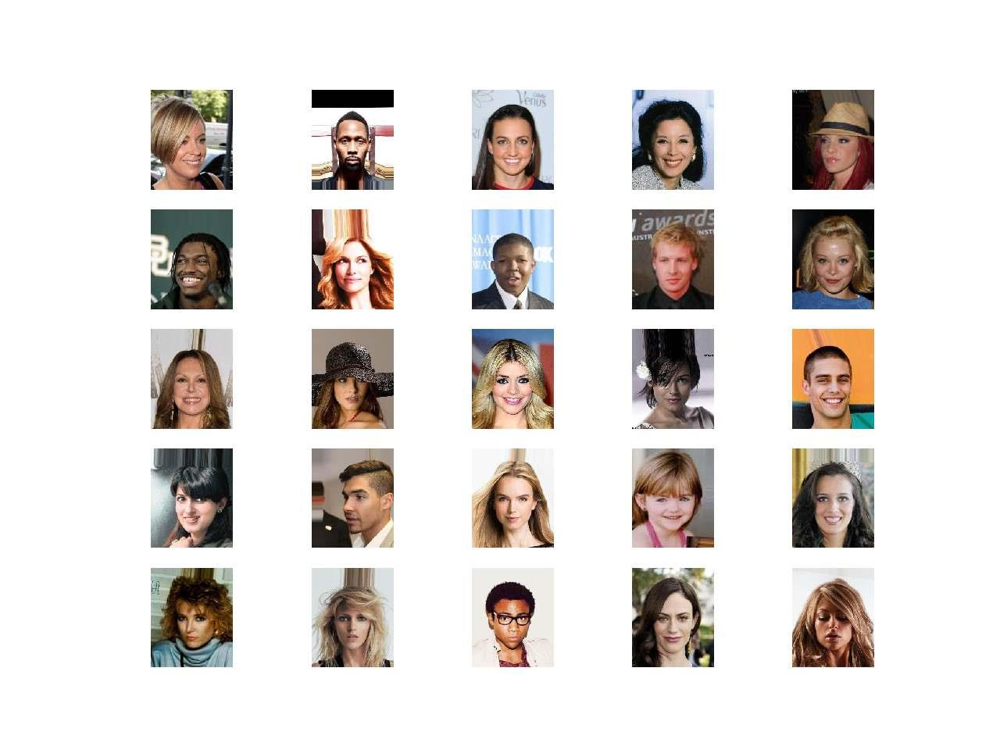

When working with a GAN, it is easier to model a dataset if all of the images are small
and square in shape. Further, as we are only interested in the face in each photo, and not
the background, we can perform face detection and extract only the face before resizing the
result to a fixed size. There are many ways to perform face detection. In this case, we will
use a pre-trained Multi-Task Cascaded Convolutional Neural Network, or MTCNN. This is a
state-of-the-art deep learning model for face detection, described in the 2016 paper titled Joint
Face Detection and Alignment Using Multitask Cascaded Convolutional Networks. We will use
the implementation provided by Ivan de Paz Centeno in the ipazc/mtcnn project. This library
can be installed via pip as follows:

```
sudo pip install mtcnn

```

We can confirm that the library was installed correctly by importing the library and printing
the version; for example:

```
# confirm mtcnn was installed correctly
import mtcnn
# show version
print(mtcnn.__version__)

```


Running the example prints the current version of the library.

```
0.0.9

```

The MTCNN model is very easy to use. First, an instance of the MTCNN model is created,
then the detect faces() function can be called passing in the pixel data for one image. The
result is a list of detected faces, with a bounding box defined in pixel offset values.

```
...
# prepare model
model = MTCNN()
# detect face in the image
faces = model.detect_faces(pixels)
# extract details of the face
x1, y1, width, height = faces[0]['box']

```

We can update our example to extract the face from each loaded photo and resize the
extracted face pixels to a fixed size. In this case, we will use the square shape of 80 × 80 pixels.
The extract face() function below implements this, taking the MTCNN model and pixel
values for a single photograph as arguments and returning an 80 × 80 × 3 array of pixel values
with just the face, or None if no face was detected (which can happen rarely).

```
# extract the face from a loaded image and resize
def extract_face(model, pixels, required_size=(80, 80)):
# detect face in the image
faces = model.detect_faces(pixels)
# skip cases where we could not detect a face
if len(faces) == 0:
return None
# extract details of the face
x1, y1, width, height = faces[0]['box']
# force detected pixel values to be positive (bug fix)
x1, y1 = abs(x1), abs(y1)
# convert into coordinates
x2, y2 = x1 + width, y1 + height
# retrieve face pixels
face_pixels = pixels[y1:y2, x1:x2]
# resize pixels to the model size
image = Image.fromarray(face_pixels)
image = image.resize(required_size)
face_array = asarray(image)
return face_array

```

We can now update the load faces() function to extract the face from the loaded photo
and store that in the list of faces returned.

```
# load images and extract faces for all images in a directory
def load_faces(directory, n_faces):
# prepare model
model = MTCNN()
faces = list()

# enumerate files
for filename in listdir(directory):
# load the image
pixels = load_image(directory + filename)
# get face
face = extract_face(model, pixels)
if face is None:
continue
# store
faces.append(face)
print(len(faces), face.shape)
# stop once we have enough
if len(faces) >= n_faces:
break
return asarray(faces)

```

Tying this together, the complete example is listed below.
 In this case, we increase the total
number of loaded faces to 50,000 to provide a good training dataset for our GAN model.

```
# example of extracting and resizing faces into a new dataset
from os import listdir
from numpy import asarray
from numpy import savez_compressed
from PIL import Image
from mtcnn.mtcnn import MTCNN
# load an image as an rgb numpy array
def load_image(filename):
# load image from file
image = Image.open(filename)
# convert to RGB, if needed
image = image.convert('RGB')
# convert to array
pixels = asarray(image)
return pixels
# extract the face from a loaded image and resize
def extract_face(model, pixels, required_size=(80, 80)):
# detect face in the image
faces = model.detect_faces(pixels)
# skip cases where we could not detect a face
if len(faces) == 0:
return None
# extract details of the face
x1, y1, width, height = faces[0]['box']
# force detected pixel values to be positive (bug fix)
x1, y1 = abs(x1), abs(y1)
# convert into coordinates
x2, y2 = x1 + width, y1 + height
# retrieve face pixels
face_pixels = pixels[y1:y2, x1:x2]
# resize pixels to the model size
image = Image.fromarray(face_pixels)
image = image.resize(required_size)
face_array = asarray(image)


return face_array
# load images and extract faces for all images in a directory
def load_faces(directory, n_faces):
# prepare model
model = MTCNN()
faces = list()
# enumerate files
for filename in listdir(directory):
# load the image
pixels = load_image(directory + filename)
# get face
face = extract_face(model, pixels)
if face is None:
continue
# store
faces.append(face)
print(len(faces), face.shape)
# stop once we have enough
if len(faces) >= n_faces:
break
return asarray(faces)
# directory that contains all images
directory = 'img_align_celeba/'
# load and extract all faces
all_faces = load_faces(directory, 50000)
print('Loaded: ', all_faces.shape)
# save in compressed format
savez_compressed('img_align_celeba.npz', all_faces)

```

Running the example may take a few minutes given the large number of faces to be loaded.
At the end of the run, the array of extracted and resized faces is saved as a compressed NumPy
array with the filename img align celeba.npz. The prepared dataset can then be loaded any
time, as follows.

```
# load the prepared dataset
from numpy import load
# load the face dataset
data = load('img_align_celeba.npz')
faces = data['arr_0']
print('Loaded: ', faces.shape)

```

Loading the dataset summarizes the shape of the array, showing 50K images with the size of
80 × 80 pixels and three color channels.

```
Loaded: (50000, 80, 80, 3)

```

We are now ready to develop a GAN model to generate faces using this dataset.


## How to Develop a GAN for CelebA

In this section, we will develop a GAN for the faces dataset that we have prepared. The first
step is to define the models. The discriminator model takes as input one 80 × 80 color image
and outputs a binary prediction as to whether the image is real (class = 1) or fake (class = 0).
It is implemented as a modest convolutional neural network using best practices for GAN
design such as using the LeakyReLU activation function with a slope of 0.2, using a 2 × 2 stride
to downsample, and the Adam version of stochastic gradient descent with a learning rate of
0.0002 and a momentum of 0.5 The define discriminator() function below implements this,
defining and compiling the discriminator model and returning it. The input shape of the image
is parameterized as a default function argument in case you want to re-use the function for your
own image data later.

```
# define the standalone discriminator model
def define_discriminator(in_shape=(80,80,3)):
model = Sequential()
# normal
model.add(Conv2D(128, (5,5), padding='same', input_shape=in_shape))
model.add(LeakyReLU(alpha=0.2))
# downsample to 40x40
model.add(Conv2D(128, (5,5), strides=(2,2), padding='same'))
model.add(LeakyReLU(alpha=0.2))
# downsample to 20x30
model.add(Conv2D(128, (5,5), strides=(2,2), padding='same'))
model.add(LeakyReLU(alpha=0.2))
# downsample to 10x10
model.add(Conv2D(128, (5,5), strides=(2,2), padding='same'))
model.add(LeakyReLU(alpha=0.2))
# downsample to 5x5
model.add(Conv2D(128, (5,5), strides=(2,2), padding='same'))
model.add(LeakyReLU(alpha=0.2))
# classifier
model.add(Flatten())
model.add(Dropout(0.4))
model.add(Dense(1, activation='sigmoid'))
# compile model
opt = Adam(lr=0.0002, beta_1=0.5)
model.compile(loss='binary_crossentropy', optimizer=opt, metrics=['accuracy'])
return model

```

The generator model takes as input a point in the latent space and outputs a single 80 × 80
color image. This is achieved by using a fully connected layer to interpret the point in the latent
space and provide sufficient activations that can be reshaped into many different (in this case
128) of a low-resolution version of the output image (e.g. 5 × 5). This is then upsampled four
times, doubling the size and quadrupling the area of the activations each time using transpose
convolutional layers. The model uses best practices such as the LeakyReLU activation, a kernel
size that is a factor of the stride size, and a hyperbolic tangent (Tanh) activation function in
the output layer.
The define generator() function below defines the generator model but intentionally does
not compile it as it is not trained directly, then returns the model. The size of the latent space
is parameterized as a function argument.

```
# define the standalone generator model
def define_generator(latent_dim):
model = Sequential()
# foundation for 5x5 feature maps
n_nodes = 128 * 5 * 5
model.add(Dense(n_nodes, input_dim=latent_dim))
model.add(LeakyReLU(alpha=0.2))
model.add(Reshape((5, 5, 128)))
# upsample to 10x10
model.add(Conv2DTranspose(128, (4,4), strides=(2,2), padding='same'))
model.add(LeakyReLU(alpha=0.2))
# upsample to 20x20
model.add(Conv2DTranspose(128, (4,4), strides=(2,2), padding='same'))
model.add(LeakyReLU(alpha=0.2))
# upsample to 40x40
model.add(Conv2DTranspose(128, (4,4), strides=(2,2), padding='same'))
model.add(LeakyReLU(alpha=0.2))
# upsample to 80x80
model.add(Conv2DTranspose(128, (4,4), strides=(2,2), padding='same'))
model.add(LeakyReLU(alpha=0.2))
# output layer 80x80x3
model.add(Conv2D(3, (5,5), activation='tanh', padding='same'))
return model

```

Next, a GAN model can be defined that combines both the generator model and the
discriminator model into one larger model. This larger model will be used to train the model
weights in the generator, using the output and error calculated by the discriminator model. The
discriminator model is trained separately, and as such, the model weights are marked as not
trainable in this larger GAN model to ensure that only the weights of the generator model are
updated. This change to the trainability of the discriminator weights only has an effect when
training the combined GAN model, not when training the discriminator standalone.
This larger GAN model takes as input a point in the latent space, uses the generator model
to generate an image, which is fed as input to the discriminator model, then output or classified
as real or fake. The define gan() function below implements this, taking the already-defined
generator and discriminator models as input.

```
# define the combined generator and discriminator model, for updating the generator
def define_gan(g_model, d_model):
# make weights in the discriminator not trainable
d_model.trainable = False
# connect them
model = Sequential()
# add generator
model.add(g_model)
# add the discriminator
model.add(d_model)
# compile model
opt = Adam(lr=0.0002, beta_1=0.5)
model.compile(loss='binary_crossentropy', optimizer=opt)
return model

```


Now that we have defined the GAN model, we need to train it. But, before we can train
the model, we require input data. The first step is to load and scale the pre-processed faces
dataset. The saved NumPy array can be loaded, as we did in the previous section, then the
pixel values must be scaled to the range [-1,1] to match the output of the generator model. The
load real samples() function below implements this, returning the loaded and scaled image
data ready for modeling.

```
# load and prepare training images
def load_real_samples():
# load the face dataset
data = load('img_align_celeba.npz')
X = data['arr_0']
# convert from unsigned ints to floats
X = X.astype('float32')
# scale from [0,255] to [-1,1]
X = (X - 127.5) / 127.5
return X

```

We will require one batch (or a half batch) of real images from the dataset each update to
the GAN model. A simple way to achieve this is to select a random sample of images from the
dataset each time. The generate real samples() function below implements this, taking the
prepared dataset as an argument, selecting and returning a random sample of face images and
their corresponding class label for the discriminator, specifically class = 1, indicating that they
are real images.

```
# select real samples
def generate_real_samples(dataset, n_samples):
# choose random instances
ix = randint(0, dataset.shape[0], n_samples)
# retrieve selected images
X = dataset[ix]
# generate 'real' class labels (1)
y = ones((n_samples, 1))
return X, y

```

Next, we need inputs for the generator model. These are random points from the latent
space, specifically Gaussian distributed random variables. The generate latent points()
function implements this, taking the size of the latent space as an argument and the number of
points required and returning them as a batch of input samples for the generator model.

```
# generate points in latent space as input for the generator
def generate_latent_points(latent_dim, n_samples):
# generate points in the latent space
x_input = randn(latent_dim * n_samples)
# reshape into a batch of inputs for the network
x_input = x_input.reshape(n_samples, latent_dim)
return x_input

```

Next, we need to use the points in the latent space as input to the generator in order to
generate new images. The generate fake samples() function below implements this, taking

the generator model and size of the latent space as arguments, then generating points in the
latent space and using them as input to the generator model. The function returns the generated
images and their corresponding class label for the discriminator model, specifically class = 0 to
indicate they are fake or generated.

```
# use the generator to generate n fake examples, with class labels
def generate_fake_samples(g_model, latent_dim, n_samples):
# generate points in latent space
x_input = generate_latent_points(latent_dim, n_samples)
# predict outputs
X = g_model.predict(x_input)
# create 'fake' class labels (0)
y = zeros((n_samples, 1))
return X, y

```

We are now ready to fit the GAN models. The model is fit for 100 training epochs, which is
arbitrary, as the model begins generating plausible faces after perhaps the first few epochs. A
batch size of 128 samples is used, and each training epoch involves 50000
or about 390 batches of
real and fake samples and updates to the model. First, the discriminator model is updated for
a half batch of real samples, then a half batch of fake samples, together forming one batch of
weight updates. The generator is then updated via the combined GAN model. Importantly, the
class label is set to 1 or real for the fake samples. This has the effect of updating the generator
toward getting better at generating real samples on the next batch.
The train() function below implements this, taking the defined models, dataset, and size
of the latent dimension as arguments and parameterizing the number of epochs and batch size
with default arguments.

```
# train the generator and discriminator
def train(g_model, d_model, gan_model, dataset, latent_dim, n_epochs=100, n_batch=128):
bat_per_epo = int(dataset.shape[0] / n_batch)
half_batch = int(n_batch / 2)
# manually enumerate epochs
for i in range(n_epochs):
# enumerate batches over the training set
for j in range(bat_per_epo):
# get randomly selected 'real' samples
X_real, y_real = generate_real_samples(dataset, half_batch)
# update discriminator model weights
d_loss1, _ = d_model.train_on_batch(X_real, y_real)
# generate 'fake' examples
X_fake, y_fake = generate_fake_samples(g_model, latent_dim, half_batch)
# update discriminator model weights
d_loss2, _ = d_model.train_on_batch(X_fake, y_fake)
# prepare points in latent space as input for the generator
X_gan = generate_latent_points(latent_dim, n_batch)
# create inverted labels for the fake samples
y_gan = ones((n_batch, 1))
# update the generator via the discriminator's error
g_loss = gan_model.train_on_batch(X_gan, y_gan)
# summarize loss on this batch
print('>%d, %d/%d, d1=%.3f, d2=%.3f g=%.3f' %
(i+1, j+1, bat_per_epo, d_loss1, d_loss2, g_loss))
# evaluate the model performance, sometimes


if (i+1) % 10 == 0:
summarize_performance(i, g_model, d_model, dataset, latent_dim)

```

You will note that every 10 training epochs, the summarize performance() function is
called. There is currently no reliable way to automatically evaluate the quality of generated
images. Therefore, we must generate images periodically during training and save the model at
these times. This both provides a checkpoint that we can later load and use to generate images,
and a way to safeguard against the training process failing, which can happen. Below defines
the summarize performance() and save plot() functions. The summarize performance()
function generates samples and evaluates the performance of the discriminator on real and
fake samples. The classification accuracy is reported and might provide insight into model
performance. The save plot() is called to create and save a plot of the generated images, and
then the model is saved to a file.

```
# create and save a plot of generated images
def save_plot(examples, epoch, n=10):
# scale from [-1,1] to [0,1]
examples = (examples + 1) / 2.0
# plot images
for i in range(n * n):
# define subplot
pyplot.subplot(n, n, 1 + i)
# turn off axis
pyplot.axis('off')
# plot raw pixel data
pyplot.imshow(examples[i])
# save plot to file
filename = 'generated_plot_e%03d.png' % (epoch+1)
pyplot.savefig(filename)
pyplot.close()
# evaluate the discriminator, plot generated images, save generator model
def summarize_performance(epoch, g_model, d_model, dataset, latent_dim, n_samples=100):
# prepare real samples
X_real, y_real = generate_real_samples(dataset, n_samples)
# evaluate discriminator on real examples
_, acc_real = d_model.evaluate(X_real, y_real, verbose=0)
# prepare fake examples
x_fake, y_fake = generate_fake_samples(g_model, latent_dim, n_samples)
# evaluate discriminator on fake examples
_, acc_fake = d_model.evaluate(x_fake, y_fake, verbose=0)
# summarize discriminator performance
print('>Accuracy real: %.0f%%, fake: %.0f%%' % (acc_real*100, acc_fake*100))
# save plot
save_plot(x_fake, epoch)
# save the generator model tile file
filename = 'generator_model_%03d.h5' % (epoch+1)
g_model.save(filename)

```

We can then define the size of the latent space, define all three models, and train them on
the loaded face dataset.


```
...
# size of the latent space
latent_dim = 100
# create the discriminator
d_model = define_discriminator()
# create the generator
g_model = define_generator(latent_dim)
# create the gan
gan_model = define_gan(g_model, d_model)
# load image data
dataset = load_real_samples()
# train model
train(g_model, d_model, gan_model, dataset, latent_dim)

```

Tying all of this together, the complete example is listed below.

```
# example of a gan for generating faces
from numpy import load
from numpy import zeros
from numpy import ones
from numpy.random import randn
from numpy.random import randint
from keras.optimizers import Adam
from keras.models import Sequential
from keras.layers import Dense
from keras.layers import Reshape
from keras.layers import Flatten
from keras.layers import Conv2D
from keras.layers import Conv2DTranspose
from keras.layers import LeakyReLU
from keras.layers import Dropout
from matplotlib import pyplot
# define the standalone discriminator model
def define_discriminator(in_shape=(80,80,3)):
model = Sequential()
# normal
model.add(Conv2D(128, (5,5), padding='same', input_shape=in_shape))
model.add(LeakyReLU(alpha=0.2))
# downsample to 40x40
model.add(Conv2D(128, (5,5), strides=(2,2), padding='same'))
model.add(LeakyReLU(alpha=0.2))
# downsample to 20x30
model.add(Conv2D(128, (5,5), strides=(2,2), padding='same'))
model.add(LeakyReLU(alpha=0.2))
# downsample to 10x10
model.add(Conv2D(128, (5,5), strides=(2,2), padding='same'))
model.add(LeakyReLU(alpha=0.2))
# downsample to 5x5
model.add(Conv2D(128, (5,5), strides=(2,2), padding='same'))
model.add(LeakyReLU(alpha=0.2))
# classifier
model.add(Flatten())
model.add(Dropout(0.4))


model.add(Dense(1, activation='sigmoid'))
# compile model
opt = Adam(lr=0.0002, beta_1=0.5)
model.compile(loss='binary_crossentropy', optimizer=opt, metrics=['accuracy'])
return model
# define the standalone generator model
def define_generator(latent_dim):
model = Sequential()
# foundation for 5x5 feature maps
n_nodes = 128 * 5 * 5
model.add(Dense(n_nodes, input_dim=latent_dim))
model.add(LeakyReLU(alpha=0.2))
model.add(Reshape((5, 5, 128)))
# upsample to 10x10
model.add(Conv2DTranspose(128, (4,4), strides=(2,2), padding='same'))
model.add(LeakyReLU(alpha=0.2))
# upsample to 20x20
model.add(Conv2DTranspose(128, (4,4), strides=(2,2), padding='same'))
model.add(LeakyReLU(alpha=0.2))
# upsample to 40x40
model.add(Conv2DTranspose(128, (4,4), strides=(2,2), padding='same'))
model.add(LeakyReLU(alpha=0.2))
# upsample to 80x80
model.add(Conv2DTranspose(128, (4,4), strides=(2,2), padding='same'))
model.add(LeakyReLU(alpha=0.2))
# output layer 80x80x3
model.add(Conv2D(3, (5,5), activation='tanh', padding='same'))
return model
# define the combined generator and discriminator model, for updating the generator
def define_gan(g_model, d_model):
# make weights in the discriminator not trainable
d_model.trainable = False
# connect them
model = Sequential()
# add generator
model.add(g_model)
# add the discriminator
model.add(d_model)
# compile model
opt = Adam(lr=0.0002, beta_1=0.5)
model.compile(loss='binary_crossentropy', optimizer=opt)
return model
# load and prepare training images
def load_real_samples():
# load the face dataset
data = load('img_align_celeba.npz')
X = data['arr_0']
# convert from unsigned ints to floats
X = X.astype('float32')
# scale from [0,255] to [-1,1]
X = (X - 127.5) / 127.5
return X


# select real samples
def generate_real_samples(dataset, n_samples):
# choose random instances
ix = randint(0, dataset.shape[0], n_samples)
# retrieve selected images
X = dataset[ix]
# generate 'real' class labels (1)
y = ones((n_samples, 1))
return X, y
# generate points in latent space as input for the generator
def generate_latent_points(latent_dim, n_samples):
# generate points in the latent space
x_input = randn(latent_dim * n_samples)
# reshape into a batch of inputs for the network
x_input = x_input.reshape(n_samples, latent_dim)
return x_input
# use the generator to generate n fake examples, with class labels
def generate_fake_samples(g_model, latent_dim, n_samples):
# generate points in latent space
x_input = generate_latent_points(latent_dim, n_samples)
# predict outputs
X = g_model.predict(x_input)
# create 'fake' class labels (0)
y = zeros((n_samples, 1))
return X, y
# create and save a plot of generated images
def save_plot(examples, epoch, n=10):
# scale from [-1,1] to [0,1]
examples = (examples + 1) / 2.0
# plot images
for i in range(n * n):
# define subplot
pyplot.subplot(n, n, 1 + i)
# turn off axis
pyplot.axis('off')
# plot raw pixel data
pyplot.imshow(examples[i])
# save plot to file
filename = 'generated_plot_e%03d.png' % (epoch+1)
pyplot.savefig(filename)
pyplot.close()
# evaluate the discriminator, plot generated images, save generator model
def summarize_performance(epoch, g_model, d_model, dataset, latent_dim, n_samples=100):
# prepare real samples
X_real, y_real = generate_real_samples(dataset, n_samples)
# evaluate discriminator on real examples
_, acc_real = d_model.evaluate(X_real, y_real, verbose=0)
# prepare fake examples
x_fake, y_fake = generate_fake_samples(g_model, latent_dim, n_samples)
# evaluate discriminator on fake examples
_, acc_fake = d_model.evaluate(x_fake, y_fake, verbose=0)
# summarize discriminator performance


print('>Accuracy real: %.0f%%, fake: %.0f%%' % (acc_real*100, acc_fake*100))
# save plot
save_plot(x_fake, epoch)
# save the generator model tile file
filename = 'generator_model_%03d.h5' % (epoch+1)
g_model.save(filename)
# train the generator and discriminator
def train(g_model, d_model, gan_model, dataset, latent_dim, n_epochs=100, n_batch=128):
bat_per_epo = int(dataset.shape[0] / n_batch)
half_batch = int(n_batch / 2)
# manually enumerate epochs
for i in range(n_epochs):
# enumerate batches over the training set
for j in range(bat_per_epo):
# get randomly selected 'real' samples
X_real, y_real = generate_real_samples(dataset, half_batch)
# update discriminator model weights
d_loss1, _ = d_model.train_on_batch(X_real, y_real)
# generate 'fake' examples
X_fake, y_fake = generate_fake_samples(g_model, latent_dim, half_batch)
# update discriminator model weights
d_loss2, _ = d_model.train_on_batch(X_fake, y_fake)
# prepare points in latent space as input for the generator
X_gan = generate_latent_points(latent_dim, n_batch)
# create inverted labels for the fake samples
y_gan = ones((n_batch, 1))
# update the generator via the discriminator's error
g_loss = gan_model.train_on_batch(X_gan, y_gan)
# summarize loss on this batch
print('>%d, %d/%d, d1=%.3f, d2=%.3f g=%.3f' %
(i+1, j+1, bat_per_epo, d_loss1, d_loss2, g_loss))
# evaluate the model performance, sometimes
if (i+1) % 10 == 0:
summarize_performance(i, g_model, d_model, dataset, latent_dim)
# size of the latent space
latent_dim = 100
# create the discriminator
d_model = define_discriminator()
# create the generator
g_model = define_generator(latent_dim)
# create the gan
gan_model = define_gan(g_model, d_model)
# load image data
dataset = load_real_samples()
# train model
train(g_model, d_model, gan_model, dataset, latent_dim)

```

Note: Running the example may take many hours to run on CPU hardware. I recommend
running the example on GPU hardware if possible. If you need help, you can get started
quickly by using an AWS EC2 instance to train the model. See the instructions in Appendix C.


The loss for the discriminator on real and fake samples, as well as the loss for the generator,
is reported after each batch.

Note: Your specific results may vary given the stochastic nature of the learning algorithm.
Consider running the example a few times and compare the average performance.

```
>1,
>1,
>1,
>1,
>1,


...

1/390,
2/390,
3/390,
4/390,
5/390,

d1=0.699,
d1=0.541,
d1=0.213,
d1=0.013,
d1=0.012,

d2=0.696
d2=0.702
d2=0.742
d2=0.806
d2=0.772

g=0.692
g=0.686
g=0.656
g=0.656
g=0.682

```

The discriminator loss may crash down to values of 0.0 for real and generated samples. If
this happens, it is an example of a training failure from which the model is likely not likely to
recover and you should restart the training process.

```
...
>34,
>34,
>34,
>34,
>34,
>34,

...

130/390,
131/390,
132/390,
133/390,
134/390,
135/390,

d1=0.844,
d1=1.233,
d1=1.183,
d1=0.000,
d1=0.081,
d1=0.000,

d2=8.434 g=3.450
d2=12.021 g=3.541
d2=15.759 g=0.000
d2=15.942 g=0.006
d2=15.942 g=0.000
d2=15.942 g=0.000


```

Review the generated plots and select a model based on the best quality images. The model
should begin to generate faces after about 30 training epochs. The faces are not completely
clear, but it is obvious that they are faces, with all the right things (hair, eyes, nose, mouth) in
roughly the right places.


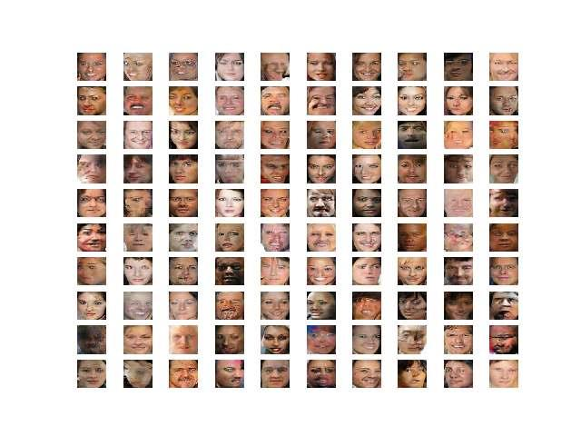


## How to Explore the Latent Space for Generated Faces

In this section, we will use our trained GAN model as the basis for exploring the latent space.


**How to Load the Model and Generate Faces**

The first step is to load the saved model and confirm that it can generate plausible faces. The
model can be loaded using the load model() function in the Keras API. We can then generate
a number of random points in the latent space and use them as input to the loaded model to
generate new faces. The faces can then be plotted. The complete example is listed below.

```
# example of loading the generator model and generating images
from numpy.random import randn
from keras.models import load_model
from matplotlib import pyplot
# generate points in latent space as input for the generator
def generate_latent_points(latent_dim, n_samples):
# generate points in the latent space
x_input = randn(latent_dim * n_samples)
# reshape into a batch of inputs for the network


z_input = x_input.reshape(n_samples, latent_dim)
return z_input
# create a plot of generated images
def plot_generated(examples, n):
# plot images
for i in range(n * n):
# define subplot
pyplot.subplot(n, n, 1 + i)
# turn off axis
pyplot.axis('off')
# plot raw pixel data
pyplot.imshow(examples[i, :, :])
pyplot.show()
# load model
model = load_model('generator_model_030.h5')
# generate images
latent_points = generate_latent_points(100, 25)
# generate images
X = model.predict(latent_points)
# scale from [-1,1] to [0,1]
X = (X + 1) / 2.0
# plot the result
plot_generated(X, 5)

```

Running the example first loads the saved model. Then, 25 random points in the 100dimensional latent space are created and provided to the generator model to create 25 images
of faces, which are then plotted in a 5 × 5 grid.


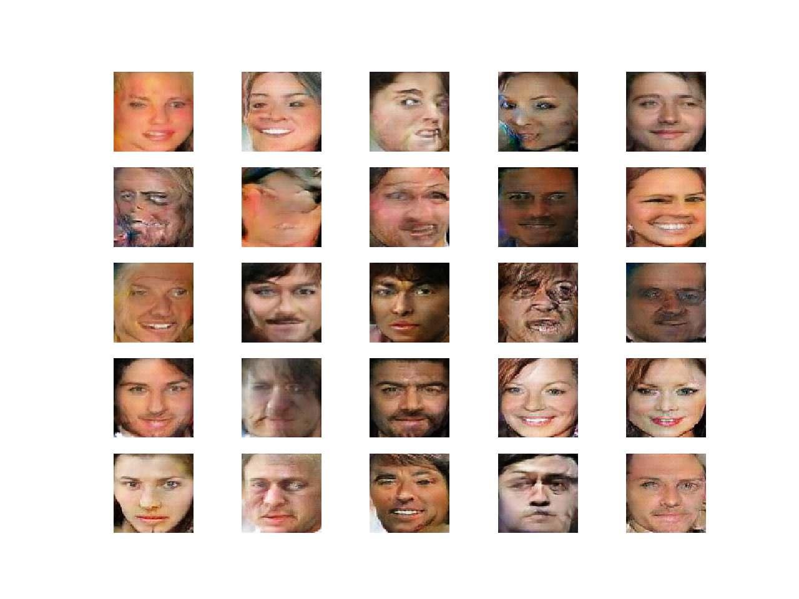


How to Interpolate Between Generated Faces

Next, we can create an interpolation path between two points in the latent space and generate
faces along this path. The simplest interpolation we can use is a linear or uniform interpolation
between two points in the latent space. We can achieve this using the linspace() NumPy
function to calculate ratios of the contribution from two points, then enumerate these ratios
and construct a vector for each ratio. The interpolate points() function below implements
this and returns a series of linearly interpolated vectors between two points in latent space,
including the first and last point.

```
# uniform interpolation between two points in latent space
def interpolate_points(p1, p2, n_steps=10):
# interpolate ratios between the points
ratios = linspace(0, 1, num=n_steps)
# linear interpolate vectors
vectors = list()
for ratio in ratios:
v = (1.0 - ratio) * p1 + ratio * p2
vectors.append(v)
return asarray(vectors)

```


We can then generate two points in the latent space, perform the interpolation, then generate
an image for each interpolated vector. The result will be a series of images that transition
between the two original images. The example below demonstrates this for two faces.

```
# example of interpolating between generated faces
from numpy import asarray
from numpy.random import randn
from numpy import linspace
from keras.models import load_model
from matplotlib import pyplot
# generate points in latent space as input for the generator
def generate_latent_points(latent_dim, n_samples):
# generate points in the latent space
x_input = randn(latent_dim * n_samples)
# reshape into a batch of inputs for the network
z_input = x_input.reshape(n_samples, latent_dim)
return z_input
# uniform interpolation between two points in latent space
def interpolate_points(p1, p2, n_steps=10):
# interpolate ratios between the points
ratios = linspace(0, 1, num=n_steps)
# linear interpolate vectors
vectors = list()
for ratio in ratios:
v = (1.0 - ratio) * p1 + ratio * p2
vectors.append(v)
return asarray(vectors)
# create a plot of generated images
def plot_generated(examples, n):
# plot images
for i in range(n):
# define subplot
pyplot.subplot(1, n, 1 + i)
# turn off axis
pyplot.axis('off')
# plot raw pixel data
pyplot.imshow(examples[i, :, :])
pyplot.show()
# load model
model = load_model('generator_model_030.h5')
# generate points in latent space
pts = generate_latent_points(100, 2)
# interpolate points in latent space
interpolated = interpolate_points(pts[0], pts[1])
# generate images
X = model.predict(interpolated)
# scale from [-1,1] to [0,1]
X = (X + 1) / 2.0
# plot the result
plot_generated(X, len(interpolated))

```

Running the example calculates the interpolation path between the two points in latent
space, generates images for each, and plots the result. You can see the clear linear progression
in ten steps from the first face on the left to the final face on the right.

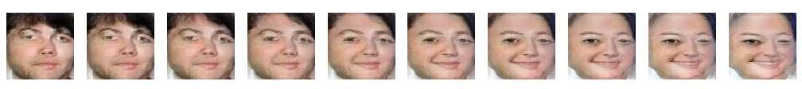

We can update the example to repeat this process multiple times so we can see the transition
between multiple generated faces on a single plot. The complete example is listed below.

```
# example of interpolating between generated faces
from numpy import asarray
from numpy import vstack
from numpy.random import randn
from numpy import linspace
from keras.models import load_model
from matplotlib import pyplot
# generate points in latent space as input for the generator
def generate_latent_points(latent_dim, n_samples):
# generate points in the latent space
x_input = randn(latent_dim * n_samples)
# reshape into a batch of inputs for the network
z_input = x_input.reshape(n_samples, latent_dim)
return z_input
# uniform interpolation between two points in latent space
def interpolate_points(p1, p2, n_steps=10):
# interpolate ratios between the points
ratios = linspace(0, 1, num=n_steps)
# linear interpolate vectors
vectors = list()
for ratio in ratios:
v = (1.0 - ratio) * p1 + ratio * p2
vectors.append(v)
return asarray(vectors)
# create a plot of generated images
def plot_generated(examples, n):
# plot images
for i in range(n * n):
# define subplot
pyplot.subplot(n, n, 1 + i)
# turn off axis
pyplot.axis('off')
# plot raw pixel data
pyplot.imshow(examples[i, :, :])
pyplot.show()
# load model
model = load_model('generator_model_030.h5')
# generate points in latent space

n = 20
pts = generate_latent_points(100, n)
# interpolate pairs
results = None
for i in range(0, n, 2):
# interpolate points in latent space
interpolated = interpolate_points(pts[i], pts[i+1])
# generate images
X = model.predict(interpolated)
# scale from [-1,1] to [0,1]
X = (X + 1) / 2.0
if results is None:
results = X
else:
results = vstack((results, X))
# plot the result
plot_generated(results, 10)

```

Running the example creates 10 different face starting points and 10 matching face endpoints,
and the linear interpolation between each.

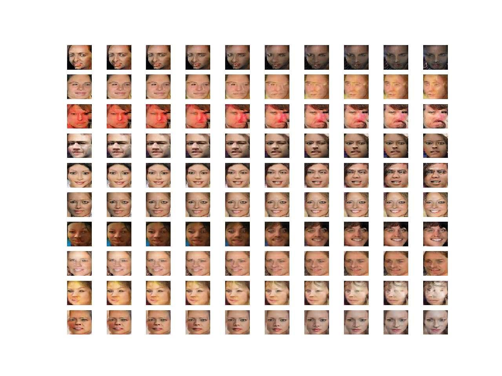


In these cases, we have performed a linear interpolation which assumes that the latent space
is a uniformly distributed hypercube. Technically, our chosen latent space is a 100-dimension
hypersphere or multimodal Gaussian distribution. There is a mathematical function called the
spherical linear interpolation function, or Slerp, that should be used when interpolating this
space to ensure the curvature of the space is taken into account. For more details, I recommend
reading the Issue on Linear Interpolation in Soumith Chintala’s dcgan.torch project2 . In that
project, an implementation of the Slerp function for Python is provided that we can use as the
basis for our own Slerp function, provided listed below.

```
# spherical linear interpolation (slerp)
def slerp(val, low, high):
omega = arccos(clip(dot(low/norm(low), high/norm(high)), -1, 1))
so = sin(omega)
if so == 0:
# L'Hopital's rule/LERP
return (1.0-val) * low + val * high
return sin((1.0-val)*omega) / so * low + sin(val*omega) / so * high

```

This function can be called from our interpolate points() function instead of performing
the manual linear interpolation. The complete example with this change is listed below.

```
# example of interpolating between generated faces
from numpy import asarray
from numpy import vstack
from numpy.random import randn
from numpy import arccos
from numpy import clip
from numpy import dot
from numpy import sin
from numpy import linspace
from numpy.linalg import norm
from keras.models import load_model
from matplotlib import pyplot
# generate points in latent space as input for the generator
def generate_latent_points(latent_dim, n_samples):
# generate points in the latent space
x_input = randn(latent_dim * n_samples)
# reshape into a batch of inputs for the network
z_input = x_input.reshape(n_samples, latent_dim)
return z_input
# spherical linear interpolation (slerp)
def slerp(val, low, high):
omega = arccos(clip(dot(low/norm(low), high/norm(high)), -1, 1))
so = sin(omega)
if so == 0:
# L'Hopital's rule/LERP
return (1.0-val) * low + val * high
return sin((1.0-val)*omega) / so * low + sin(val*omega) / so * high
# uniform interpolation between two points in latent space


https://github.com/soumith/dcgan.torch/issues/14


def interpolate_points(p1, p2, n_steps=10):
# interpolate ratios between the points
ratios = linspace(0, 1, num=n_steps)
# linear interpolate vectors
vectors = list()
for ratio in ratios:
v = slerp(ratio, p1, p2)
vectors.append(v)
return asarray(vectors)
# create a plot of generated images
def plot_generated(examples, n):
# plot images
for i in range(n * n):
# define subplot
pyplot.subplot(n, n, 1 + i)
# turn off axis
pyplot.axis('off')
# plot raw pixel data
pyplot.imshow(examples[i, :, :])
pyplot.show()
# load model
model = load_model('generator_model_030.h5')
# generate points in latent space
n = 20
pts = generate_latent_points(100, n)
# interpolate pairs
results = None
for i in range(0, n, 2):
# interpolate points in latent space
interpolated = interpolate_points(pts[i], pts[i+1])
# generate images
X = model.predict(interpolated)
# scale from [-1,1] to [0,1]
X = (X + 1) / 2.0
if results is None:
results = X
else:
results = vstack((results, X))
# plot the result
plot_generated(results, 10)

```

The result is 10 more transitions between generated faces, this time using the correct Slerp
interpolation method. The difference is subtle but somehow visually more correct.


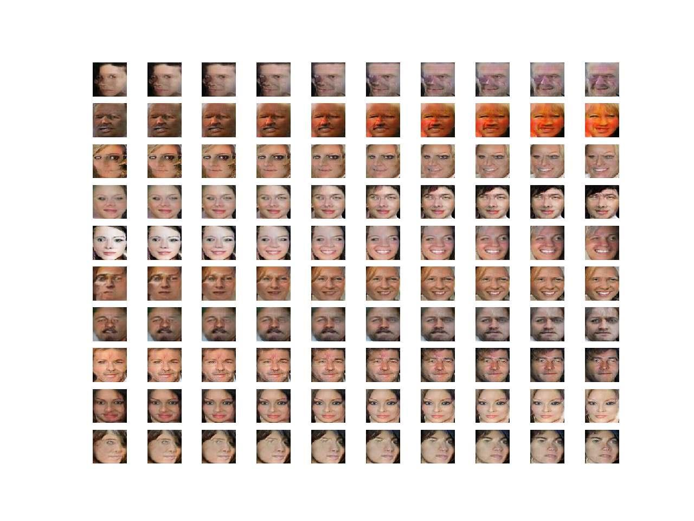


## How to Explore the Latent Space for Faces

Finally, we can explore the latent space by performing vector arithmetic with the generated faces.
First, we must generate a large number of faces and save both the faces and their corresponding
latent vectors. We can then review the plot of generated faces and select faces with features we’re
interested in, note their index (number), and retrieve their latent space vectors for manipulation.
The example below will load the GAN model and use it to generate 100 random faces.

```
# example of loading the generator model and generating images
from numpy.random import randn
from keras.models import load_model
from matplotlib import pyplot
from numpy import savez_compressed
# generate points in latent space as input for the generator
def generate_latent_points(latent_dim, n_samples):
# generate points in the latent space
x_input = randn(latent_dim * n_samples)
# reshape into a batch of inputs for the network
z_input = x_input.reshape(n_samples, latent_dim)
return z_input


# create a plot of generated images
def plot_generated(examples, n):
# plot images
for i in range(n * n):
# define subplot
pyplot.subplot(n, n, 1 + i)
# turn off axis
pyplot.axis('off')
# plot raw pixel data
pyplot.imshow(examples[i, :, :])
pyplot.savefig('generated_faces.png')
pyplot.close()
# load model
model = load_model('generator_model_030.h5')
# generate points in latent space
latent_points = generate_latent_points(100, 100)
# save points
savez_compressed('latent_points.npz', latent_points)
# generate images
X = model.predict(latent_points)
# scale from [-1,1] to [0,1]
X = (X + 1) / 2.0
# save plot
plot_generated(X, 10)

```

Running the example loads the model, generates faces, and saves the latent vectors and
generated faces. The latent vectors are saved to a compressed NumPy array with the filename
latent points.npz. The 100 generated faces are plotted in a 10 × 10 grid and saved in a file
named generated faces.png. In this case, we have a good collection of faces to work with.
Each face has an index that we can use to retrieve the latent vector. For example, the first face
is 1, which corresponds to the first vector in the saved array (index 0). We will perform the
operation:

smiling woman − neutral woman + neutral man = smiling man


Therefore, we need three faces for each of smiling woman, neutral woman, and neutral man.
In this case, we will use the following indexes in the image:
- Smiling Woman: 92, 98, 99
- Neutral Woman: 9, 21, 79
- Neutral Man: 10, 30, 45


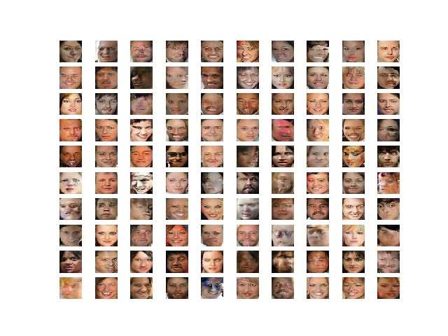

Now that we have latent vectors to work with and a target arithmetic, we can get started.
First, we can specify our preferred images and load the saved NumPy array of latent points.

```
# retrieve specific points
smiling_woman_ix = [92, 98, 99]
neutral_woman_ix = [9, 21, 79]
neutral_man_ix = [10, 30, 45]
# load the saved latent points
data = load('latent_points.npz')
points = data['arr_0']

```

Next, we can retrieve each vector and calculate the average for each vector type (e.g. smiling
woman). We could perform vector arithmetic with single images directly, but we will get a
more robust result if we work with an average of a few faces with the desired property. The
average points() function below takes the loaded array of latent space points, retrieves each,
calculates the average, and returns all of the vectors.

```
# average list of latent space vectors
def average_points(points, ix):
# convert to zero offset points
zero_ix = [i-1 for i in ix]
# retrieve required points

vectors = points[zero_ix]
# average the vectors
avg_vector = mean(vectors, axis=0)
# combine original and avg vectors
all_vectors = vstack((vectors, avg_vector))
return all_vectors

```

We can now use this function to retrieve all of the required points in latent space and
generate images.

```
# average vectors
smiling_woman = average_points(points, smiling_woman_ix)
neutral_woman = average_points(points, neutral_woman_ix)
neutral_man = average_points(points, neutral_man_ix)
# combine all vectors
all_vectors = vstack((smiling_woman, neutral_woman, neutral_man))
# generate images
images = model.predict(all_vectors)
# scale pixel values
images = (images + 1) / 2.0
plot_generated(images, 3, 4)

```

Finally, we can use the average vectors to perform vector arithmetic in latent space and plot
the result.

```
# smiling woman - neutral woman + neutral man = smiling man
result_vector = smiling_woman[-1] - neutral_woman[-1] + neutral_man[-1]
# generate image
result_vector = expand_dims(result_vector, 0)
result_image = model.predict(result_vector)
# scale pixel values
result_image = (result_image + 1) / 2.0
pyplot.imshow(result_image[0])
pyplot.show()

```


Tying this together, the complete example is listed below.

```
# example of loading the generator model and generating images
from keras.models import load_model
from matplotlib import pyplot
from numpy import load
from numpy import mean
from numpy import vstack
from numpy import expand_dims
# average list of latent space vectors
def average_points(points, ix):
# convert to zero offset points
zero_ix = [i-1 for i in ix]
# retrieve required points
vectors = points[zero_ix]


# average the vectors
avg_vector = mean(vectors, axis=0)
# combine original and avg vectors
all_vectors = vstack((vectors, avg_vector))
return all_vectors
# create a plot of generated images
def plot_generated(examples, rows, cols):
# plot images
for i in range(rows * cols):
# define subplot
pyplot.subplot(rows, cols, 1 + i)
# turn off axis
pyplot.axis('off')
# plot raw pixel data
pyplot.imshow(examples[i, :, :])
pyplot.show()
# load model
model = load_model('generator_model_030.h5')
# retrieve specific points
smiling_woman_ix = [92, 98, 99]
neutral_woman_ix = [9, 21, 79]
neutral_man_ix = [10, 30, 45]
# load the saved latent points
data = load('latent_points.npz')
points = data['arr_0']
# average vectors
smiling_woman = average_points(points, smiling_woman_ix)
neutral_woman = average_points(points, neutral_woman_ix)
neutral_man = average_points(points, neutral_man_ix)
# combine all vectors
all_vectors = vstack((smiling_woman, neutral_woman, neutral_man))
# generate images
images = model.predict(all_vectors)
# scale pixel values
images = (images + 1) / 2.0
plot_generated(images, 3, 4)
# smiling woman - neutral woman + neutral man = smiling man
result_vector = smiling_woman[-1] - neutral_woman[-1] + neutral_man[-1]
# generate image
result_vector = expand_dims(result_vector, 0)
result_image = model.predict(result_vector)
# scale pixel values
result_image = (result_image + 1) / 2.0
pyplot.imshow(result_image[0])
pyplot.show()

```

Running the example first loads the points in latent space for our specific images, calculates
the average of the points, and generates the faces for the points. We can see that, indeed, our
selected faces were retrieved correctly and that the average of the points in the vector space
captures the salient feature we are going for on each line (e.g. smiling woman, neutral woman,
etc.).


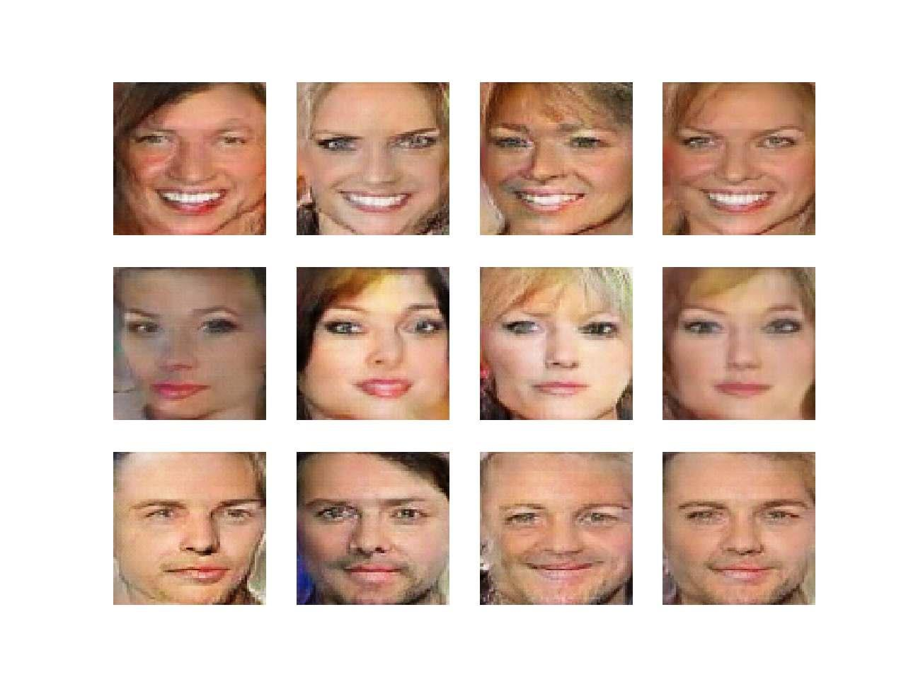

Next, vector arithmetic is performed and the result is a smiling man, as we would expect.

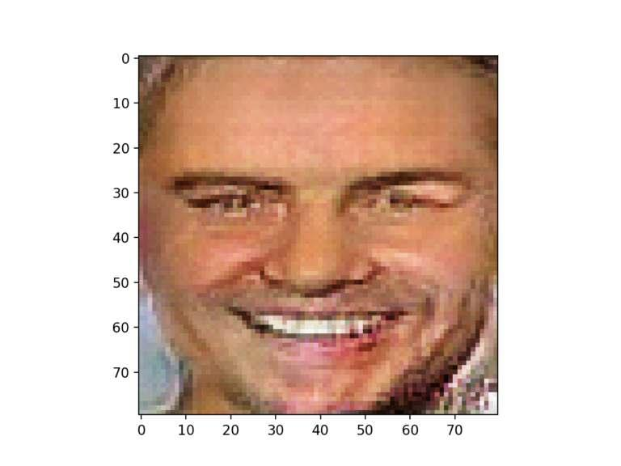


## Extensions

This section lists some ideas for extending the tutorial that you may wish to explore.
- Additional Arithmetic. Try arithmetic with different image features or different arithmetic and review the results of the generated faces.
- Additional Interpolation. Try interpolating between three or more points in latent
space and review the results of the generated faces.
- Tune Model. Update the GAN model configuration so that training is more stable and
better quality faces can be generated.

If you explore any of these extensions, I’d love to know.

## Further Reading

This section provides more resources on the topic if you are looking to go deeper.

## Papers

- Joint Face Detection and Alignment Using Multitask Cascaded Convolutional Networks,
2016.
https://arxiv.org/abs/1604.02878
- Unsupervised Representation Learning with Deep Convolutional Generative Adversarial
Networks, 2015.
https://arxiv.org/abs/1511.06434
- Sampling Generative Networks, 2016.
https://arxiv.org/abs/1609.04468


## APIs

- Keras API.
https://keras.io/
- How can I “freeze” Keras layers?.
https://keras.io/getting-started/faq/#how-can-i-freeze-keras-layers
- MatplotLib API.
https://matplotlib.org/api/
- numpy.random.rand API.
https://docs.scipy.org/doc/numpy/reference/generated/numpy.random.rand.html
- numpy.random.randn API.
https://docs.scipy.org/doc/numpy/reference/generated/numpy.random.randn.html

- numpy.zeros API.
https://docs.scipy.org/doc/numpy/reference/generated/numpy.zeros.html
- numpy.ones API.
https://docs.scipy.org/doc/numpy/reference/generated/numpy.ones.html
- numpy.hstack API.
https://docs.scipy.org/doc/numpy/reference/generated/numpy.hstack.html


## Articles

- Large-scale CelebFaces Attributes (CelebA) Dataset.
http://mmlab.ie.cuhk.edu.hk/projects/CelebA.html
- CelebFaces Attributes (CelebA) Dataset, Kaggle.
https://www.kaggle.com/jessicali9530/celeba-dataset
- MTCNN Face Detection Project, GitHub.
https://github.com/ipazc/mtcnn
- linear interpolation?, dcgan.torch Project, GitHub.
https://github.com/soumith/dcgan.torch/issues/14


## Summary

In this tutorial, you discovered how to develop a generative adversarial network for face generation
and explore the structure of latent space and the effect on generated faces. Specifically, you
learned:
- How to develop a generative adversarial network for generating faces.
- How to interpolate between points in latent space and generate images that morph from
one face to another.
- How to perform vector arithmetic in latent space and achieve targeted effects in the
resulting generated faces.

## Next

In the next tutorial, you will explore common failure modes seen when training GAN models.
