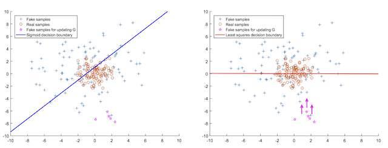
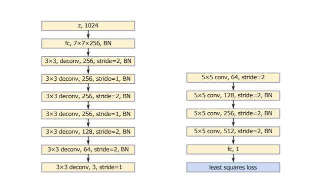
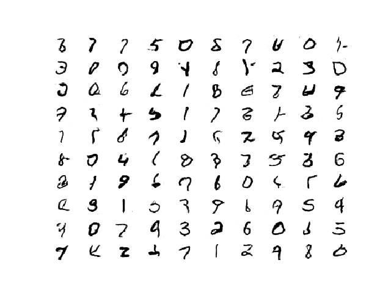
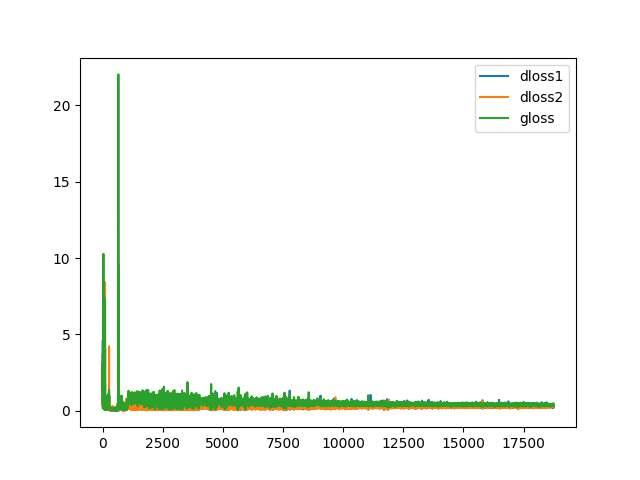
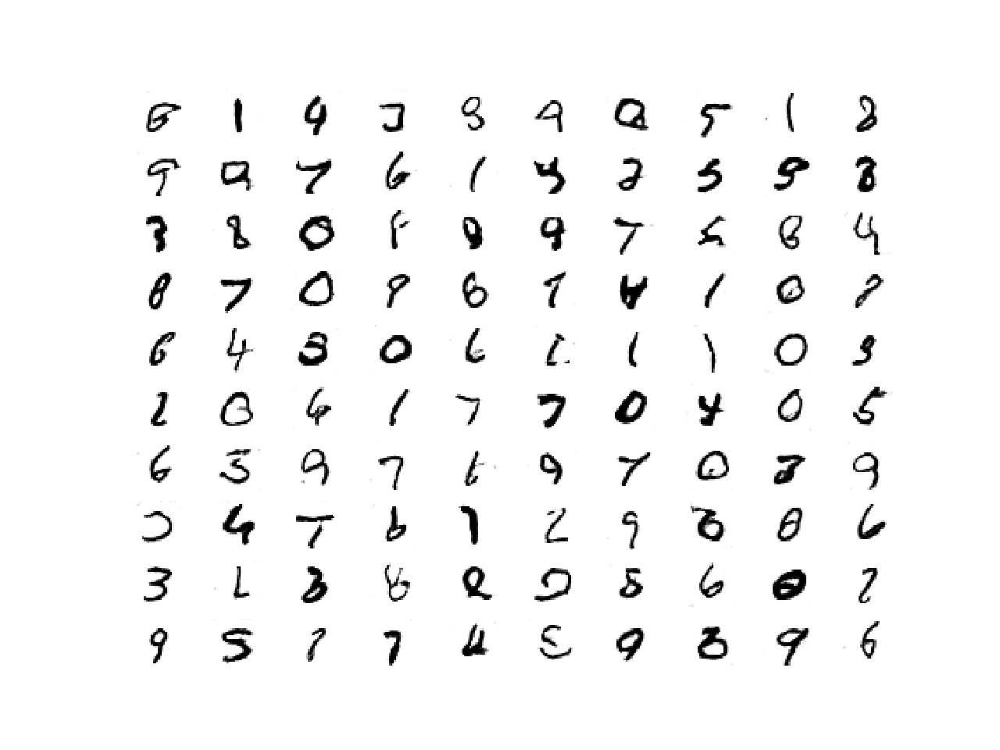

# Lab : Introduction to neural learning: gradient descent

#### Pre-reqs:
- Google Chrome (Recommended)

#### Lab Environment
Notebooks are ready to run. All packages have been installed. There is no requirement for any setup.

**Note:** Elev8ed Notebooks (powered by Jupyter) will be accessible at the port given to you by your instructor. Password for jupyterLab : `1234`

All Notebooks are present in `work/generative-adversarial-networks` folder. To copy and paste: use **Control-C** and to paste inside of a terminal, use **Control-V**

You can access jupyter lab at `<host-ip>:<port>/lab/workspaces/`


## How to Develop a Least Squares GAN (LSGAN)

The Least Squares Generative Adversarial Network, or LSGAN for short, is an extension to the
GAN architecture that addresses the problem of vanishing gradients and loss saturation. It is
motivated by the desire to provide a signal to the generator about fake samples that are far from
the discriminator model’s decision boundary for classifying them as real or fake. The further
the generated images are from the decision boundary, the larger the error signal provided to the
generator, encouraging the generation of more realistic images. The LSGAN can be implemented
with a minor change to the output layer of the discriminator layer and the adoption of the least
squares, or L2, loss function. In this tutorial, you will discover how to develop a least squares
generative adversarial network. After completing this tutorial, you will know:

- The LSGAN addresses vanishing gradients and loss saturation of the deep convolutional
GAN.
- The LSGAN can be implemented by a mean squared error or L2 loss function for the
discriminator model.
- How to implement the LSGAN model for generating handwritten digits for the MNIST
dataset.

Let’s get started.

## Tutorial Overview

This tutorial is divided into three parts; they are:
- What Is Least Squares GAN
- How to Develop an LSGAN for MNIST
- How to Generate Images With LSGAN


## What Is Least Squares GAN

The standard Generative Adversarial Network, or GAN for short, is an effective architecture for
training an unsupervised generative model. The architecture involves training a discriminator
model to tell the difference between real (from the dataset) and fake (generated) images, and
using the discriminator, in turn, to train the generator model. The generator is updated in such
a way that it is encouraged to generate images that are more likely to fool the discriminator.
The discriminator is a binary classifier and is trained using binary cross-entropy loss function.
A limitation of this loss function is that it is primarily concerned with whether the predictions
are correct or not, and less so with how correct or incorrect they might be.

... when we use the fake samples to update the generator by making the discriminator
believe they are from real data, it will cause almost no error because they are on the
correct side, i.e., the real data side, of the decision boundary

— Least Squares Generative Adversarial Networks, 2016.

This can be conceptualized in two dimensions as a line or decision boundary separating dots
that represent real and fake images. The discriminator is responsible for devising the decision
boundary to best separate real and fake images and the generator is responsible for creating new
points that look like real points, confusing the discriminator. The choice of cross-entropy loss
means that points generated far from the boundary are right or wrong, but provide very little
gradient information to the generator on how to generate better images. This small gradient for
generated images far from the decision boundary is referred to as a vanishing gradient problem
or a loss saturation. The loss function is unable to give a strong signal as to how to best update
the model.

The Least Squares Generative Adversarial Network, or LSGAN for short, is an extension to
the GAN architecture proposed by Xudong Mao, et al. in their 2016 paper titled Least Squares
Generative Adversarial Networks. The LSGAN is a modification to the GAN architecture that
changes the loss function for the discriminator from binary cross-entropy to a least squares loss.
The motivation for this change is that the least squares loss will penalize generated images based
on their distance from the decision boundary. This will provide a strong gradient signal for
generated images that are very different or far from the existing data and address the problem
of saturated loss.

... minimizing the objective function of regular GAN suffers from vanishing gradients,
which makes it hard to update the generator. LSGANs can relieve this problem
because LSGANs penalize samples based on their distances to the decision boundary,
which generates more gradients to update the generator.

— Least Squares Generative Adversarial Networks, 2016.

This can be conceptualized with a plot, below, taken from the paper, that shows on the left
the sigmoid decision boundary (blue) and generated fake points far from the decision boundary
(pink), and on the right the least squares decision boundary (red) and the points far from the
boundary (pink) given a gradient that moves them closer to the boundary.




In addition to avoiding loss saturation, the LSGAN also results in a more stable training
process and the generation of higher quality and larger images than the traditional deep
convolutional GAN.

First, LSGANs are able to generate higher quality images than regular GANs.
Second, LSGANs perform more stable during the learning process.

— Least Squares Generative Adversarial Networks, 2016.

The LSGAN can be implemented by using the target values of 1.0 for real and 0.0 for fake
images and optimizing the model using the mean squared error (MSE) loss function, e.g. L2
loss. The output layer of the discriminator model must be a linear activation function. The
authors propose a generator and discriminator model architecture, inspired by the VGG model
architecture, and use interleaving upsampling and normal convolutional layers in the generator
model, seen on the left in the image below.




## How to Develop an LSGAN for MNIST

In this section, we will develop an LSGAN for the MNIST handwritten digit dataset (described
in Section 7.2). The first step is to define the models. Both the discriminator and the generator
will be based on the Deep Convolutional GAN, or DCGAN, architecture. This involves the use
of Convolution-BatchNorm-Activation layer blocks with the use of 2 × 2 stride for downsampling
and transpose convolutional layers for upsampling. LeakyReLU activation layers are used in the
discriminator and ReLU activation layers are used in the generator. The discriminator expects
grayscale input images with the shape 28 × 28, the shape of images in the MNIST dataset, and
the output layer is a single node with a linear activation function. The model is optimized using
the mean squared error (MSE) loss function as per the LSGAN. The define discriminator()
function below defines the discriminator model.

```
# define the standalone discriminator model
def define_discriminator(in_shape=(28,28,1)):
# weight initialization
init = RandomNormal(stddev=0.02)
# define model
model = Sequential()
# downsample to 14x14
model.add(Conv2D(64, (4,4), strides=(2,2), padding='same', kernel_initializer=init,
input_shape=in_shape))
model.add(BatchNormalization())
model.add(LeakyReLU(alpha=0.2))
# downsample to 7x7
model.add(Conv2D(128, (4,4), strides=(2,2), padding='same', kernel_initializer=init))
model.add(BatchNormalization())
model.add(LeakyReLU(alpha=0.2))
# classifier
model.add(Flatten())
model.add(Dense(1, activation='linear', kernel_initializer=init))
# compile model with L2 loss
model.compile(loss='mse', optimizer=Adam(lr=0.0002, beta_1=0.5))
return model

```

The generator model takes a point in latent space as input and outputs a grayscale image
with the shape 28 × 28 pixels, where pixel values are in the range [-1,1] via the Tanh activation
function on the output layer. The define generator() function below defines the generator
model. This model is not compiled as it is not trained in a standalone manner.

```
# define the standalone generator model
def define_generator(latent_dim):
# weight initialization
init = RandomNormal(stddev=0.02)
# define model
model = Sequential()
# foundation for 7x7 image
n_nodes = 256 * 7 * 7
model.add(Dense(n_nodes, kernel_initializer=init, input_dim=latent_dim))
model.add(BatchNormalization())
model.add(Activation('relu'))
model.add(Reshape((7, 7, 256)))
# upsample to 14x14

model.add(Conv2DTranspose(128, (4,4), strides=(2,2), padding='same',
kernel_initializer=init))
model.add(BatchNormalization())
model.add(Activation('relu'))
# upsample to 28x28
model.add(Conv2DTranspose(64, (4,4), strides=(2,2), padding='same',
kernel_initializer=init))
model.add(BatchNormalization())
model.add(Activation('relu'))
# output 28x28x1
model.add(Conv2D(1, (7,7), padding='same', kernel_initializer=init))
model.add(Activation('tanh'))
return model

```

The generator model is updated via the discriminator model. This is achieved by creating
a composite model that stacks the generator on top of the discriminator so that error signals
can flow back through the discriminator to the generator. The weights of the discriminator are
marked as not trainable when used in this composite model. Updates via the composite model
involve using the generator to create new images by providing random points in the latent space
as input. The generated images are passed to the discriminator, which will classify them as
real or fake. The weights are updated as though the generated images are real (e.g. target
of 1.0), allowing the generator to be updated toward generating more realistic images. The
define gan() function defines and compiles the composite model for updating the generator
model via the discriminator, again optimized via mean squared error as per the LSGAN.

```
# define the combined generator and discriminator model, for updating the generator
def define_gan(generator, discriminator):
# make weights in the discriminator not trainable
discriminator.trainable = False
# connect them
model = Sequential()
# add generator
model.add(generator)
# add the discriminator
model.add(discriminator)
# compile model with L2 loss
model.compile(loss='mse', optimizer=Adam(lr=0.0002, beta_1=0.5))
return model

```

Next, we can define a function to load the MNIST handwritten digit dataset and scale the
pixel values to the range [-1,1] to match the images output by the generator model. Only the
training part of the MNIST dataset is used, which contains 60,000 centered grayscale images of
digits zero through nine.

```
# load mnist images
def load_real_samples():
# load dataset
(trainX, _), (_, _) = load_data()
# expand to 3d, e.g. add channels
X = expand_dims(trainX, axis=-1)
# convert from ints to floats

X = X.astype('float32')
# scale from [0,255] to [-1,1]
X = (X - 127.5) / 127.5
return X

```

We can then define a function to retrieve a batch of randomly selected images from the training
dataset. The real images are returned with corresponding target values for the discriminator
model, e.g. y=1.0, to indicate they are real.

```
# select real samples
def generate_real_samples(dataset, n_samples):
# choose random instances
ix = randint(0, dataset.shape[0], n_samples)
# select images
X = dataset[ix]
# generate class labels
y = ones((n_samples, 1))
return X, y

```

Next, we can develop the corresponding functions for the generator. First, a function for
generating random points in the latent space to use as input for generating images via the
generator model.

```
# generate points in latent space as input for the generator
def generate_latent_points(latent_dim, n_samples):
# generate points in the latent space
x_input = randn(latent_dim * n_samples)
# reshape into a batch of inputs for the network
x_input = x_input.reshape(n_samples, latent_dim)
return x_input

```

Next, a function that will use the generator model to generate a batch of fake images for
updating the discriminator model, along with the target value (y=0) to indicate the images are
fake.

```
# use the generator to generate n fake examples, with class labels
def generate_fake_samples(generator, latent_dim, n_samples):
# generate points in latent space
x_input = generate_latent_points(latent_dim, n_samples)
# predict outputs
X = generator.predict(x_input)
# create class labels
y = zeros((n_samples, 1))
return X, y

```

We need to use the generator periodically during training to generate images that we
can subjectively inspect and use as the basis for choosing a final generator model. The
summarize performance() function below can be called during training to generate and save a
plot of images and save the generator model. Images are plotted using a reverse grayscale color
map to make the digits black on a white background.

```
# generate samples and save as a plot and save the model
def summarize_performance(step, g_model, latent_dim, n_samples=100):
# prepare fake examples
X, _ = generate_fake_samples(g_model, latent_dim, n_samples)
# scale from [-1,1] to [0,1]
X = (X + 1) / 2.0
# plot images
for i in range(10 * 10):
# define subplot
pyplot.subplot(10, 10, 1 + i)
# turn off axis
pyplot.axis('off')
# plot raw pixel data
pyplot.imshow(X[i, :, :, 0], cmap='gray_r')
# save plot to file
filename1 = 'generated_plot_%06d.png' % (step+1)
pyplot.savefig(filename1)
pyplot.close()
# save the generator model
filename2 = 'model_%06d.h5' % (step+1)
g_model.save(filename2)
print('Saved %s and %s' % (filename1, filename2))

```

We are also interested in the behavior of loss during training. As such, we can record loss in
lists across each training iteration, then create and save a line plot of the learning dynamics of the
models. Creating and saving the plot of learning curves is implemented in the plot history()
function.

```
# create a line plot of loss for the gan and save to file
def plot_history(d1_hist, d2_hist, g_hist):
pyplot.plot(d1_hist, label='dloss1')
pyplot.plot(d2_hist, label='dloss2')
pyplot.plot(g_hist, label='gloss')
pyplot.legend()
filename = 'plot_line_plot_loss.png'
pyplot.savefig(filename)
pyplot.close()
print('Saved %s' % (filename))

```

Finally, we can define the main training loop via the train() function. The function takes
the defined models and dataset as arguments and parameterizes the number of training epochs
and batch size as default function arguments. Each training loop involves first generating a
half-batch of real and fake samples and using them to create one batch worth of weight updates
to the discriminator. Next, the generator is updated via the composite model, providing the real
(y=1) target as the expected output for the model. The loss is reported each training iteration,
and the model performance is summarized in terms of a plot of generated images at the end of
every epoch. The plot of learning curves is created and saved at the end of the run.

```
# train the generator and discriminator
def train(g_model, d_model, gan_model, dataset, latent_dim, n_epochs=20, n_batch=64):
# calculate the number of batches per training epoch

bat_per_epo = int(dataset.shape[0] / n_batch)
# calculate the number of training iterations
n_steps = bat_per_epo * n_epochs
# calculate the size of half a batch of samples
half_batch = int(n_batch / 2)
# lists for storing loss, for plotting later
d1_hist, d2_hist, g_hist = list(), list(), list()
# manually enumerate epochs
for i in range(n_steps):
# prepare real and fake samples
X_real, y_real = generate_real_samples(dataset, half_batch)
X_fake, y_fake = generate_fake_samples(g_model, latent_dim, half_batch)
# update discriminator model
d_loss1 = d_model.train_on_batch(X_real, y_real)
d_loss2 = d_model.train_on_batch(X_fake, y_fake)
# update the generator via the discriminator's error
z_input = generate_latent_points(latent_dim, n_batch)
y_real2 = ones((n_batch, 1))
g_loss = gan_model.train_on_batch(z_input, y_real2)
# summarize loss on this batch
print('>%d, d1=%.3f, d2=%.3f g=%.3f' % (i+1, d_loss1, d_loss2, g_loss))
# record history
d1_hist.append(d_loss1)
d2_hist.append(d_loss2)
g_hist.append(g_loss)
# evaluate the model performance every 'epoch'
if (i+1) % (bat_per_epo * 1) == 0:
summarize_performance(i, g_model, latent_dim)
# create line plot of training history
plot_history(d1_hist, d2_hist, g_hist)

```

Tying all of this together, the complete code example of training an LSGAN on the MNIST
handwritten digit dataset is listed below.

```
# example of lsgan for mnist
from numpy import expand_dims
from numpy import zeros
from numpy import ones
from numpy.random import randn
from numpy.random import randint
from keras.datasets.mnist import load_data
from keras.optimizers import Adam
from keras.models import Sequential
from keras.layers import Dense
from keras.layers import Reshape
from keras.layers import Flatten
from keras.layers import Conv2D
from keras.layers import Conv2DTranspose
from keras.layers import Activation
from keras.layers import LeakyReLU
from keras.layers import BatchNormalization
from keras.initializers import RandomNormal
from matplotlib import pyplot
# define the standalone discriminator model

def define_discriminator(in_shape=(28,28,1)):
# weight initialization
init = RandomNormal(stddev=0.02)
# define model
model = Sequential()
# downsample to 14x14
model.add(Conv2D(64, (4,4), strides=(2,2), padding='same', kernel_initializer=init,
input_shape=in_shape))
model.add(BatchNormalization())
model.add(LeakyReLU(alpha=0.2))
# downsample to 7x7
model.add(Conv2D(128, (4,4), strides=(2,2), padding='same', kernel_initializer=init))
model.add(BatchNormalization())
model.add(LeakyReLU(alpha=0.2))
# classifier
model.add(Flatten())
model.add(Dense(1, activation='linear', kernel_initializer=init))
# compile model with L2 loss
model.compile(loss='mse', optimizer=Adam(lr=0.0002, beta_1=0.5))
return model
# define the standalone generator model
def define_generator(latent_dim):
# weight initialization
init = RandomNormal(stddev=0.02)
# define model
model = Sequential()
# foundation for 7x7 image
n_nodes = 256 * 7 * 7
model.add(Dense(n_nodes, kernel_initializer=init, input_dim=latent_dim))
model.add(BatchNormalization())
model.add(Activation('relu'))
model.add(Reshape((7, 7, 256)))
# upsample to 14x14
model.add(Conv2DTranspose(128, (4,4), strides=(2,2), padding='same',
kernel_initializer=init))
model.add(BatchNormalization())
model.add(Activation('relu'))
# upsample to 28x28
model.add(Conv2DTranspose(64, (4,4), strides=(2,2), padding='same',
kernel_initializer=init))
model.add(BatchNormalization())
model.add(Activation('relu'))
# output 28x28x1
model.add(Conv2D(1, (7,7), padding='same', kernel_initializer=init))
model.add(Activation('tanh'))
return model
# define the combined generator and discriminator model, for updating the generator
def define_gan(generator, discriminator):
# make weights in the discriminator not trainable
discriminator.trainable = False
# connect them
model = Sequential()
# add generator
model.add(generator)


# add the discriminator
model.add(discriminator)
# compile model with L2 loss
model.compile(loss='mse', optimizer=Adam(lr=0.0002, beta_1=0.5))
return model
# load mnist images
def load_real_samples():
# load dataset
(trainX, _), (_, _) = load_data()
# expand to 3d, e.g. add channels
X = expand_dims(trainX, axis=-1)
# convert from ints to floats
X = X.astype('float32')
# scale from [0,255] to [-1,1]
X = (X - 127.5) / 127.5
return X
# # select real samples
def generate_real_samples(dataset, n_samples):
# choose random instances
ix = randint(0, dataset.shape[0], n_samples)
# select images
X = dataset[ix]
# generate class labels
y = ones((n_samples, 1))
return X, y
# generate points in latent space as input for the generator
def generate_latent_points(latent_dim, n_samples):
# generate points in the latent space
x_input = randn(latent_dim * n_samples)
# reshape into a batch of inputs for the network
x_input = x_input.reshape(n_samples, latent_dim)
return x_input
# use the generator to generate n fake examples, with class labels
def generate_fake_samples(generator, latent_dim, n_samples):
# generate points in latent space
x_input = generate_latent_points(latent_dim, n_samples)
# predict outputs
X = generator.predict(x_input)
# create class labels
y = zeros((n_samples, 1))
return X, y
# generate samples and save as a plot and save the model
def summarize_performance(step, g_model, latent_dim, n_samples=100):
# prepare fake examples
X, _ = generate_fake_samples(g_model, latent_dim, n_samples)
# scale from [-1,1] to [0,1]
X = (X + 1) / 2.0
# plot images
for i in range(10 * 10):
# define subplot
pyplot.subplot(10, 10, 1 + i)


# turn off axis
pyplot.axis('off')
# plot raw pixel data
pyplot.imshow(X[i, :, :, 0], cmap='gray_r')
# save plot to file
filename1 = 'generated_plot_%06d.png' % (step+1)
pyplot.savefig(filename1)
pyplot.close()
# save the generator model
filename2 = 'model_%06d.h5' % (step+1)
g_model.save(filename2)
print('Saved %s and %s' % (filename1, filename2))
# create a line plot of loss for the gan and save to file
def plot_history(d1_hist, d2_hist, g_hist):
pyplot.plot(d1_hist, label='dloss1')
pyplot.plot(d2_hist, label='dloss2')
pyplot.plot(g_hist, label='gloss')
pyplot.legend()
filename = 'plot_line_plot_loss.png'
pyplot.savefig(filename)
pyplot.close()
print('Saved %s' % (filename))
# train the generator and discriminator
def train(g_model, d_model, gan_model, dataset, latent_dim, n_epochs=20, n_batch=64):
# calculate the number of batches per training epoch
bat_per_epo = int(dataset.shape[0] / n_batch)
# calculate the number of training iterations
n_steps = bat_per_epo * n_epochs
# calculate the size of half a batch of samples
half_batch = int(n_batch / 2)
# lists for storing loss, for plotting later
d1_hist, d2_hist, g_hist = list(), list(), list()
# manually enumerate epochs
for i in range(n_steps):
# prepare real and fake samples
X_real, y_real = generate_real_samples(dataset, half_batch)
X_fake, y_fake = generate_fake_samples(g_model, latent_dim, half_batch)
# update discriminator model
d_loss1 = d_model.train_on_batch(X_real, y_real)
d_loss2 = d_model.train_on_batch(X_fake, y_fake)
# update the generator via the discriminator's error
z_input = generate_latent_points(latent_dim, n_batch)
y_real2 = ones((n_batch, 1))
g_loss = gan_model.train_on_batch(z_input, y_real2)
# summarize loss on this batch
print('>%d, d1=%.3f, d2=%.3f g=%.3f' % (i+1, d_loss1, d_loss2, g_loss))
# record history
d1_hist.append(d_loss1)
d2_hist.append(d_loss2)
g_hist.append(g_loss)
# evaluate the model performance every 'epoch'
if (i+1) % (bat_per_epo * 1) == 0:
summarize_performance(i, g_model, latent_dim)
# create line plot of training history


plot_history(d1_hist, d2_hist, g_hist)
# size of the latent space
latent_dim = 100
# create the discriminator
discriminator = define_discriminator()
# create the generator
generator = define_generator(latent_dim)
# create the gan
gan_model = define_gan(generator, discriminator)
# load image data
dataset = load_real_samples()
print(dataset.shape)
# train model
train(generator, discriminator, gan_model, dataset, latent_dim)

```

Note: Running the example may take many hours to run on CPU hardware. I recommend
running the example on GPU hardware if possible. If you need help, you can get started
quickly by using an AWS EC2 instance to train the model. See the instructions in Appendix C.

Running the example will report the loss of the discriminator on real (d1) and fake (d2)
examples and the loss of the generator via the discriminator on generated examples presented
as real (g). These scores are printed at the end of each training run and are expected to remain
small values throughout the training process. Values of zero for an extended period may indicate
a failure mode and the training process should be restarted.

Note: Your specific results may vary given the stochastic nature of the learning algorithm.
Consider running the example a few times and compare the average performance.

```
>1,
>2,
>3,
>4,
>5,
...

d1=9.292,
d1=1.173,
d1=1.347,
d1=0.604,
d1=0.643,

d2=0.153
d2=2.057
d2=1.922
d2=0.545
d2=0.734

g=2.530
g=0.903
g=2.215
g=1.846
g=1.619

```

Plots of generated images are created at the end of every epoch. The generated images at
the beginning of the run are rough.


After a handful of training epochs, the generated images begin to look crisp and realistic.
Recall that more training epochs may or may not correspond to a generator that outputs higher
quality images. Review the generated plots and choose a final model with the best quality
images.




At the end of the training run, a plot of learning curves is created for the discriminator and
generator. In this case, we can see that training remains somewhat stable throughout the run,
with some very large peaks observed, which wash out the scale of the plot.





## How to Generate Images With LSGAN

We can use the saved generator model to create new images on demand. This can be achieved
by first selecting a final model based on image quality, then loading it and providing new points
from the latent space as input in order to generate new plausible images from the domain. In
this case, we will use the model saved after 20 epochs, or 18,740 ( 60000
or 937 batches per epoch
64
×20 epochs) training iterations.

```
# example of loading the generator model and generating images
from keras.models import load_model
from numpy.random import randn
from matplotlib import pyplot
# generate points in latent space as input for the generator
def generate_latent_points(latent_dim, n_samples):
# generate points in the latent space
x_input = randn(latent_dim * n_samples)
# reshape into a batch of inputs for the network
x_input = x_input.reshape(n_samples, latent_dim)
return x_input

# create a plot of generated images (reversed grayscale)
def plot_generated(examples, n):
# plot images
for i in range(n * n):
# define subplot
pyplot.subplot(n, n, 1 + i)
# turn off axis
pyplot.axis('off')
# plot raw pixel data
pyplot.imshow(examples[i, :, :, 0], cmap='gray_r')
pyplot.show()
# load model
model = load_model('model_018740.h5')
# generate images
latent_points = generate_latent_points(100, 100)
# generate images
X = model.predict(latent_points)
# plot the result
plot_generated(X, 10)

```

Running the example generates a plot of 10 × 10, or 100, new and plausible handwritten
digits.




## Further Reading

This section provides more resources on the topic if you are looking to go deeper.

## Papers

- Least Squares Generative Adversarial Networks, 2016.
https://arxiv.org/abs/1611.04076


## API

- Keras Datasets API..
https://keras.io/datasets/
- Keras Sequential Model API.
https://keras.io/models/sequential/
- Keras Convolutional Layers API.
https://keras.io/layers/convolutional/

- How can I “freeze” Keras layers?.
https://keras.io/getting-started/faq/#how-can-i-freeze-keras-layers
- MatplotLib API.
https://matplotlib.org/api/
- NumPy Random sampling (numpy.random) API.
https://docs.scipy.org/doc/numpy/reference/routines.random.html
- NumPy Array manipulation routines.
https://docs.scipy.org/doc/numpy/reference/routines.array-manipulation.html


## Articles

- Least Squares GAN, 2017.
https://wiseodd.github.io/techblog/2017/03/02/least-squares-gan/
- LSGAN Project (Official), GitHub.
https://github.com/xudonmao/LSGAN
- Keras-GAN Project, GitHub.
https://github.com/eriklindernoren/Keras-GAN


## Summary

In this tutorial, you discovered how to develop a least squares generative adversarial network.
Specifically, you learned:

- The LSGAN addresses vanishing gradients and loss saturation of the deep convolutional
GAN.
- The LSGAN can be implemented by a mean squared error or L2 loss function for the
discriminator model.
- How to implement the LSGAN model for generating handwritten digits for the MNIST
dataset.


## Next

In the next tutorial, you will discover the Wasserstein loss function and the WGAN and how to
implement it from scratch.
