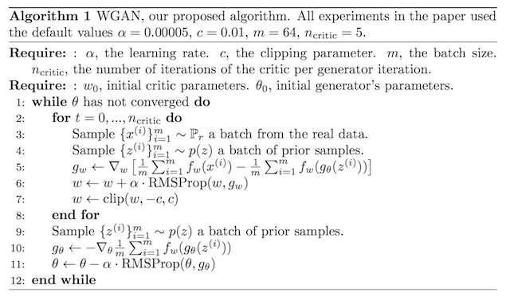
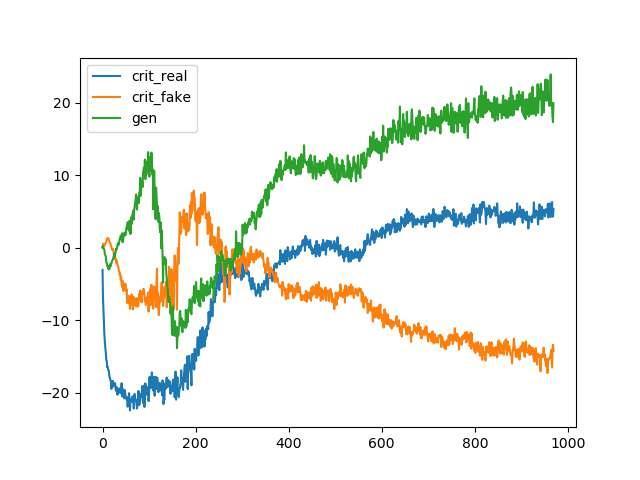
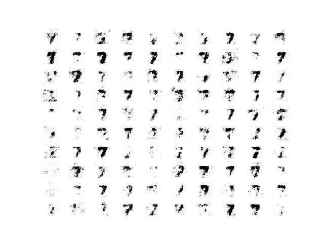
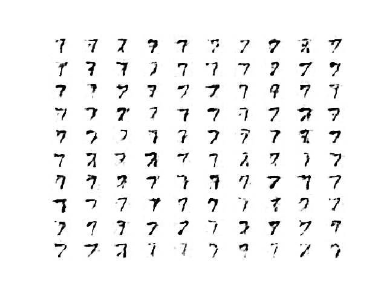
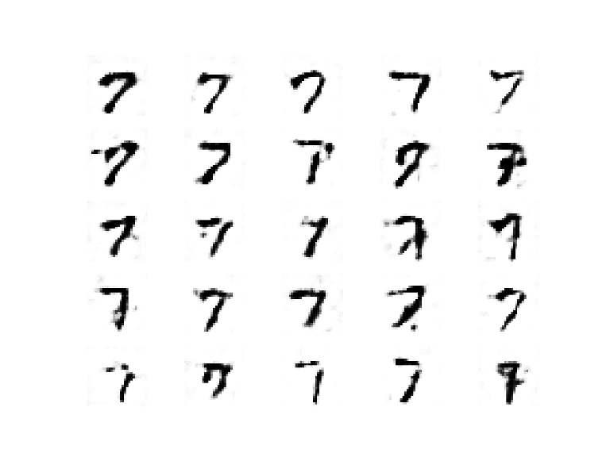

# Lab : Introduction to neural learning: gradient descent

#### Pre-reqs:
- Google Chrome (Recommended)

#### Lab Environment
Notebooks are ready to run. All packages have been installed. There is no requirement for any setup.

**Note:** Elev8ed Notebooks (powered by Jupyter) will be accessible at the port given to you by your instructor. Password for jupyterLab : `1234`

All Notebooks are present in `work/generative-adversarial-networks` folder. To copy and paste: use **Control-C** and to paste inside of a terminal, use **Control-V**

You can access jupyter lab at `<host-ip>:<port>/lab/workspaces/`


## How to Develop a Wasserstein GAN (WGAN)

The Wasserstein Generative Adversarial Network, or Wasserstein GAN, is an extension to the
generative adversarial network that both improves the stability when training the model and
provides a loss function that correlates with the quality of generated images. The development of
the WGAN has a dense mathematical motivation, although in practice requires only a few minor
modifications to the established standard deep convolutional generative adversarial network,
or DCGAN. In this tutorial, you will discover how to implement the Wasserstein generative
adversarial network from scratch. After completing this tutorial, you will know:

- The differences between the standard DCGAN and the new Wasserstein GAN.
- How to implement the specific details of the Wasserstein GAN from scratch.
- How to develop a WGAN for image generation and interpret model behavior.

Let’s get started.


Tutorial Overview

## This tutorial is divided into five parts; they are:
1. Wasserstein Generative Adversarial Network
2. How to Implement Wasserstein Loss
3. Wasserstein GAN Implementation Details
4. How to Train a Wasserstein GAN Model
5. How to Generate Images With WGAN


## What Is a Wasserstein GAN?

The Wasserstein GAN, or WGAN for short, was introduced by Martin Arjovsky, et al. in their
2017 paper titled Wasserstein GAN. It is an extension of the GAN that seeks an alternate way
of training the generator model to better approximate the distribution of data observed in a
given training dataset. Instead of using a discriminator to classify or predict the probability
of generated images as being real or fake, the WGAN changes or replaces the discriminator
model with a critic that scores the realness or fakeness of a given image. This change is
motivated by a mathematical argument that training the generator should seek a minimization
of the distance between the distribution of the data observed in the training dataset and the
distribution observed in generated examples. The argument contrasts different distribution
distance measures, such as Kullback-Leibler (KL) divergence, Jensen-Shannon (JS) divergence,
and the Earth-Mover (EM) distance, the latter also referred to as Wasserstein distance.

The most fundamental difference between such distances is their impact on the
convergence of sequences of probability distributions.

— Wasserstein GAN, 2017.

They demonstrate that a critic neural network can be trained to approximate the Wasserstein
distance, and, in turn, used to effectively train a generator model. Importantly, the Wasserstein
distance has the properties that it is continuous and differentiable and continues to provide a
linear gradient, even after the critic is well trained.

The fact that the EM distance is continuous and differentiable a.e. means that we
can (and should) train the critic till optimality. [...] the more we train the critic,
the more reliable gradient of the Wasserstein we get, which is actually useful by the
fact that Wasserstein is differentiable almost everywhere.

— Wasserstein GAN, 2017.

This is unlike the discriminator model of the DCGAN that, once trained, may fail to provide
useful gradient information for updating the generator model. The benefit of the WGAN is
that the training process is more stable and less sensitive to model architecture and choice of
hyperparameter configurations.

... training WGANs does not require maintaining a careful balance in training of the
discriminator and the generator, and does not require a careful design of the network
architecture either. The mode dropping phenomenon that is typical in GANs is also
drastically reduced.

— Wasserstein GAN, 2017.

Perhaps most importantly, the loss of the discriminator appears to relate to the quality of
images created by the generator. Specifically, the lower the loss of the critic when evaluating
generated images, the higher the expected quality of the generated images. This is important as
unlike other GANs that seek stability in terms of finding an equilibrium between two models,
the WGAN seeks convergence, lowering generator loss.


To our knowledge, this is the first time in GAN literature that such a property is
shown, where the loss of the GAN shows properties of convergence. This property is
extremely useful when doing research in adversarial networks as one does not need
to stare at the generated samples to figure out failure modes and to gain information
on which models are doing better over others.

— Wasserstein GAN, 2017.

## How to Implement Wasserstein Loss

The Wasserstein loss function seeks to increase the gap between the scores for real and generated
images. We can summarize the function as it is described in the paper as follows:

- Critic Loss = [average critic score on real images] - [average critic score on fake images]
- Generator Loss = -[average critic score on fake images]

Where the average scores are calculated across a minibatch of samples. This is precisely
how the loss is implemented for graph-based deep learning frameworks such as PyTorch and
TensorFlow. The calculations are straightforward to interpret once we recall that stochastic
gradient descent seeks to minimize loss. In the case of the generator, a larger score from the
critic will result in a smaller loss for the generator, encouraging the critic to output larger
scores for fake images. For example, an average score of 10 becomes -10, an average score of 50
becomes -50, which is smaller, and so on.
In the case of the critic, a larger score for real images results in a larger resulting loss for
the critic, penalizing the model. This encourages the critic to output smaller scores for real
images. For example, an average score of 20 for real images and 50 for fake images results in a
loss of -30; an average score of 10 for real images and 50 for fake images results in a loss of -40,
which is better, and so on. The sign of the loss does not matter in this case, as long as loss for
real images is a small number and the loss for fake images is a large number. The Wasserstein
loss encourages the critic to separate these numbers. We can also reverse the situation and
encourage the critic to output a large score for real images and a small score for fake images
and achieve the same result. Some implementations make this change.
In the Keras deep learning library (and some others), we cannot implement the Wasserstein
loss function directly as described in the paper and as implemented in PyTorch and TensorFlow.
Instead, we can achieve the same effect without having the calculation of the loss for the critic
dependent upon the loss calculated for real and fake images. A good way to think about this is a
negative score for real images and a positive score for fake images, although this negative/positive
split of scores learned during training is not required; just larger and smaller is sufficient.
- Small Critic Score (e.g.< 0): Real - Large Critic Score (e.g. >0): Fake

We can multiply the average predicted score by -1 in the case of fake images so that larger
averages become smaller averages and the gradient is in the correct direction, i.e. minimizing
loss. For example, average scores on fake images of [0.5, 0.8, and 1.0] across three batches of
fake images would become [-0.5, -0.8, and -1.0] when calculating weight updates.
- Loss For Fake Images = -1 × Average Critic Score


No change is needed for the case of real scores, as we want to encourage smaller average
scores for real images.
- Loss For Real Images = Average Critic Score

This can be implemented consistently by assigning an expected outcome target of -1 for
real images and 1 for fake images and implementing the loss function as the expected label
multiplied by the average score. The -1 label will be multiplied by the average score for real
images and encourage a larger predicted average, and the 1 label will be multiplied by the
average score for fake images and have no effect, encouraging a smaller predicted average.

- Wasserstein Loss = Label × Average Critic Score

Or

- Wasserstein Loss(Real Images) = 1 × Average Predicted Score
- Wasserstein Loss(Fake Images) = -1 × Average Predicted Score

We can implement this in Keras by assigning the expected labels of -1 and 1 for real and
fake images respectively. The inverse labels could be used to the same effect, e.g. -1 for fake
and 1 for real to encourage small scores for real images and large scores for fake images. Some
developers do implement the WGAN in this alternate way, which is just as correct. Now that
we know how to implement the Wasserstein loss function in Keras, let’s clarify one common
point of misunderstanding.

## Common Point of Confusion With Expected Labels

Recall we are using the expected labels of -1 for real images and 1 for fake images. A common
point of confusion is that a perfect critic model will output -1 for every real image and 1 for
every fake image. This is incorrect.
Again, recall we are using stochastic gradient descent to find the set of weights in the critic
(and generator) models that minimize the loss function. We have established that we want the
critic model to output larger scores on average for fake images and smaller scores on average for
real images. We then designed a loss function to encourage this outcome. This is the key point
about loss functions used to train neural network models. They encourage a desired model
behavior, and they do not have to achieve this by providing the expected outcomes. In this
case, we defined our Wasserstein loss function to interpret the average score predicted by the
critic model and used labels for the real and fake cases to help with this interpretation. So what
is a good loss for real and fake images under Wasserstein loss?
Wasserstein is not an absolute and comparable loss for comparing across GAN models.
Instead, it is relative and depends on your model configuration and dataset. What is important
is that it is consistent for a given critic model and convergence of the generator (better loss)
does correlate with better generated image quality. It could be negative scores for real images
and positive scores for fake images, but this is not required. All scores could be positive or all
scores could be negative. The loss function only encourages a separation between scores for fake
and real images as larger and smaller, not necessarily positive and negative.

## Wasserstein GAN Implementation Details

Although the theoretical grounding for the WGAN is dense, the implementation of a WGAN
requires a few minor changes to the standard Deep Convolutional GAN, or DCGAN. The image
below provides a summary of the main training loop for training a WGAN, taken from the
paper. Take note of the listing of recommended hyperparameters used in the model.



The differences in implementation for the WGAN are as follows:

1. Use a linear activation function in the output layer of the critic model (instead of sigmoid).
2. Use -1 labels for real images and 1 labels for fake images (instead of 1 and 0).
3. Use Wasserstein loss to train the critic and generator models.
4. Constrain critic model weights to a limited range after each minibatch update (e.g.
[-0.01,0.01]).
5. Update the critic model more times than the generator each iteration (e.g. 5).
6. Use the RMSProp version of gradient descent with a small learning rate and no momentum
(e.g. 0.00005).

Using the standard DCGAN model as a starting point, let’s take a look at each of these
implementation details in turn.

## Linear Activation in Critic Output Layer

The DCGAN uses the sigmoid activation function in the output layer of the discriminator to
predict the likelihood of a given image being real. In the WGAN, the critic model requires a
linear activation to predict the score of realness for a given image. This can be achieved by
setting the activation argument to ‘linear’ in the output layer of the critic model.

```
# define output layer of the critic model
...
model.add(Dense(1, activation='linear'))

```

The linear activation is the default activation for a layer, so we can, in fact, leave the
activation unspecified to achieve the same result.

 ```           
# define output layer of the critic model
...
model.add(Dense(1))

```

## Class Labels for Real and Fake Images

The DCGAN uses the class 0 for fake images and class 1 for real images, and these class labels
are used to train the GAN. In the DCGAN, these are precise labels that the discriminator
is expected to achieve. The WGAN does not have precise labels for the critic. Instead, it
encourages the critic to output scores that are different for real and fake images. This is achieved
via the Wasserstein function that cleverly makes use of positive and negative class labels. The
WGAN can be implemented where -1 class labels are used for real images and 1 class labels are
used for fake or generated images. This can be achieved using the ones() NumPy function. For
example:

```
...
# generate class labels, -1 for 'real'
y = -ones((n_samples, 1))
...
# create class labels with 1.0 for 'fake'
y = ones((n_samples, 1))

```

## Wasserstein Loss Function

We can implement the Wasserstein loss as a custom function in Keras that calculates the average
score for real or fake images. The score is maximizing for real examples and minimizing for
fake examples. Given that stochastic gradient descent is a minimization algorithm, we can
multiply the class label by the mean score (e.g. -1 for real and 1 for fake which as no effect),
which ensures that the loss for real and fake images is minimizing to the network. An efficient
implementation of this loss function for Keras is listed below.
from keras import backend

```
# implementation of wasserstein loss
def wasserstein_loss(y_true, y_pred):
return backend.mean(y_true * y_pred)

```


This loss function can be used to train a Keras model by specifying the function name when
compiling the model. For example:

```
...
# compile the model
model.compile(loss=wasserstein_loss, ...)

```


## Critic Weight Clipping

The DCGAN does not use any gradient clipping, although the WGAN requires gradient clipping
for the critic model. We can implement weight clipping as a Keras constraint. This is a class
that must extend the Constraint class and define an implementation of the call () function
can also define an init () function to set the configuration, in this case, the symmetrical
for applying the operation and the get config() function for returning any configuration. We
size of the bounding box for the weight hypercube, e.g. 0.01. The ClipConstraint class is
defined below.

```
# clip model weights to a given hypercube
class ClipConstraint(Constraint):
# set clip value when initialized
def __init__(self, clip_value):
self.clip_value = clip_value
# clip model weights to hypercube
def __call__(self, weights):
return backend.clip(weights, -self.clip_value, self.clip_value)
# get the config
def get_config(self):
return {'clip_value': self.clip_value}

```

To use the constraint, the class can be constructed, then used in a layer by setting the
kernel constraint argument; for example:

```
...
# define the constraint
const = ClipConstraint(0.01)
...
# use the constraint in a layer
model.add(Conv2D(..., kernel_constraint=const))

```

The constraint is only required when updating the critic model.
 


## Update Critic More Than Generator

In the DCGAN, the generator and the discriminator model must be updated in equal amounts.
Specifically, the discriminator is updated with a half batch of real and a half batch of fake
samples each iteration, whereas the generator is updated with a single batch of generated
samples (described in Chapter 4). For example:

```
...
# main gan training loop
for i in range(n_steps):
# update the discriminator
# get randomly selected 'real' samples
X_real, y_real = generate_real_samples(dataset, half_batch)
# update critic model weights
c_loss1 = c_model.train_on_batch(X_real, y_real)
# generate 'fake' examples
X_fake, y_fake = generate_fake_samples(g_model, latent_dim, half_batch)
# update critic model weights
c_loss2 = c_model.train_on_batch(X_fake, y_fake)
# update generator
# prepare points in latent space as input for the generator
X_gan = generate_latent_points(latent_dim, n_batch)
# create inverted labels for the fake samples
y_gan = ones((n_batch, 1))
# update the generator via the critic's error
g_loss = gan_model.train_on_batch(X_gan, y_gan)

```

In the WGAN model, the critic model must be updated more than the generator model.
Specifically, a new hyperparameter is defined to control the number of times that the critic is
updated for each update to the generator model, called n critic, and is set to 5. This can be
implemented as a new loop within the main GAN update loop; for example:

```
...
# main gan training loop
for i in range(n_steps):
# update the critic
for _ in range(n_critic):
# get randomly selected 'real' samples
X_real, y_real = generate_real_samples(dataset, half_batch)
# update critic model weights
c_loss1 = c_model.train_on_batch(X_real, y_real)
# generate 'fake' examples
X_fake, y_fake = generate_fake_samples(g_model, latent_dim, half_batch)
# update critic model weights
c_loss2 = c_model.train_on_batch(X_fake, y_fake)
# update generator
# prepare points in latent space as input for the generator
X_gan = generate_latent_points(latent_dim, n_batch)
# create inverted labels for the fake samples
y_gan = ones((n_batch, 1))
# update the generator via the critic's error
g_loss = gan_model.train_on_batch(X_gan, y_gan)

```


## Use RMSProp Stochastic Gradient Descent

The DCGAN uses the Adam version of stochastic gradient descent with a small learning rate
and modest momentum. The WGAN recommends the use of RMSProp instead, with a small
learning rate of 0.00005. This can be implemented in Keras when the model is compiled. For
example:

```
...
# compile model
opt = RMSprop(lr=0.00005)
model.compile(loss=wasserstein_loss, optimizer=opt)

```

## How to Train a Wasserstein GAN Model

Now that we know the specific implementation details for the WGAN, we can implement the
model for image generation. In this section, we will develop a WGAN to generate a single
handwritten digit (the number seven) from the MNIST dataset (described in Section 7.2). This
is a good test problem for the WGAN as it is a small dataset requiring a modest mode that is
quick to train. The first step is to define the models.
The critic model takes as input one 28 × 28 grayscale image and outputs a score for the
realness or fakeness of the image. It is implemented as a modest convolutional neural network
using best practices for DCGAN design such as using the LeakyReLU activation function with a
slope of 0.2, batch normalization, and using a 2 × 2 stride to downsample. The critic model
makes use of the new ClipConstraint weight constraint to clip model weights after minibatch
updates and is optimized using the custom wasserstein loss() function, and the RMSProp
version of stochastic gradient descent with a learning rate of 0.00005. The define critic()
function below implements this, defining and compiling the critic model and returning it. The
input shape of the image is parameterized as a default function argument to make it clear.

```
# define the standalone critic model
def define_critic(in_shape=(28,28,1)):
# weight initialization
init = RandomNormal(stddev=0.02)
# weight constraint
const = ClipConstraint(0.01)
# define model
model = Sequential()
# downsample to 14x14
model.add(Conv2D(64, (4,4), strides=(2,2), padding='same', kernel_initializer=init,
kernel_constraint=const, input_shape=in_shape))
model.add(BatchNormalization())
model.add(LeakyReLU(alpha=0.2))
# downsample to 7x7
model.add(Conv2D(64, (4,4), strides=(2,2), padding='same', kernel_initializer=init,
kernel_constraint=const))
model.add(BatchNormalization())
model.add(LeakyReLU(alpha=0.2))
# scoring, linear activation
model.add(Flatten())
model.add(Dense(1))

# compile model
opt = RMSprop(lr=0.00005)
model.compile(loss=wasserstein_loss, optimizer=opt)
return model

```

The generator model takes as input a point in the latent space and outputs a single 28 × 28
grayscale image. This is achieved by using a fully connected layer to interpret the point in the
latent space and provide sufficient activations that can be reshaped into many copies (in this case,
128) of a low-resolution version of the output image (e.g. 7 × 7). This is then upsampled two
times, doubling the size and quadrupling the area of the activations each time using transpose
convolutional layers. The model uses best practices such as the LeakyReLU activation, a kernel
size that is a factor of the stride size, and a hyperbolic tangent (Tanh) activation function in
the output layer.
The define generator() function below defines the generator model but intentionally does
not compile it as it is not trained directly, then returns the model. The size of the latent space
is parameterized as a function argument.

```
# define the standalone generator model
def define_generator(latent_dim):
# weight initialization
init = RandomNormal(stddev=0.02)
# define model
model = Sequential()
# foundation for 7x7 image
n_nodes = 128 * 7 * 7
model.add(Dense(n_nodes, kernel_initializer=init, input_dim=latent_dim))
model.add(LeakyReLU(alpha=0.2))
model.add(Reshape((7, 7, 128)))
# upsample to 14x14
model.add(Conv2DTranspose(128, (4,4), strides=(2,2), padding='same',
kernel_initializer=init))
model.add(BatchNormalization())
model.add(LeakyReLU(alpha=0.2))
# upsample to 28x28
model.add(Conv2DTranspose(128, (4,4), strides=(2,2), padding='same',
kernel_initializer=init))
model.add(BatchNormalization())
model.add(LeakyReLU(alpha=0.2))
# output 28x28x1
model.add(Conv2D(1, (7,7), activation='tanh', padding='same', kernel_initializer=init))
return model

```

Next, a GAN model can be defined that combines both the generator model and the critic
model into one larger model. This larger model will be used to train the model weights in the
generator, using the output and error calculated by the critic model. The critic model is trained
separately, and as such, the model weights are marked as not trainable in this larger GAN
model to ensure that only the weights of the generator model are updated. This change to the
trainability of the critic weights only has an effect when training the combined GAN model, not
when training the critic standalone.

This larger GAN model takes as input a point in the latent space, uses the generator model
to generate an image, which is fed as input to the critic model, then scored as real or fake. The
model is fit using RMSProp with the custom wasserstein loss() function. The define gan()
function below implements this, taking the already defined generator and critic models as input.

```
# define the combined generator and critic model, for updating the generator
def define_gan(generator, critic):
# make weights in the critic not trainable
critic.trainable = False
# connect them
model = Sequential()
# add generator
model.add(generator)
# add the critic
model.add(critic)
# compile model
opt = RMSprop(lr=0.00005)
model.compile(loss=wasserstein_loss, optimizer=opt)
return model

```

Now that we have defined the GAN model, we need to train it. But, before we can train the
model, we require input data. The first step is to load and scale the MNIST dataset. The whole
dataset is loaded via a call to the load data() Keras function, then a subset of the images is
selected (about 5,000) that belongs to class 7, e.g. are a handwritten depiction of the number
seven. Then the pixel values must be scaled to the range [-1,1] to match the output of the
generator model. The load real samples() function below implements this, returning the
loaded and scaled subset of the MNIST training dataset ready for modeling.

```
# load images
def load_real_samples():
# load dataset
(trainX, trainy), (_, _) = load_data()
# select all of the examples for a given class
selected_ix = trainy == 7
X = trainX[selected_ix]
# expand to 3d, e.g. add channels
X = expand_dims(X, axis=-1)
# convert from ints to floats
X = X.astype('float32')
# scale from [0,255] to [-1,1]
X = (X - 127.5) / 127.5
return X

```

We will require one batch (or a half batch) of real images from the dataset each update to
the GAN model. A simple way to achieve this is to select a random sample of images from the
dataset each time. The generate real samples() function below implements this, taking the
prepared dataset as an argument, selecting and returning a random sample of images and their
corresponding label for the critic, specifically target = −1 indicating that they are real images.


# select real samples

### 16.5. How to Train a Wasserstein GAN Model

317

def generate_real_samples(dataset, n_samples):
# choose random instances
ix = randint(0, dataset.shape[0], n_samples)
# select images
X = dataset[ix]
# generate class labels, -1 for 'real'
y = -ones((n_samples, 1))
return X, y

```

Next, we need inputs for the generator model. These are random points from the latent
space, specifically Gaussian distributed random variables. The generate latent points()
function implements this, taking the size of the latent space as an argument and the number of
points required, and returning them as a batch of input samples for the generator model.
# generate points in latent space as input for the generator
def generate_latent_points(latent_dim, n_samples):
# generate points in the latent space
x_input = randn(latent_dim * n_samples)
# reshape into a batch of inputs for the network
x_input = x_input.reshape(n_samples, latent_dim)
return x_input

```

Next, we need to use the points in the latent space as input to the generator in order to
generate new images. The generate fake samples() function below implements this, taking
the generator model and size of the latent space as arguments, then generating points in the
latent space and using them as input to the generator model. The function returns the generated
images and their corresponding label for the critic model, specifically target = 1 to indicate
they are fake or generated.

```
# use the generator to generate n fake examples, with class labels
def generate_fake_samples(generator, latent_dim, n_samples):
# generate points in latent space
x_input = generate_latent_points(latent_dim, n_samples)
# predict outputs
X = generator.predict(x_input)
# create class labels with 1.0 for 'fake'
y = ones((n_samples, 1))
return X, y

```

We need to record the performance of the model. Perhaps the most reliable way to evaluate
the performance of a GAN is to use the generator to generate images, and then review and
subjectively evaluate them. The summarize performance() function below takes the generator
model at a given point during training and uses it to generate 100 images in a 10 × 10 grid,
that are then plotted and saved to file. The model is also saved to file at this time, in case we
would like to use it later to generate more images.

```
# generate samples and save as a plot and save the model
def summarize_performance(step, g_model, latent_dim, n_samples=100):
# prepare fake examples
X, _ = generate_fake_samples(g_model, latent_dim, n_samples)

# scale from [-1,1] to [0,1]
X = (X + 1) / 2.0
# plot images
for i in range(10 * 10):
# define subplot
pyplot.subplot(10, 10, 1 + i)
# turn off axis
pyplot.axis('off')
# plot raw pixel data
pyplot.imshow(X[i, :, :, 0], cmap='gray_r')
# save plot to file
filename1 = 'generated_plot_%04d.png' % (step+1)
pyplot.savefig(filename1)
pyplot.close()
# save the generator model
filename2 = 'model_%04d.h5' % (step+1)
g_model.save(filename2)
print('>Saved: %s and %s' % (filename1, filename2))

```

In addition to image quality, it is a good idea to keep track of the loss and accuracy of the
model over time. The loss for the critic for real and fake samples can be tracked for each model
update, as can the loss for the generator for each update. These can then be used to create line
plots of loss at the end of the training run. The plot history() function below implements
this and saves the results to file.

```
# create a line plot of loss for the gan and save to file
def plot_history(d1_hist, d2_hist, g_hist):
# plot history
pyplot.plot(d1_hist, label='crit_real')
pyplot.plot(d2_hist, label='crit_fake')
pyplot.plot(g_hist, label='gen')
pyplot.legend()
pyplot.savefig('plot_line_plot_loss.png')
pyplot.close()

```

We are now ready to fit the GAN model. The model is fit for 10 training epochs, which is
arbitrary, as the model begins generating plausible number-7 digits after perhaps the first few
epochs. A batch size of 64 samples is used, and each training epoch involves 6265
, or about 97,
64
batches of real and fake samples and updates to the model. The model is therefore trained for
10 epochs of 97 batches, or 970 iterations. First, the critic model is updated for a half batch of
real samples, then a half batch of fake samples, together forming one batch of weight updates.
This is then repeated n critic (5) times as required by the WGAN algorithm. The generator
is then updated via the composite GAN model. Importantly, the target label is set to -1 or real
for the generated samples. This has the effect of updating the generator toward getting better
at generating real samples on the next batch.
The train() function below implements this, taking the defined models, dataset, and size
of the latent dimension as arguments and parameterizing the number of epochs and batch size
with default arguments. The generator model is saved at the end of training. The performance

of the critic and generator models is reported each iteration. Sample images are generated and
saved every epoch, and line plots of model performance are created and saved at the end of the
run.

```
# train the generator and critic
def train(g_model, c_model, gan_model, dataset, latent_dim, n_epochs=10, n_batch=64,
n_critic=5):
# calculate the number of batches per training epoch
bat_per_epo = int(dataset.shape[0] / n_batch)
# calculate the number of training iterations
n_steps = bat_per_epo * n_epochs
# calculate the size of half a batch of samples
half_batch = int(n_batch / 2)
# lists for keeping track of loss
c1_hist, c2_hist, g_hist = list(), list(), list()
# manually enumerate epochs
for i in range(n_steps):
# update the critic more than the generator
c1_tmp, c2_tmp = list(), list()
for _ in range(n_critic):
# get randomly selected 'real' samples
X_real, y_real = generate_real_samples(dataset, half_batch)
# update critic model weights
c_loss1 = c_model.train_on_batch(X_real, y_real)
c1_tmp.append(c_loss1)
# generate 'fake' examples
X_fake, y_fake = generate_fake_samples(g_model, latent_dim, half_batch)
# update critic model weights
c_loss2 = c_model.train_on_batch(X_fake, y_fake)
c2_tmp.append(c_loss2)
# store critic loss
c1_hist.append(mean(c1_tmp))
c2_hist.append(mean(c2_tmp))
# prepare points in latent space as input for the generator
X_gan = generate_latent_points(latent_dim, n_batch)
# create inverted labels for the fake samples
y_gan = -ones((n_batch, 1))
# update the generator via the critic's error
g_loss = gan_model.train_on_batch(X_gan, y_gan)
g_hist.append(g_loss)
# summarize loss on this batch
print('>%d, c1=%.3f, c2=%.3f g=%.3f' % (i+1, c1_hist[-1], c2_hist[-1], g_loss))
# evaluate the model performance every 'epoch'
if (i+1) % bat_per_epo == 0:
summarize_performance(i, g_model, latent_dim)
# line plots of loss
plot_history(c1_hist, c2_hist, g_hist)

```

Now that all of the functions have been defined, we can create the models, load the dataset,
and begin the training process.

```
...
# size of the latent space
latent_dim = 50
# create the critic

### 16.5. How to Train a Wasserstein GAN Model
critic = define_critic()
# create the generator
generator = define_generator(latent_dim)
# create the gan
gan_model = define_gan(generator, critic)
# load image data
dataset = load_real_samples()
print(dataset.shape)
# train model
train(generator, critic, gan_model, dataset, latent_dim)

```

Tying all of this together, the complete example is listed below.

```
# example of a wgan for generating handwritten digits
from numpy import expand_dims
from numpy import mean
from numpy import ones
from numpy.random import randn
from numpy.random import randint
from keras.datasets.mnist import load_data
from keras import backend
from keras.optimizers import RMSprop
from keras.models import Sequential
from keras.layers import Dense
from keras.layers import Reshape
from keras.layers import Flatten
from keras.layers import Conv2D
from keras.layers import Conv2DTranspose
from keras.layers import LeakyReLU
from keras.layers import BatchNormalization
from keras.initializers import RandomNormal
from keras.constraints import Constraint
from matplotlib import pyplot
# clip model weights to a given hypercube
class ClipConstraint(Constraint):
# set clip value when initialized
def __init__(self, clip_value):
self.clip_value = clip_value
# clip model weights to hypercube
def __call__(self, weights):
return backend.clip(weights, -self.clip_value, self.clip_value)
# get the config
def get_config(self):
return {'clip_value': self.clip_value}
# calculate wasserstein loss
def wasserstein_loss(y_true, y_pred):
return backend.mean(y_true * y_pred)
# define the standalone critic model
def define_critic(in_shape=(28,28,1)):
# weight initialization

init = RandomNormal(stddev=0.02)
# weight constraint
const = ClipConstraint(0.01)
# define model
model = Sequential()
# downsample to 14x14
model.add(Conv2D(64, (4,4), strides=(2,2), padding='same', kernel_initializer=init,
kernel_constraint=const, input_shape=in_shape))
model.add(BatchNormalization())
model.add(LeakyReLU(alpha=0.2))
# downsample to 7x7
model.add(Conv2D(64, (4,4), strides=(2,2), padding='same', kernel_initializer=init,
kernel_constraint=const))
model.add(BatchNormalization())
model.add(LeakyReLU(alpha=0.2))
# scoring, linear activation
model.add(Flatten())
model.add(Dense(1))
# compile model
opt = RMSprop(lr=0.00005)
model.compile(loss=wasserstein_loss, optimizer=opt)
return model
# define the standalone generator model
def define_generator(latent_dim):
# weight initialization
init = RandomNormal(stddev=0.02)
# define model
model = Sequential()
# foundation for 7x7 image
n_nodes = 128 * 7 * 7
model.add(Dense(n_nodes, kernel_initializer=init, input_dim=latent_dim))
model.add(LeakyReLU(alpha=0.2))
model.add(Reshape((7, 7, 128)))
# upsample to 14x14
model.add(Conv2DTranspose(128, (4,4), strides=(2,2), padding='same',
kernel_initializer=init))
model.add(BatchNormalization())
model.add(LeakyReLU(alpha=0.2))
# upsample to 28x28
model.add(Conv2DTranspose(128, (4,4), strides=(2,2), padding='same',
kernel_initializer=init))
model.add(BatchNormalization())
model.add(LeakyReLU(alpha=0.2))
# output 28x28x1
model.add(Conv2D(1, (7,7), activation='tanh', padding='same', kernel_initializer=init))
return model
# define the combined generator and critic model, for updating the generator
def define_gan(generator, critic):
# make weights in the critic not trainable
critic.trainable = False
# connect them
model = Sequential()
# add generator
model.add(generator)

# add the critic
model.add(critic)
# compile model
opt = RMSprop(lr=0.00005)
model.compile(loss=wasserstein_loss, optimizer=opt)
return model
# load images
def load_real_samples():
# load dataset
(trainX, trainy), (_, _) = load_data()
# select all of the examples for a given class
selected_ix = trainy == 7
X = trainX[selected_ix]
# expand to 3d, e.g. add channels
X = expand_dims(X, axis=-1)
# convert from ints to floats
X = X.astype('float32')
# scale from [0,255] to [-1,1]
X = (X - 127.5) / 127.5
return X
# select real samples
def generate_real_samples(dataset, n_samples):
# choose random instances
ix = randint(0, dataset.shape[0], n_samples)
# select images
X = dataset[ix]
# generate class labels, -1 for 'real'
y = -ones((n_samples, 1))
return X, y
# generate points in latent space as input for the generator
def generate_latent_points(latent_dim, n_samples):
# generate points in the latent space
x_input = randn(latent_dim * n_samples)
# reshape into a batch of inputs for the network
x_input = x_input.reshape(n_samples, latent_dim)
return x_input
# use the generator to generate n fake examples, with class labels
def generate_fake_samples(generator, latent_dim, n_samples):
# generate points in latent space
x_input = generate_latent_points(latent_dim, n_samples)
# predict outputs
X = generator.predict(x_input)
# create class labels with 1.0 for 'fake'
y = ones((n_samples, 1))
return X, y
# generate samples and save as a plot and save the model
def summarize_performance(step, g_model, latent_dim, n_samples=100):
# prepare fake examples
X, _ = generate_fake_samples(g_model, latent_dim, n_samples)
# scale from [-1,1] to [0,1]
X = (X + 1) / 2.0

# plot images
for i in range(10 * 10):
# define subplot
pyplot.subplot(10, 10, 1 + i)
# turn off axis
pyplot.axis('off')
# plot raw pixel data
pyplot.imshow(X[i, :, :, 0], cmap='gray_r')
# save plot to file
filename1 = 'generated_plot_%04d.png' % (step+1)
pyplot.savefig(filename1)
pyplot.close()
# save the generator model
filename2 = 'model_%04d.h5' % (step+1)
g_model.save(filename2)
print('>Saved: %s and %s' % (filename1, filename2))
# create a line plot of loss for the gan and save to file
def plot_history(d1_hist, d2_hist, g_hist):
# plot history
pyplot.plot(d1_hist, label='crit_real')
pyplot.plot(d2_hist, label='crit_fake')
pyplot.plot(g_hist, label='gen')
pyplot.legend()
pyplot.savefig('plot_line_plot_loss.png')
pyplot.close()
# train the generator and critic
def train(g_model, c_model, gan_model, dataset, latent_dim, n_epochs=10, n_batch=64,
n_critic=5):
# calculate the number of batches per training epoch
bat_per_epo = int(dataset.shape[0] / n_batch)
# calculate the number of training iterations
n_steps = bat_per_epo * n_epochs
# calculate the size of half a batch of samples
half_batch = int(n_batch / 2)
# lists for keeping track of loss
c1_hist, c2_hist, g_hist = list(), list(), list()
# manually enumerate epochs
for i in range(n_steps):
# update the critic more than the generator
c1_tmp, c2_tmp = list(), list()
for _ in range(n_critic):
# get randomly selected 'real' samples
X_real, y_real = generate_real_samples(dataset, half_batch)
# update critic model weights
c_loss1 = c_model.train_on_batch(X_real, y_real)
c1_tmp.append(c_loss1)
# generate 'fake' examples
X_fake, y_fake = generate_fake_samples(g_model, latent_dim, half_batch)
# update critic model weights
c_loss2 = c_model.train_on_batch(X_fake, y_fake)
c2_tmp.append(c_loss2)
# store critic loss
c1_hist.append(mean(c1_tmp))
c2_hist.append(mean(c2_tmp))

# prepare points in latent space as input for the generator
X_gan = generate_latent_points(latent_dim, n_batch)
# create inverted labels for the fake samples
y_gan = -ones((n_batch, 1))
# update the generator via the critic's error
g_loss = gan_model.train_on_batch(X_gan, y_gan)
g_hist.append(g_loss)
# summarize loss on this batch
print('>%d, c1=%.3f, c2=%.3f g=%.3f' % (i+1, c1_hist[-1], c2_hist[-1], g_loss))
# evaluate the model performance every 'epoch'
if (i+1) % bat_per_epo == 0:
summarize_performance(i, g_model, latent_dim)
# line plots of loss
plot_history(c1_hist, c2_hist, g_hist)
# size of the latent space
latent_dim = 50
# create the critic
critic = define_critic()
# create the generator
generator = define_generator(latent_dim)
# create the gan
gan_model = define_gan(generator, critic)
# load image data
dataset = load_real_samples()
print(dataset.shape)
# train model
train(generator, critic, gan_model, dataset, latent_dim)

```
##### Run Notebook
Click notebook `01_train_wgan.ipynb` in jupterLab UI and run jupyter notebook.

Running the example is quick, taking approximately 10 minutes on modern hardware without
a GPU. First, the loss of the critic and generator models is reported to the console each iteration
of the training loop. Specifically, c1 is the loss of the critic on real examples, c2 is the loss of
the critic in generated samples, and g is the loss of the generator trained via the critic. The c1
scores are inverted as part of the loss function; this means if they are reported as negative, then
they are really positive, and if they are reported as positive, they are really negative. The sign
of the c2 scores is unchanged.

Note: Your specific results may vary given the stochastic nature of the learning algorithm.
Consider running the example a few times and compare the average performance.

Recall that the Wasserstein loss seeks scores for real and fake that are more different during
training. We can see this towards the end of the run, such as the final epoch where the c1 loss
for real examples is 5.338 (really -5.338) and the c2 loss for fake examples is -14.260, and this
separation of about 10 units is consistent at least for the prior few iterations. We can also see
that in this case, the model is scoring the loss of the generator at around 20. Again, recall that
we update the generator via the critic model and treat the generated examples as real with the
target of -1, therefore the score can be interpreted as a value around -20, close to the loss for
fake samples.

```
...
>961, c1=5.110, c2=-15.388 g=19.579

### 16.5. How to Train a Wasserstein GAN Model
>962,
>963,
>964,
>965,
>966,
>967,
>968,
>969,
>970,

c1=6.116,
c1=4.982,
c1=4.238,
c1=5.585,
c1=4.807,
c1=6.307,
c1=4.298,
c1=4.283,
c1=5.338,

c2=-15.222
c2=-15.192
c2=-14.689
c2=-14.126
c2=-14.755
c2=-16.538
c2=-14.178
c2=-13.398
c2=-14.260

325

g=20.054
g=21.048
g=23.911
g=19.578
g=20.034
g=19.572
g=17.956
g=17.326
g=19.927

```

Line plots for loss are created and saved at the end of the run. The plot shows the loss for
the critic on real samples (blue), the loss for the critic on fake samples (orange), and the loss for
the critic when updating the generator with fake samples (green). There is one important factor
when reviewing learning curves for the WGAN and that is the trend. The benefit of the WGAN
is that the loss correlates with generated image quality. Lower loss means better quality images,
for a stable training process. In this case, lower loss specifically refers to lower Wasserstein loss
for generated images as reported by the critic (orange line). This sign of this loss is not inverted
by the target label (e.g. the target label is 1.0), therefore, a well-performing WGAN should
show this line trending down as the image quality of the generated model is increased.




In this case, more training seems to result in better quality generated images, with a major
hurdle occurring around epoch 200-300 after which quality remains pretty good for the model.
Before and around this hurdle, image quality is poor; for example:



After this epoch, the WGAN begins to generate plausible handwritten digits.





## How to Generate Images With WGAN

We can use the saved generator model to create new images on demand. This can be achieved
by first selecting a final model based on image quality, then loading it and providing new points
from the latent space as input in order to generate new plausible images from the domain. In
this case, we will use the model saved after 10 epochs, or 970 training iterations.

```
# example of loading the generator model and generating images
from keras.models import load_model
from numpy.random import randn
from matplotlib import pyplot
# generate points in latent space as input for the generator
def generate_latent_points(latent_dim, n_samples):
# generate points in the latent space
x_input = randn(latent_dim * n_samples)
# reshape into a batch of inputs for the network
x_input = x_input.reshape(n_samples, latent_dim)
return x_input
# create a plot of generated images (reversed grayscale)


def plot_generated(examples, n):
# plot images
for i in range(n * n):
# define subplot
pyplot.subplot(n, n, 1 + i)
# turn off axis
pyplot.axis('off')
# plot raw pixel data
pyplot.imshow(examples[i, :, :, 0], cmap='gray_r')
pyplot.show()
# load model
model = load_model('model_0970.h5')
# generate images
latent_points = generate_latent_points(50, 25)
# generate images
X = model.predict(latent_points)
# plot the result
plot_generated(X, 5)

```
##### Run Notebook
Click notebook `02_inference_wgan.ipynb` in jupterLab UI and run jupyter notebook.

Running the example generates a plot of 5 × 5, or 25, new and plausible handwritten number
seven digits.




## Further Reading

This section provides more resources on the topic if you are looking to go deeper.

## Papers

- Wasserstein GAN, 2017.
https://arxiv.org/abs/1701.07875
- Improved Training of Wasserstein GANs, 2017.
https://arxiv.org/abs/1704.00028

## API 

- Keras Datasets API..
https://keras.io/datasets/
- Keras Sequential Model API.
https://keras.io/models/sequential/
- Keras Convolutional Layers API.
https://keras.io/layers/convolutional/
- How can I “freeze” Keras layers?.
https://keras.io/getting-started/faq/#how-can-i-freeze-keras-layers
- MatplotLib API.
https://matplotlib.org/api/
- NumPy Random sampling (numpy.random) API.
https://docs.scipy.org/doc/numpy/reference/routines.random.html
- NumPy Array manipulation routines.
https://docs.scipy.org/doc/numpy/reference/routines.array-manipulation.html


## Articles

- Wasserstein GAN, GitHub.
https://github.com/martinarjovsky/WassersteinGAN
- Wasserstein Generative Adversarial Networks (WGANS) Project, GitHub.
https://github.com/kpandey008/wasserstein-gans
- Keras-GAN: Keras implementations of Generative Adversarial Networks, GitHub.
https://github.com/eriklindernoren/Keras-GAN
- Improved WGAN, keras-contrib Project, GitHub.
https://github.com/keras-team/keras-contrib/blob/master/examples/improved_
wgan.py

### Summary

In this tutorial, you discovered how to implement the Wasserstein generative adversarial network
from scratch. Specifically, you learned:

- The differences between the standard DCGAN and the new Wasserstein GAN.
- How to implement the specific details of the Wasserstein GAN from scratch.
- How to develop a WGAN for image generation and interpret model behavior.

## Next

This was the final tutorial in this part. In the next part, you will explore a suite of different
conditional GAN models.

**Part V**
**Conditional GANs**

## Overview

In this part you will discover conditional GANs that add some control over the types of images
generated by the model. After reading the chapters in this part, you will know:

- Discover how to generate class-conditional images with the cGAN (Chapter 17).
- Discover how to add control variables to influence image generation with the InfoGAN
(Chapter 18).
- Discover how to improve the image generation process by adding an auxiliary classifier
model with the AC-GAN (Chapter 19).
- Discover how to train a semi-supervised model along with the discriminator in the SGAN
(Chapter 20)