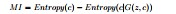
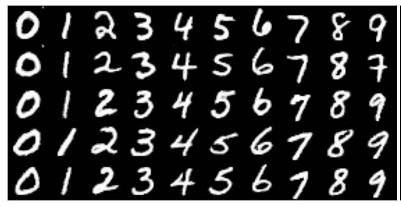
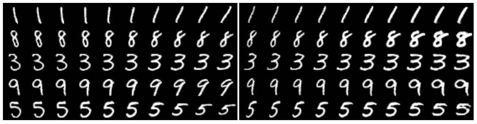
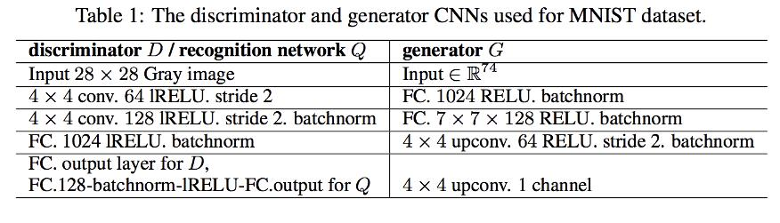
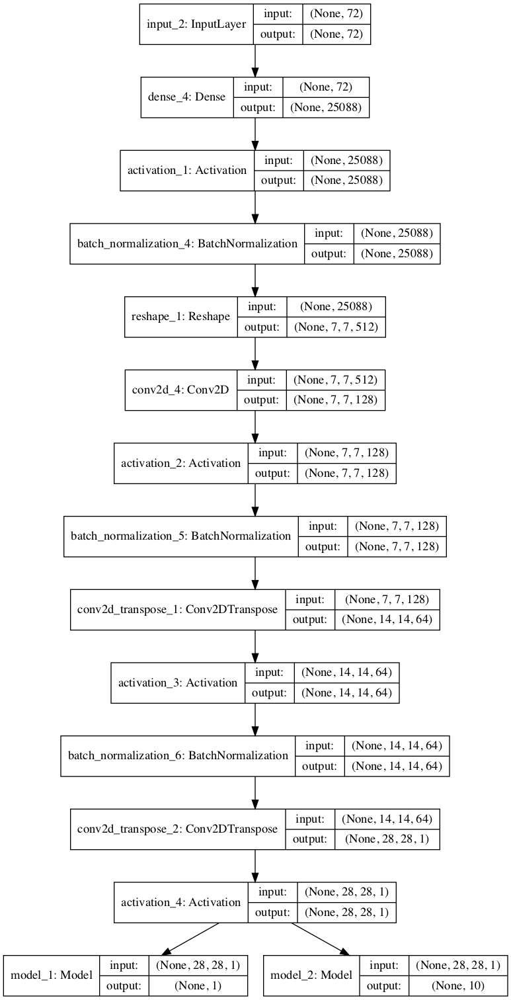
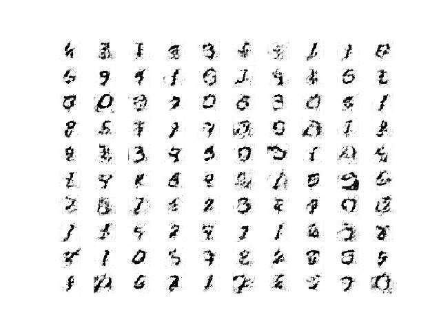
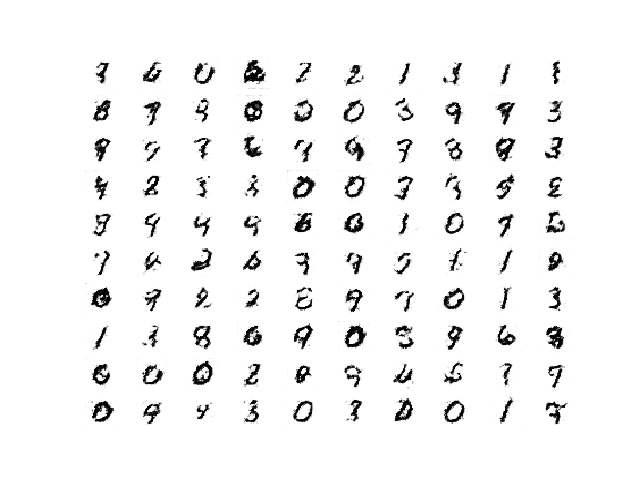
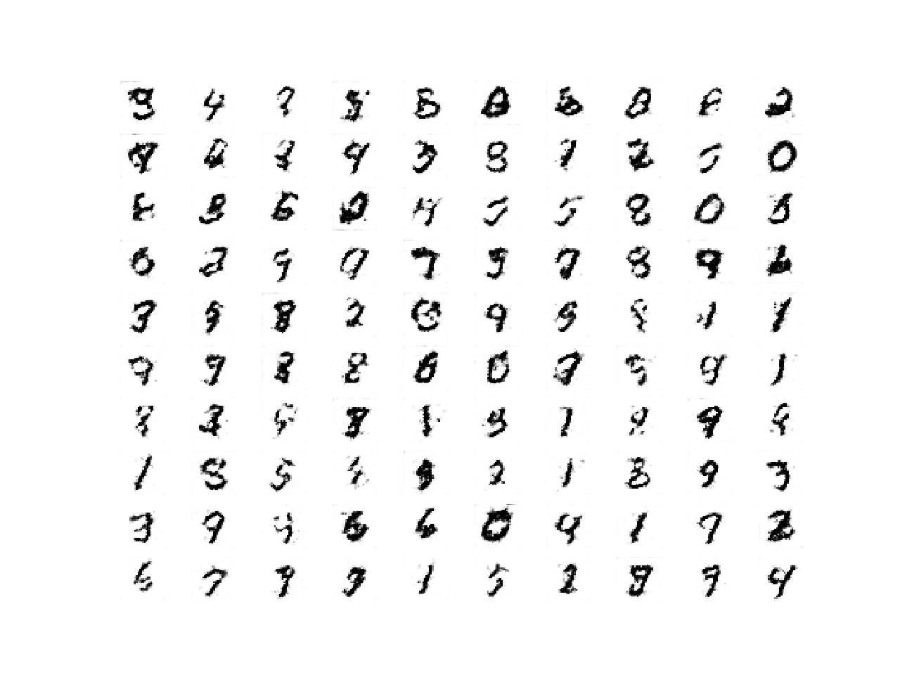
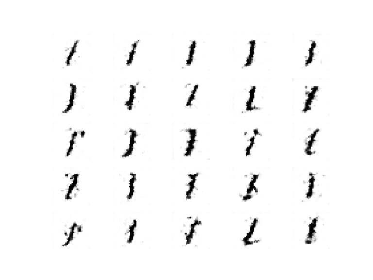
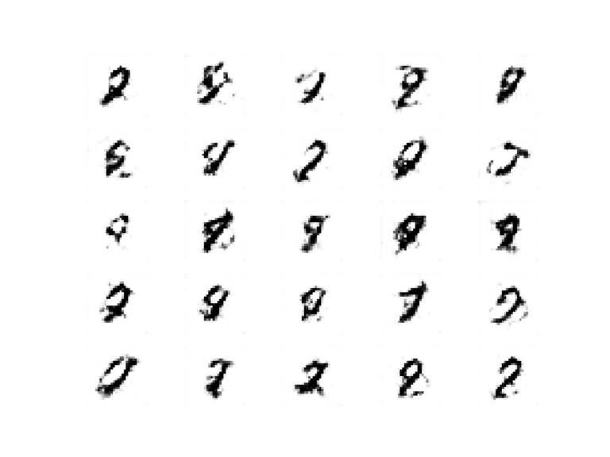

# Lab : Introduction to neural learning: gradient descent

#### Pre-reqs:
- Google Chrome (Recommended)

#### Lab Environment
Notebooks are ready to run. All packages have been installed. There is no requirement for any setup.

**Note:** Elev8ed Notebooks (powered by Jupyter) will be accessible at the port given to you by your instructor. Password for jupyterLab : `1234`

All Notebooks are present in `work/generative-adversarial-networks` folder. To copy and paste: use **Control-C** and to paste inside of a terminal, use **Control-V**

You can access jupyter lab at `<host-ip>:<port>/lab/workspaces/`


## How to Develop an Information Maximizing GAN (InfoGAN)

The Generative Adversarial Network, or GAN, is an architecture for training deep convolutional
models for generating synthetic images. Although remarkably effective, the default GAN
provides no control over the types of images that are generated. The Information Maximizing
GAN, or InfoGAN for short, is an extension to the GAN architecture that introduces control
variables that are automatically learned by the architecture and allow control over the generated
image, such as style, thickness, and type in the case of generating images of handwritten digits.
In this tutorial, you will discover how to implement an Information Maximizing Generative
Adversarial Network model from scratch. After completing this tutorial, you will know:

- The InfoGAN is motivated by the desire to disentangle and control the properties in
generated images.
- The InfoGAN involves the addition of control variables to generate an auxiliary model
that predicts the control variables, trained via mutual information loss function.
- How to develop and train an InfoGAN model from scratch and use the control variables
to control which digit is generated by the model.

Let’s get started.

## Tutorial Overview

This tutorial is divided into four parts; they are:

1. What Is the Information Maximizing GAN
2. How to Implement the InfoGAN Loss Function
3. How to Develop an InfoGAN for MNIST
4. How to Use Control Codes With an InfoGAN


## What Is the Information Maximizing GAN

The Generative Adversarial Network, or GAN for short, is an architecture for training a
generative model, such as a model for generating synthetic images. It involves the simultaneous
training of the generator model for generating images with a discriminator model that learns to
classify images as either real (from the training dataset) or fake (generated). The two models
compete in a zero-sum game such that convergence of the training process involves finding a
balance between the generator’s skill in generating convincing images and the discriminator’s in
being able to detect them. The generator model takes as input a random point from a latent
space, typically 50 to 100 random Gaussian variables. The generator applies a unique meaning
to the points in the latent space via training and maps points to specific output synthetic images.
This means that although the latent space is structured by the generator model, there is no
control over the generated image.

The GAN formulation uses a simple factored continuous input noise vector z, while
imposing no restrictions on the manner in which the generator may use this noise.
As a result, it is possible that the noise will be used by the generator in a highly
entangled way, causing the individual dimensions of z to not correspond to semantic
features of the data.

— InfoGAN: Interpretable Representation Learning by Information Maximizing Generative
Adversarial Nets, 2016.

The latent space can be explored and generated images compared in an attempt to understand
the mapping that the generator model has learned. Alternatively, the generation process can
be conditioned, such as via a class label, so that images of a specific type can be created on
demand. This is the basis for the Conditional Generative Adversarial Network, CGAN or cGAN
for short. Another approach is to provide control variables as input to the generator, along
with the point in latent space (noise). The generator can be trained to use the control variables
to influence specific properties of the generated images. This is the approach taken with the
Information Maximizing Generative Adversarial Network, or InfoGAN for short.

InfoGAN, an information-theoretic extension to the Generative Adversarial Network
that is able to learn disentangled representations in a completely unsupervised
manner.

— InfoGAN: Interpretable Representation Learning by Information Maximizing Generative
Adversarial Nets, 2016.

The structured mapping learned by the generator during the training process is somewhat
random. Although the generator model learns to spatially separate properties of generated
images in the latent space, there is no control. The properties are entangled. The InfoGAN is
motivated by the desire to disentangle the properties of generated images. For example, in the
case of faces, the properties of generating a face can be disentangled and controlled, such as the
shape of the face, hair color, hairstyle, and so on.

For example, for a dataset of faces, a useful disentangled representation may allocate
a separate set of dimensions for each of the following attributes: facial expression,
eye color, hairstyle, presence or absence of eyeglasses, and the identity of the
corresponding person.


— InfoGAN: Interpretable Representation Learning by Information Maximizing Generative
Adversarial Nets, 2016.

Control variables are provided along with the noise as input to the generator and the model
is trained via a mutual information loss function.

... we present a simple modification to the generative adversarial network objective
that encourages it to learn interpretable and meaningful representations. We do so
by maximizing the mutual information between a fixed small subset of the GAN’s
noise variables and the observations, which turns out to be relatively straightforward.

— InfoGAN: Interpretable Representation Learning by Information Maximizing Generative
Adversarial Nets, 2016.

Mutual information refers to the amount of information learned about one variable given
another variable. In this case, we are interested in the information about the control variables
given the image generated using noise and the control variables. In information theory, mutual
information between X and Y , I(X; Y ), measures the amount of information learned from
knowledge of random variable Y about the other random variable X. The Mutual Information
(M I) is calculated as the conditional entropy of the image (created by the generator (G) from
the noise (z) and the control variable (c)) given the control variables (c) subtracted from the
marginal entropy of the control variables (c); for example:



Calculating the true mutual information, in practice, is often intractable, although simplifications are adopted in the paper, referred to as Variational Information Maximization, and the
entropy for the control codes is kept constant. Training the generator via mutual information is
achieved through the use of a new model, referred to as Q or the auxiliary model. The new
model shares all of the same weights as the discriminator model for interpreting an input image,
but unlike the discriminator model that predicts whether the image is real or fake, the auxiliary
model predicts the control codes that were used to generate the image.

Both models are used to update the generator model, first to improve the likelihood
of generating images that fool the discriminator model, and second to improve the mutual
information between the control codes used to generate an image and the auxiliary model’s
prediction of the control codes. The result is that the generator model is regularized via mutual
information loss such that the control codes capture salient properties of the generated images
and, in turn, can be used to control the image generation process.

... mutual information can be utilized whenever we are interested in learning a
parametrized mapping from a given input X to a higher level representation Y
which preserves information about the original input. [...] show that the task of
maximizing mutual information is essentially equivalent to training an autoencoder
to minimize reconstruction error.

— Understanding Mutual Information and its use in InfoGAN, 2016.

## How to Implement the InfoGAN Loss Function

The InfoGAN is reasonably straightforward to implement once you are familiar with the inputs
and outputs of the model. The only stumbling block might be the mutual information loss
function, especially if you don’t have a strong math background, like most developers. There
are two main types of control variables used with the InfoGan: categorical and continuous, and
continuous variables may have different data distributions, which impact how the mutual loss is
calculated. The mutual loss can be calculated and summed across all control variables based on
the variable type, and this is the approach used in the official InfoGAN implementation released
by OpenAI for TensorFlow.

In Keras, it might be easier to simplify the control variables to categorical and either Gaussian
or Uniform continuous variables and have separate outputs on the auxiliary model for each
control variable type. This is so that a different loss function can be used, greatly simplifying the
implementation. See the papers and posts in the further reading section for more background
on the recommendations in this section.

## Categorical Control Variables

The categorical variable may be used to control the type or class of the generated image. This
is implemented as a one hot encoded vector. That is, if the class has 10 values, then the control
code would be one class, e.g. 6, and the categorical control vector input to the generator model
would be a 10 element vector of all zero values with a one value for class 6, for example, [0,
0, 0, 0, 0, 0, 1, 0, 0]. We do not need to choose the categorical control variables when
training the model; instead, they are generated randomly, e.g. each selected with a uniform
probability for each sample.

... a uniform categorical distribution on latent codes c ∼ Cat(K = 10, p = 0.1)

— InfoGAN: Interpretable Representation Learning by Information Maximizing Generative
Adversarial Nets, 2016.

In the auxiliary model, the output layer for the categorical variable would also be a one hot
encoded vector to match the input control code, and the softmax activation function is used.
For categorical latent code ci , we use the natural choice of softmax nonlinearity to
represent Q(ci |x).

— InfoGAN: Interpretable Representation Learning by Information Maximizing Generative
Adversarial Nets, 2016.

Recall that the mutual information is calculated as the conditional entropy from the control
variable and the output of the auxiliary model subtracted from the entropy of the control
variable provided to the input variable. We can implement this directly, but it’s not necessary.
The entropy of the control variable is a constant and comes out to be a very small number
close to zero; as such, we can remove it from our calculation. The conditional entropy can be
calculated directly as the cross-entropy between the control variable input and the output from
the auxiliary model. Therefore, the categorical cross-entropy loss function can be used, as we
would on any multiclass classification problem. A hyperparameter, lambda, is used to scale the
mutual information loss function and is set to 1, and therefore can be ignored.


Even though InfoGAN introduces an extra hyperparameter λ, it’s easy to tune and
simply setting to 1 is sufficient for discrete latent codes.

— InfoGAN: Interpretable Representation Learning by Information Maximizing Generative
Adversarial Nets, 2016.


## Continuous Control Variables

The continuous control variables may be used to control the style of the image. The continuous
variables are sampled from a uniform distribution, such as between -1 and 1, and provided as
input to the generator model.

... continuous codes that can capture variations that are continuous in nature:
c2, c3 ∼ U nif (−1, 1)

— InfoGAN: Interpretable Representation Learning by Information Maximizing Generative
Adversarial Nets, 2016.

The auxiliary model can implement the prediction of continuous control variables with a
Gaussian distribution, where the output layer is configured to have one node for the mean, and
one node for the standard deviation of the Gaussian, e.g. two outputs are required for each
continuous control variable.

For continuous latent code cj , there are more options depending on what is the true
posterior P (cj |x). In our experiments, we have found that simply treating Q(cj |x)
as a factored Gaussian is sufficient.

— InfoGAN: Interpretable Representation Learning by Information Maximizing Generative
Adversarial Nets, 2016.

Nodes that output the mean can use a linear activation function, whereas nodes that output
the standard deviation must produce a positive value, therefore an activation function such as
the sigmoid can be used to create a value between 0 and 1.

For continuous latent codes, we parameterize the approximate posterior through
a diagonal Gaussian distribution, and the recognition network outputs its mean
and standard deviation, where the standard deviation is parameterized through an
exponential transformation of the network output to ensure positivity.

— InfoGAN: Interpretable Representation Learning by Information Maximizing Generative
Adversarial Nets, 2016.

The loss function must be calculated as the mutual information on the Gaussian control
codes, meaning they must be reconstructed from the mean and standard deviation prior to
calculating the loss. Calculating the entropy and conditional entropy for Gaussian distributed
variables can be implemented directly, although is not necessary. Instead, the mean squared
error loss can be used. Alternately, the output distribution can be simplified to a uniform
distribution for each control variable, a single output node for each variable in the auxiliary
model with linear activation can be used, and the model can use the mean squared error loss
function.


##How to Develop an InfoGAN for MNIST

In this section, we will take a closer look at the generator (g), discriminator (d), and auxiliary
models (q) and how to implement them in Keras. We will develop an InfoGAN implementation
for the MNIST dataset (described in Section 7.2), as was done in the InfoGAN paper. The
paper explores two versions; the first uses just categorical control codes and allows the model to
map one categorical variable to approximately one digit (although there is no ordering of the
digits by categorical variables).




The paper also explores a version of the InfoGAN architecture with the one hot encoded
categorical variable (c1) and two continuous control variables (c2 and c3). The first continuous
variable is discovered to control the rotation of the digits and the second controls the thickness
of the digits.




We will focus on the simpler case of using a categorical control variable with 10 values and

encourage the model to learn to let this variable control the class of the generated digit. You
may want to extend this example by either changing the cardinality of the categorical control
variable or adding continuous control variables. The configuration of the GAN model used for
training on the MNIST dataset was provided as an appendix to the paper, reproduced below.
We will use the listed configuration as a starting point in developing our own generator (g),
discriminator (d), and auxiliary (q) models.




Let’s start off by developing the generator model as a deep convolutional neural network (e.g.
a DCGAN). The model could take the noise vector (z) and control vector (c) as separate inputs
and concatenate them before using them as the basis for generating the image. Alternately,
the vectors can be concatenated beforehand and provided to a single input layer in the model.
The approaches are equivalent and we will use the latter in this case to keep the model simple.
The define generator() function below defines the generator model and takes the size of the
input vector as an argument.
A fully connected layer takes the input vector and produces a sufficient number of activations
to create 512 7 × 7 feature maps from which the activations are reshaped. These then pass
through a normal convolutional layer with 1×1 stride, then two subsequent upsampling transpose
convolutional layers with a 2 × 2 stride first to 14 × 14 feature maps then to the desired 1
channel 28 × 28 feature map output with pixel values in the range [-1,-1] via a Tanh activation
function. Good generator configuration heuristics are as follows, including a random Gaussian
weight initialization, ReLU activations in the hidden layers, and use of batch normalization.

```
# define the standalone generator model
def define_generator(gen_input_size):
# weight initialization
init = RandomNormal(stddev=0.02)
# image generator input
in_lat = Input(shape=(gen_input_size,))
# foundation for 7x7 image
n_nodes = 512 * 7 * 7
gen = Dense(n_nodes, kernel_initializer=init)(in_lat)
gen = Activation('relu')(gen)
gen = BatchNormalization()(gen)
gen = Reshape((7, 7, 512))(gen)
# normal
gen = Conv2D(128, (4,4), padding='same', kernel_initializer=init)(gen)

### 18.4. How to Develop an InfoGAN for MNIST

370

gen = Activation('relu')(gen)
gen = BatchNormalization()(gen)
# upsample to 14x14
gen = Conv2DTranspose(64, (4,4), strides=(2,2), padding='same',
kernel_initializer=init)(gen)
gen = Activation('relu')(gen)
gen = BatchNormalization()(gen)
# upsample to 28x28
gen = Conv2DTranspose(1, (4,4), strides=(2,2), padding='same',
kernel_initializer=init)(gen)
# tanh output
out_layer = Activation('tanh')(gen)
# define model
model = Model(in_lat, out_layer)
return model

```

Next, we can define the discriminator and auxiliary models. The discriminator model is
trained in a standalone manner on real and fake images, as per a normal GAN. Neither the
generator nor the auxiliary models are fit directly; instead, they are fit as part of a composite
model. Both the discriminator and auxiliary models share the same input and feature extraction
layers but differ in their output layers. Therefore, it makes sense to define them both at the same
time. Again, there are many ways that this architecture could be implemented, but defining the
discriminator and auxiliary models as separate models first allows us later to combine them into
a larger GAN model directly via the functional API.
The define discriminator() function below defines the discriminator and auxiliary models
and takes the cardinality of the categorical variable (e.g. number of values, such as 10) as an
input. The shape of the input image is also parameterized as a function argument and set
to the default value of the size of the MNIST images. The feature extraction layers involve
two downsampling layers, used instead of pooling layers as a best practice. Also following best
practice for DCGAN models, we use the LeakyReLU activation and batch normalization.
The discriminator model (d) has a single output node and predicts the probability of an
input image being real via the sigmoid activation function. The model is compiled as it will be
used in a standalone way, optimizing the binary cross-entropy function via the Adam version
of stochastic gradient descent with best practice learning rate and momentum. The auxiliary
model (q) has one node output for each value in the categorical variable and uses a softmax
activation function. A fully connected layer is added between the feature extraction layers and
the output layer, as was used in the InfoGAN paper. The model is not compiled as it is not for
or used in a standalone manner.

```
# define the standalone discriminator model
def define_discriminator(n_cat, in_shape=(28,28,1)):
# weight initialization
init = RandomNormal(stddev=0.02)
# image input
in_image = Input(shape=in_shape)
# downsample to 14x14
d = Conv2D(64, (4,4), strides=(2,2), padding='same', kernel_initializer=init)(in_image)
d = LeakyReLU(alpha=0.1)(d)
# downsample to 7x7
d = Conv2D(128, (4,4), strides=(2,2), padding='same', kernel_initializer=init)(d)

d = LeakyReLU(alpha=0.1)(d)
d = BatchNormalization()(d)
# normal
d = Conv2D(256, (4,4), padding='same', kernel_initializer=init)(d)
d = LeakyReLU(alpha=0.1)(d)
d = BatchNormalization()(d)
# flatten feature maps
d = Flatten()(d)
# real/fake output
out_classifier = Dense(1, activation='sigmoid')(d)
# define d model
d_model = Model(in_image, out_classifier)
# compile d model
d_model.compile(loss='binary_crossentropy', optimizer=Adam(lr=0.0002, beta_1=0.5))
# create q model layers
q = Dense(128)(d)
q = BatchNormalization()(q)
q = LeakyReLU(alpha=0.1)(q)
# q model output
out_codes = Dense(n_cat, activation='softmax')(q)
# define q model
q_model = Model(in_image, out_codes)
return d_model, q_model

```

Next, we can define the composite GAN model. This model uses all submodels and is
the basis for training the weights of the generator model. The define gan() function below
implements this and defines and returns the model, taking the three submodels as input. The
discriminator is trained in a standalone manner as mentioned, therefore all weights of the
discriminator are set as not trainable (in this context only). The output of the generator model
is connected to the input of the discriminator model, and to the input of the auxiliary model.
This creates a new composite model that takes a [noise + control] vector as input, that
then passes through the generator to produce an image. The image then passes through the
discriminator model to produce a classification and through the auxiliary model to produce a
prediction of the control variables. The model has two output layers that need to be trained
with different loss functions. Binary cross-entropy loss is used for the discriminator output, as
we did when compiling the discriminator for standalone use, and mutual information loss is
used for the auxiliary model, which, in this case, can be implemented directly as categorical
cross-entropy and achieve the desired result.

```
# define the combined discriminator, generator and q network model
def define_gan(g_model, d_model, q_model):
# make weights in the discriminator (some shared with the q model) as not trainable
d_model.trainable = False
# connect g outputs to d inputs
d_output = d_model(g_model.output)
# connect g outputs to q inputs
q_output = q_model(g_model.output)
# define composite model
model = Model(g_model.input, [d_output, q_output])
# compile model
opt = Adam(lr=0.0002, beta_1=0.5)
model.compile(loss=['binary_crossentropy', 'categorical_crossentropy'], optimizer=opt)
return model

```

To make the GAN model architecture clearer, we can create the models and a plot of the
composite model. The complete example is listed below.

```
# create and plot the infogan model for mnist
from keras.optimizers import Adam
from keras.models import Model
from keras.layers import Input
from keras.layers import Dense
from keras.layers import Reshape
from keras.layers import Flatten
from keras.layers import Conv2D
from keras.layers import Conv2DTranspose
from keras.layers import LeakyReLU
from keras.layers import BatchNormalization
from keras.layers import Activation
from keras.initializers import RandomNormal
from keras.utils.vis_utils import plot_model
# define the standalone discriminator model
def define_discriminator(n_cat, in_shape=(28,28,1)):
# weight initialization
init = RandomNormal(stddev=0.02)
# image input
in_image = Input(shape=in_shape)
# downsample to 14x14
d = Conv2D(64, (4,4), strides=(2,2), padding='same', kernel_initializer=init)(in_image)
d = LeakyReLU(alpha=0.1)(d)
# downsample to 7x7
d = Conv2D(128, (4,4), strides=(2,2), padding='same', kernel_initializer=init)(d)
d = LeakyReLU(alpha=0.1)(d)
d = BatchNormalization()(d)
# normal
d = Conv2D(256, (4,4), padding='same', kernel_initializer=init)(d)
d = LeakyReLU(alpha=0.1)(d)
d = BatchNormalization()(d)
# flatten feature maps
d = Flatten()(d)
# real/fake output
out_classifier = Dense(1, activation='sigmoid')(d)
# define d model
d_model = Model(in_image, out_classifier)
# compile d model
d_model.compile(loss='binary_crossentropy', optimizer=Adam(lr=0.0002, beta_1=0.5))
# create q model layers
q = Dense(128)(d)
q = BatchNormalization()(q)
q = LeakyReLU(alpha=0.1)(q)
# q model output
out_codes = Dense(n_cat, activation='softmax')(q)
# define q model
q_model = Model(in_image, out_codes)
return d_model, q_model

# define the standalone generator model
def define_generator(gen_input_size):
# weight initialization
init = RandomNormal(stddev=0.02)
# image generator input
in_lat = Input(shape=(gen_input_size,))
# foundation for 7x7 image
n_nodes = 512 * 7 * 7
gen = Dense(n_nodes, kernel_initializer=init)(in_lat)
gen = Activation('relu')(gen)
gen = BatchNormalization()(gen)
gen = Reshape((7, 7, 512))(gen)
# normal
gen = Conv2D(128, (4,4), padding='same', kernel_initializer=init)(gen)
gen = Activation('relu')(gen)
gen = BatchNormalization()(gen)
# upsample to 14x14
gen = Conv2DTranspose(64, (4,4), strides=(2,2), padding='same',
kernel_initializer=init)(gen)
gen = Activation('relu')(gen)
gen = BatchNormalization()(gen)
# upsample to 28x28
gen = Conv2DTranspose(1, (4,4), strides=(2,2), padding='same',
kernel_initializer=init)(gen)
# tanh output
out_layer = Activation('tanh')(gen)
# define model
model = Model(in_lat, out_layer)
return model
# define the combined discriminator, generator and q network model
def define_gan(g_model, d_model, q_model):
# make weights in the discriminator (some shared with the q model) as not trainable
d_model.trainable = False
# connect g outputs to d inputs
d_output = d_model(g_model.output)
# connect g outputs to q inputs
q_output = q_model(g_model.output)
# define composite model
model = Model(g_model.input, [d_output, q_output])
# compile model
opt = Adam(lr=0.0002, beta_1=0.5)
model.compile(loss=['binary_crossentropy', 'categorical_crossentropy'], optimizer=opt)
return model
# number of values for the categorical control code
n_cat = 10
# size of the latent space
latent_dim = 62
# create the discriminator
d_model, q_model = define_discriminator(n_cat)
# create the generator
gen_input_size = latent_dim + n_cat
g_model = define_generator(gen_input_size)
# create the gan
gan_model = define_gan(g_model, d_model, q_model)


# plot the model
plot_model(gan_model, to_file='gan_plot.png', show_shapes=True, show_layer_names=True)

```

##### Run Notebook
Click notebook `01_define_plot_models.ipynb` in jupterLab UI and run jupyter notebook.

Running the example creates all three models, then creates the composite GAN model and
saves a plot of the model architecture.

<h5><span style="color:red;">Note:</span></h5> Creating a plot of the model assumes that the pydot and graphviz libraries are
installed. If this is a problem, you can comment out the import statement and the function call
for plot model().

The plot shows all of the detail for the generator model and the compressed description
of the discriminator and auxiliary models. Importantly, note the shape of the output of the
discriminator as a single node for predicting whether the image is real or fake, and the 10
nodes for the auxiliary model to predict the categorical control code. Recall that this composite
model will only be used to update the model weights of the generator and auxiliary models,
and all weights in the discriminator model will remain untrainable, i.e. only updated when the
standalone discriminator model is updated.




Next, we will develop inputs for the generator. Each input will be a vector comprised of

noise and the control codes. Specifically, a vector of Gaussian random numbers and a one
hot encoded randomly selected categorical value. The generate latent points() function
below implements this, taking as input the size of the latent space, the number of categorical
values, and the number of samples to generate as arguments. The function returns the input
concatenated vectors as input for the generator model, as well as the standalone control codes.
The standalone control codes will be required when updating the generator and auxiliary models
via the composite GAN model, specifically for calculating the mutual information loss for the
auxiliary model.

```
# generate points in latent space as input for the generator
def generate_latent_points(latent_dim, n_cat, n_samples):
# generate points in the latent space
z_latent = randn(latent_dim * n_samples)
# reshape into a batch of inputs for the network
z_latent = z_latent.reshape(n_samples, latent_dim)
# generate categorical codes
cat_codes = randint(0, n_cat, n_samples)
# one hot encode
cat_codes = to_categorical(cat_codes, num_classes=n_cat)
# concatenate latent points and control codes
z_input = hstack((z_latent, cat_codes))
return [z_input, cat_codes]

```

Next, we can generate real and fake examples. The MNIST dataset can be loaded, transformed
into 3D input by adding an additional dimension for the grayscale images, and scaling all pixel
values to the range [-1,1] to match the output from the generator model. This is implemented
in the load real samples() function below. We can retrieve batches of real samples required
when training the discriminator by choosing a random subset of the dataset. This is implemented
in the generate real samples() function below that returns the images and the class label of 1,
to indicate to the discriminator that they are real images. The discriminator also requires batches
of fake samples generated via the generator, using the vectors from generate latent points()
function as input. The generate fake samples() function below implements this, returning
the generated images along with the class label of 0, to indicate to the discriminator that they
are fake images.

```
# load images
def load_real_samples():
# load dataset
(trainX, _), (_, _) = load_data()
# expand to 3d, e.g. add channels
X = expand_dims(trainX, axis=-1)
# convert from ints to floats
X = X.astype('float32')
# scale from [0,255] to [-1,1]
X = (X - 127.5) / 127.5
print(X.shape)
return X
# select real samples
def generate_real_samples(dataset, n_samples):
# choose random instances

ix = randint(0, dataset.shape[0], n_samples)
# select images and labels
X = dataset[ix]
# generate class labels
y = ones((n_samples, 1))
return X, y
# use the generator to generate n fake examples, with class labels
def generate_fake_samples(generator, latent_dim, n_cat, n_samples):
# generate points in latent space and control codes
z_input, _ = generate_latent_points(latent_dim, n_cat, n_samples)
# predict outputs
images = generator.predict(z_input)
# create class labels
y = zeros((n_samples, 1))
return images, y

```

Next, we need to keep track of the quality of the generated images. We will periodically use
the generator to generate a sample of images and save the generator and composite models to file.
We can then review the generated images at the end of training in order to choose a final generator
model and load the model to start using it to generate images. The summarize performance()
function below implements this, first generating 100 images, scaling their pixel values back to
the range [0,1], and saving them as a plot of images in a 10 × 10 square. The generator and
composite GAN models are also saved to file, with a unique filename based on the training
iteration number.

```
# generate samples and save as a plot and save the model
def summarize_performance(step, g_model, gan_model, latent_dim, n_cat, n_samples=100):
# prepare fake examples
X, _ = generate_fake_samples(g_model, latent_dim, n_cat, n_samples)
# scale from [-1,1] to [0,1]
X = (X + 1) / 2.0
# plot images
for i in range(100):
# define subplot
pyplot.subplot(10, 10, 1 + i)
# turn off axis
pyplot.axis('off')
# plot raw pixel data
pyplot.imshow(X[i, :, :, 0], cmap='gray_r')
# save plot to file
filename1 = 'generated_plot_%04d.png' % (step+1)
pyplot.savefig(filename1)
pyplot.close()
# save the generator model
filename2 = 'model_%04d.h5' % (step+1)
g_model.save(filename2)
# save the gan model
filename3 = 'gan_model_%04d.h5' % (step+1)
gan_model.save(filename3)
print('>Saved: %s, %s, and %s' % (filename1, filename2, filename3))

```


Finally, we can train the InfoGAN. This is implemented in the train() function below that
takes the defined models and configuration as arguments and runs the training process. The
models are trained for 100 epochs and 64 samples are used in each batch. There are 60,000
images in the MNIST training dataset, therefore one epoch involves 60000
, or 937 batches or
64
training iterations. Multiplying this by the number of epochs, or 100, means that there will
be a total of 93,700 total training iterations. Each training iteration involves first updating
the discriminator with half a batch of real samples and half a batch of fake samples to form
one batch worth of weight updates, or 64, each iteration. Next, the composite GAN model is
updated based on a batch worth of noise and control code inputs. The loss of the discriminator
on real and fake images and the loss of the generator and auxiliary model is reported each
training iteration.

```
# train the generator and discriminator
def train(g_model, d_model, gan_model, dataset, latent_dim, n_cat, n_epochs=100,
n_batch=64):
# calculate the number of batches per training epoch
bat_per_epo = int(dataset.shape[0] / n_batch)
# calculate the number of training iterations
n_steps = bat_per_epo * n_epochs
# calculate the size of half a batch of samples
half_batch = int(n_batch / 2)
# manually enumerate epochs
for i in range(n_steps):
# get randomly selected 'real' samples
X_real, y_real = generate_real_samples(dataset, half_batch)
# update discriminator and q model weights
d_loss1 = d_model.train_on_batch(X_real, y_real)
# generate 'fake' examples
X_fake, y_fake = generate_fake_samples(g_model, latent_dim, n_cat, half_batch)
# update discriminator model weights
d_loss2 = d_model.train_on_batch(X_fake, y_fake)
# prepare points in latent space as input for the generator
z_input, cat_codes = generate_latent_points(latent_dim, n_cat, n_batch)
# create inverted labels for the fake samples
y_gan = ones((n_batch, 1))
# update the g via the d and q error
_,g_1,g_2 = gan_model.train_on_batch(z_input, [y_gan, cat_codes])
# summarize loss on this batch
print('>%d, d[%.3f,%.3f], g[%.3f] q[%.3f]' % (i+1, d_loss1, d_loss2, g_1, g_2))
# evaluate the model performance every 'epoch'
if (i+1) % (bat_per_epo * 10) == 0:
summarize_performance(i, g_model, gan_model, latent_dim, n_cat)

```

We can then configure and create the models, then run the training process. We will use 10
values for the single categorical variable to match the 10 known classes in the MNIST dataset.
We will use a latent space with 64 dimensions to match the InfoGAN paper, meaning, in this
case, each input vector to the generator model will be 64 (random Gaussian variables) + 10
(one hot encoded control variable) or 72 elements in length.

```
# number of values for the categorical control code
n_cat = 10
# size of the latent space
latent_dim = 62
# create the discriminator
d_model, q_model = define_discriminator(n_cat)
# create the generator
gen_input_size = latent_dim + n_cat
g_model = define_generator(gen_input_size)
# create the gan
gan_model = define_gan(g_model, d_model, q_model)
# load image data
dataset = load_real_samples()
# train model
train(g_model, d_model, gan_model, dataset, latent_dim, n_cat)

```

Tying this together, the complete example of training an InfoGAN model on the MNIST
dataset with a single categorical control variable is listed below.

```
# example of training an infogan on mnist
from numpy import zeros
from numpy import ones
from numpy import expand_dims
from numpy import hstack
from numpy.random import randn
from numpy.random import randint
from keras.datasets.mnist import load_data
from keras.optimizers import Adam
from keras.initializers import RandomNormal
from keras.utils import to_categorical
from keras.models import Model
from keras.layers import Input
from keras.layers import Dense
from keras.layers import Reshape
from keras.layers import Flatten
from keras.layers import Conv2D
from keras.layers import Conv2DTranspose
from keras.layers import LeakyReLU
from keras.layers import BatchNormalization
from keras.layers import Activation
from matplotlib import pyplot
# define the standalone discriminator model
def define_discriminator(n_cat, in_shape=(28,28,1)):
# weight initialization
init = RandomNormal(stddev=0.02)
# image input
in_image = Input(shape=in_shape)
# downsample to 14x14
d = Conv2D(64, (4,4), strides=(2,2), padding='same', kernel_initializer=init)(in_image)
d = LeakyReLU(alpha=0.1)(d)
# downsample to 7x7
d = Conv2D(128, (4,4), strides=(2,2), padding='same', kernel_initializer=init)(d)
d = LeakyReLU(alpha=0.1)(d)
d = BatchNormalization()(d)

# normal
d = Conv2D(256, (4,4), padding='same', kernel_initializer=init)(d)
d = LeakyReLU(alpha=0.1)(d)
d = BatchNormalization()(d)
# flatten feature maps
d = Flatten()(d)
# real/fake output
out_classifier = Dense(1, activation='sigmoid')(d)
# define d model
d_model = Model(in_image, out_classifier)
# compile d model
d_model.compile(loss='binary_crossentropy', optimizer=Adam(lr=0.0002, beta_1=0.5))
# create q model layers
q = Dense(128)(d)
q = BatchNormalization()(q)
q = LeakyReLU(alpha=0.1)(q)
# q model output
out_codes = Dense(n_cat, activation='softmax')(q)
# define q model
q_model = Model(in_image, out_codes)
return d_model, q_model
# define the standalone generator model
def define_generator(gen_input_size):
# weight initialization
init = RandomNormal(stddev=0.02)
# image generator input
in_lat = Input(shape=(gen_input_size,))
# foundation for 7x7 image
n_nodes = 512 * 7 * 7
gen = Dense(n_nodes, kernel_initializer=init)(in_lat)
gen = Activation('relu')(gen)
gen = BatchNormalization()(gen)
gen = Reshape((7, 7, 512))(gen)
# normal
gen = Conv2D(128, (4,4), padding='same', kernel_initializer=init)(gen)
gen = Activation('relu')(gen)
gen = BatchNormalization()(gen)
# upsample to 14x14
gen = Conv2DTranspose(64, (4,4), strides=(2,2), padding='same',
kernel_initializer=init)(gen)
gen = Activation('relu')(gen)
gen = BatchNormalization()(gen)
# upsample to 28x28
gen = Conv2DTranspose(1, (4,4), strides=(2,2), padding='same',
kernel_initializer=init)(gen)
# tanh output
out_layer = Activation('tanh')(gen)
# define model
model = Model(in_lat, out_layer)
return model
# define the combined discriminator, generator and q network model
def define_gan(g_model, d_model, q_model):
# make weights in the discriminator (some shared with the q model) as not trainable
d_model.trainable = False

# connect g outputs to d inputs
d_output = d_model(g_model.output)
# connect g outputs to q inputs
q_output = q_model(g_model.output)
# define composite model
model = Model(g_model.input, [d_output, q_output])
# compile model
opt = Adam(lr=0.0002, beta_1=0.5)
model.compile(loss=['binary_crossentropy', 'categorical_crossentropy'], optimizer=opt)
return model
# load images
def load_real_samples():
# load dataset
(trainX, _), (_, _) = load_data()
# expand to 3d, e.g. add channels
X = expand_dims(trainX, axis=-1)
# convert from ints to floats
X = X.astype('float32')
# scale from [0,255] to [-1,1]
X = (X - 127.5) / 127.5
print(X.shape)
return X
# select real samples
def generate_real_samples(dataset, n_samples):
# choose random instances
ix = randint(0, dataset.shape[0], n_samples)
# select images and labels
X = dataset[ix]
# generate class labels
y = ones((n_samples, 1))
return X, y
# generate points in latent space as input for the generator
def generate_latent_points(latent_dim, n_cat, n_samples):
# generate points in the latent space
z_latent = randn(latent_dim * n_samples)
# reshape into a batch of inputs for the network
z_latent = z_latent.reshape(n_samples, latent_dim)
# generate categorical codes
cat_codes = randint(0, n_cat, n_samples)
# one hot encode
cat_codes = to_categorical(cat_codes, num_classes=n_cat)
# concatenate latent points and control codes
z_input = hstack((z_latent, cat_codes))
return [z_input, cat_codes]
# use the generator to generate n fake examples, with class labels
def generate_fake_samples(generator, latent_dim, n_cat, n_samples):
# generate points in latent space and control codes
z_input, _ = generate_latent_points(latent_dim, n_cat, n_samples)
# predict outputs
images = generator.predict(z_input)
# create class labels
y = zeros((n_samples, 1))

return images, y
# generate samples and save as a plot and save the model
def summarize_performance(step, g_model, gan_model, latent_dim, n_cat, n_samples=100):
# prepare fake examples
X, _ = generate_fake_samples(g_model, latent_dim, n_cat, n_samples)
# scale from [-1,1] to [0,1]
X = (X + 1) / 2.0
# plot images
for i in range(100):
# define subplot
pyplot.subplot(10, 10, 1 + i)
# turn off axis
pyplot.axis('off')
# plot raw pixel data
pyplot.imshow(X[i, :, :, 0], cmap='gray_r')
# save plot to file
filename1 = 'generated_plot_%04d.png' % (step+1)
pyplot.savefig(filename1)
pyplot.close()
# save the generator model
filename2 = 'model_%04d.h5' % (step+1)
g_model.save(filename2)
# save the gan model
filename3 = 'gan_model_%04d.h5' % (step+1)
gan_model.save(filename3)
print('>Saved: %s, %s, and %s' % (filename1, filename2, filename3))
# train the generator and discriminator
def train(g_model, d_model, gan_model, dataset, latent_dim, n_cat, n_epochs=100,
n_batch=64):
# calculate the number of batches per training epoch
bat_per_epo = int(dataset.shape[0] / n_batch)
# calculate the number of training iterations
n_steps = bat_per_epo * n_epochs
# calculate the size of half a batch of samples
half_batch = int(n_batch / 2)
# manually enumerate epochs
for i in range(n_steps):
# get randomly selected 'real' samples
X_real, y_real = generate_real_samples(dataset, half_batch)
# update discriminator and q model weights
d_loss1 = d_model.train_on_batch(X_real, y_real)
# generate 'fake' examples
X_fake, y_fake = generate_fake_samples(g_model, latent_dim, n_cat, half_batch)
# update discriminator model weights
d_loss2 = d_model.train_on_batch(X_fake, y_fake)
# prepare points in latent space as input for the generator
z_input, cat_codes = generate_latent_points(latent_dim, n_cat, n_batch)
# create inverted labels for the fake samples
y_gan = ones((n_batch, 1))
# update the g via the d and q error
_,g_1,g_2 = gan_model.train_on_batch(z_input, [y_gan, cat_codes])
# summarize loss on this batch
print('>%d, d[%.3f,%.3f], g[%.3f] q[%.3f]' % (i+1, d_loss1, d_loss2, g_1, g_2))
# evaluate the model performance every 'epoch'


if (i+1) % (bat_per_epo * 10) == 0:
summarize_performance(i, g_model, gan_model, latent_dim, n_cat)
# number of values for the categorical control code
n_cat = 10
# size of the latent space
latent_dim = 62
# create the discriminator
d_model, q_model = define_discriminator(n_cat)
# create the generator
gen_input_size = latent_dim + n_cat
g_model = define_generator(gen_input_size)
# create the gan
gan_model = define_gan(g_model, d_model, q_model)
# load image data
dataset = load_real_samples()
# train model
train(g_model, d_model, gan_model, dataset, latent_dim, n_cat)

```

##### Run Notebook
Click notebook `02_train_infogan.ipynb` in jupterLab UI and run jupyter notebook.

<h5><span style="color:red;">Note:</span></h5> Running the example may take many hours to run on CPU hardware. I recommend
running the example on GPU hardware if possible. If you need help, you can get started
quickly by using an AWS EC2 instance to train the model.

The loss across the models is reported each training iteration. If the loss for the discriminator
remains at 0.0 or goes to 0.0 for an extended time, this may be a sign of a training failure and
you may want to restart the training process. The discriminator loss may start at 0.0, but will
likely rise, as it did in this specific case. The loss for the auxiliary model will likely go to zero,
as it perfectly predicts the categorical variable. Loss for the generator and discriminator models
is likely to hover around 1.0 eventually, to demonstrate a stable training process or equilibrium
between the training of the two models.

<h5><span style="color:red;">Note:</span></h5> Your specific results may vary given the stochastic nature of the learning algorithm.
Consider running the example a few times and compare the average performance.

```
>1, d[0.924,0.758], g[0.448] q[2.909]
>2, d[0.000,2.699], g[0.547] q[2.704]
>3, d[0.000,1.557], g[1.175] q[2.820]
>4, d[0.000,0.941], g[1.466] q[2.813]
>5, d[0.000,1.013], g[1.908] q[2.715]
...
>93696, d[0.814,1.212], g[1.283] q[0.000]
>93697, d[1.063,0.920], g[1.132] q[0.000]
>93698, d[0.999,1.188], g[1.128] q[0.000]
>93699, d[0.935,0.985], g[1.229] q[0.000]
>93700, d[0.968,1.016], g[1.200] q[0.001]
>Saved: generated_plot_93700.png, model_93700.h5, and gan_model_93700.h5

```

Plots and models are saved every 10 epochs or every 9,370 training iterations. Reviewing the
plots should show poor quality images in early epochs and improved and stable quality images
in later epochs. For example, the plot of images saved after the first 10 epochs is below showing
low-quality generated images.



More epochs does not mean better quality, meaning that the best quality images may not
be those from the final model saved at the end of training. Review the plots and choose a final
model with the best image quality. In this case, we will use the model saved after 100 epochs or
93,700 training iterations.





## How to Use Control Codes With an InfoGAN

Now that we have trained the InfoGAN model, we can explore how to use it. First, we can
load the model and use it to generate random images, as we did during training. The complete
example is listed below. Change the model filename to match the model filename that generated
the best images during your training run.

```
# example of loading the generator model and generating images
from math import sqrt
from numpy import hstack
from numpy.random import randn
from numpy.random import randint
from keras.models import load_model
from keras.utils import to_categorical
from matplotlib import pyplot
# generate points in latent space as input for the generator
def generate_latent_points(latent_dim, n_cat, n_samples):
# generate points in the latent space
z_latent = randn(latent_dim * n_samples)
# reshape into a batch of inputs for the network
z_latent = z_latent.reshape(n_samples, latent_dim)


# generate categorical codes
cat_codes = randint(0, n_cat, n_samples)
# one hot encode
cat_codes = to_categorical(cat_codes, num_classes=n_cat)
# concatenate latent points and control codes
z_input = hstack((z_latent, cat_codes))
return [z_input, cat_codes]
# create a plot of generated images
def create_plot(examples, n_examples):
# plot images
for i in range(n_examples):
# define subplot
pyplot.subplot(sqrt(n_examples), sqrt(n_examples), 1 + i)
# turn off axis
pyplot.axis('off')
# plot raw pixel data
pyplot.imshow(examples[i, :, :, 0], cmap='gray_r')
pyplot.show()
# load model
model = load_model('model_93700.h5')
# number of values for the categorical control code
n_cat = 10
# size of the latent space
latent_dim = 62
# number of examples to generate
n_samples = 100
# generate points in latent space and control codes
z_input, _ = generate_latent_points(latent_dim, n_cat, n_samples)
# predict outputs
X = model.predict(z_input)
# scale from [-1,1] to [0,1]
X = (X + 1) / 2.0
# plot the result
create_plot(X, n_samples)

```

##### Run Notebook
Click notebook `03_inference_infogan.ipynb` in jupterLab UI and run jupyter notebook.


Running the example will load the saved generator model and use it to generate 100 random
images and plot the images on a 10 × 10 grid.




Next, we can update the example to test how much control our control variable gives us.
We can update the generate latent points() function to take an argument of the value for
the categorical value in [0,9], encode it, and use it as input along with noise vectors.

```
# generate points in latent space as input for the generator
def generate_latent_points(latent_dim, n_cat, n_samples, digit):
# generate points in the latent space
z_latent = randn(latent_dim * n_samples)
# reshape into a batch of inputs for the network
z_latent = z_latent.reshape(n_samples, latent_dim)
# define categorical codes
cat_codes = asarray([digit for _ in range(n_samples)])
# one hot encode
cat_codes = to_categorical(cat_codes, num_classes=n_cat)
# concatenate latent points and control codes
z_input = hstack((z_latent, cat_codes))
return [z_input, cat_codes]

```

We can test this by generating a grid of 25 images with the categorical value 1. The complete
example is listed below.

```
# example of testing different values of the categorical control variable
from math import sqrt
from numpy import asarray
from numpy import hstack
from numpy.random import randn
from keras.models import load_model
from keras.utils import to_categorical
from matplotlib import pyplot
# generate points in latent space as input for the generator
def generate_latent_points(latent_dim, n_cat, n_samples, digit):
# generate points in the latent space
z_latent = randn(latent_dim * n_samples)
# reshape into a batch of inputs for the network
z_latent = z_latent.reshape(n_samples, latent_dim)
# define categorical codes
cat_codes = asarray([digit for _ in range(n_samples)])
# one hot encode
cat_codes = to_categorical(cat_codes, num_classes=n_cat)
# concatenate latent points and control codes
z_input = hstack((z_latent, cat_codes))
return [z_input, cat_codes]
# create and save a plot of generated images
def save_plot(examples, n_examples):
# plot images
for i in range(n_examples):
# define subplot
pyplot.subplot(sqrt(n_examples), sqrt(n_examples), 1 + i)
# turn off axis
pyplot.axis('off')
# plot raw pixel data
pyplot.imshow(examples[i, :, :, 0], cmap='gray_r')
pyplot.show()
# load model
model = load_model('model_93700.h5')
# number of categorical control codes
n_cat = 10
# size of the latent space
latent_dim = 62
# number of examples to generate
n_samples = 25
# define digit
digit = 1
# generate points in latent space and control codes
z_input, _ = generate_latent_points(latent_dim, n_cat, n_samples, digit)
# predict outputs
X = model.predict(z_input)
# scale from [-1,1] to [0,1]
X = (X + 1) / 2.0
# plot the result
save_plot(X, n_samples)

```

##### Run Notebook
Click notebook `04_inference_control_code.ipynb` in jupterLab UI and run jupyter notebook.

The result is a grid of 25 generated images generated with the categorical code set to the
value 1.

<h5><span style="color:red;">Note:</span></h5> Your specific results may vary given the stochastic nature of the learning algorithm.
Consider running the example a few times and compare the average performance.
The values of the control code are expected to influence the generated images; specifically,
they are expected to influence the digit type. They are not expected to be ordered though, e.g.
control codes of 1, 2, and 3 to create those digits. Nevertheless, in this case, the control code
with a value of 1 has resulted in images generated that look like a 1.




Experiment with different digits and review what the value is controlling exactly about the
image. For example, setting the value to 5 in this case (digit = 5) results in generated images
that look like the number 8.





## Extensions

This section lists some ideas for extending the tutorial that you may wish to explore.

- Change Cardinality. Update the example to use different cardinality of the categorical
control variable (e.g. more or fewer values) and review the effect on the training process
and the control over generated images.
- Uniform Control Variables. Update the example and add two uniform continuous
control variables to the auxiliary model and review the effect on the training process and
the control over generated images.
- Gaussian Control Variables. Update the example and add two Gaussian continuous
control variables to the auxiliary model and review the effect on the training process and
the control over generated images.

If you explore any of these extensions, I’d love to know.


## Further Reading

This section provides more resources on the topic if you are looking to go deeper.

## Papers

- InfoGAN: Interpretable Representation Learning by Information Maximizing Generative
Adversarial Nets, 2016.
https://arxiv.org/abs/1606.03657
- Understanding Mutual Information and its use in InfoGAN, 2016.
https://mrdrozdov.github.io/static/papers/infogan.pdf
- The IM Algorithm: A Variational Approach To Information Maximization, 2004.
http://web4.cs.ucl.ac.uk/staff/D.Barber/publications/barber-agakov-IM-nips03.
pdf


## API

- Keras Datasets API..
https://keras.io/datasets/
- Keras Sequential Model API.
https://keras.io/models/sequential/
- Keras Convolutional Layers API.
https://keras.io/layers/convolutional/
- How can I “freeze” Keras layers?.
https://keras.io/getting-started/faq/#how-can-i-freeze-keras-layers
- MatplotLib API.
https://matplotlib.org/api/
- NumPy Random sampling (numpy.random) API.
https://docs.scipy.org/doc/numpy/reference/routines.random.html
- NumPy Array manipulation routines.
https://docs.scipy.org/doc/numpy/reference/routines.array-manipulation.html


## Articles

- InfoGAN (Official), OpenAI, GitHub.
https://github.com/openai/InfoGAN
- Mutual information, Wikipedia.
https://en.wikipedia.org/wiki/Mutual_information
- Conditional mutual information, Wikipedia.
https://en.wikipedia.org/wiki/Conditional_mutual_information


## Summary

In this tutorial, you discovered how to implement an Information Maximizing Generative
Adversarial Network model from scratch. Specifically, you learned:

- The InfoGAN is motivated by the desire to disentangle and control the properties in
generated images.
- The InfoGAN involves the addition of control variables to generate an auxiliary model
that predicts the control variables, trained via mutual information loss function.
- How to develop and train an InfoGAN model from scratch and use the control variables
to control which digit is generated by the model.

## Next

In the next tutorial, you will discover the auxiliary classifier GAN, that introduces additional
models to improve the stability of the training algorithm.

