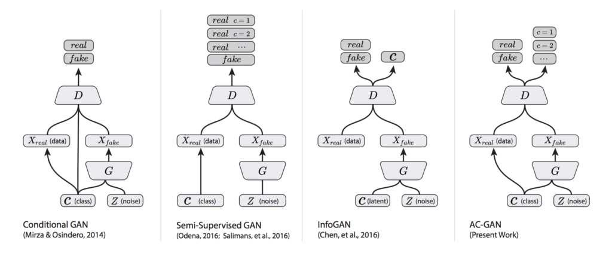

# Lab : Introduction to neural learning: gradient descent

#### Pre-reqs:
- Google Chrome (Recommended)

#### Lab Environment
Notebooks are ready to run. All packages have been installed. There is no requirement for any setup.

**Note:** Elev8ed Notebooks (powered by Jupyter) will be accessible at the port given to you by your instructor. Password for jupyterLab : `1234`

All Notebooks are present in `work/generative-adversarial-networks` folder. To copy and paste: use **Control-C** and to paste inside of a terminal, use **Control-V**

You can access jupyter lab at `<host-ip>:<port>/lab/workspaces/`


## How to Develop an Auxiliary Classifier GAN (AC-GAN)

Generative Adversarial Networks, or GANs, are an architecture for training generative models,
such as deep convolutional neural networks for generating images. The conditional generative
adversarial network, or cGAN for short, is a type of GAN that involves the conditional generation
of images by a generator model. Image generation can be conditional on a class label, if available,
allowing the targeted generated of images of a given type. The Auxiliary Classifier GAN, or
AC-GAN for short, is an extension of the conditional GAN that changes the discriminator to
predict the class label of a given image rather than receive it as input. It has the effect of
stabilizing the training process and allowing the generation of large high-quality images whilst
learning a representation in the latent space that is independent of the class label. In this
tutorial, you will discover how to develop an auxiliary classifier generative adversarial network
for generating photographs of clothing. After completing this tutorial, you will know:

- The auxiliary classifier GAN is a type of conditional GAN that requires that the discriminator predict the class label of a given image.
- How to develop generator, discriminator, and composite models for the AC-GAN.
- How to train, evaluate, and use an AC-GAN to generate photographs of clothing from the
Fashion-MNIST dataset.

Let’s get started.

## Tutorial Overview

This tutorial is divided into five parts; they are:

1. Auxiliary Classifier Generative Adversarial Networks
2. Fashion-MNIST Clothing Photograph Dataset
3. How to Define AC-GAN Models
4. How to Develop an AC-GAN for Fashion-MNIST
5. How to Generate Items of Clothing With a Fit AC-GAN


## Auxiliary Classifier Generative Adversarial Networks

The generative adversarial network is an architecture for training a generative model, typically
deep convolutional neural networks for generating image. The architecture is comprised of both
a generator model that takes random points from a latent space as input and generates images,
and a discriminator for classifying images as either real (from the dataset) or fake (generated).
Both models are then trained simultaneously in a zero-sum game. A conditional GAN, cGAN or
CGAN for short, is an extension of the GAN architecture that adds structure to the latent space
(see Chapter 17). The training of the GAN model is changed so that the generator is provided
both with a point in the latent space and a class label as input, and attempts to generate an
image for that class. The discriminator is provided with both an image and the class label and
must classify whether the image is real or fake as before.
The addition of the class as input makes the image generation process, and image classification
process, conditional on the class label, hence the name. The effect is both a more stable training
process and a resulting generator model that can be used to generate images of a given specific
type, e.g. for a class label. The Auxiliary Classifier GAN, or AC-GAN for short, is a further
extension of the GAN architecture building upon the CGAN extension. It was introduced by
Augustus Odena, et al. from Google Brain in the 2016 paper titled Conditional Image Synthesis
with Auxiliary Classifier GANs. As with the conditional GAN, the generator model in the
AC-GAN is provided both with a point in the latent space and the class label as input, e.g. the
image generation process is conditional.
The main difference is in the discriminator model, which is only provided with the image
as input, unlike the conditional GAN that is provided with the image and class label as input.
The discriminator model must then predict whether the given image is real or fake as before,
and must also predict the class label of the image.

... the model [...] is class conditional, but with an auxiliary decoder that is tasked
with reconstructing class labels.

— Conditional Image Synthesis With Auxiliary Classifier GANs, 2016.

The architecture is described in such a way that the discriminator and auxiliary classifier
may be considered separate models that share model weights. In practice, the discriminator
and auxiliary classifier can be implemented as a single neural network model with two outputs.
The first output is a single probability via the sigmoid activation function that indicates the
realness of the input image and is optimized using binary cross-entropy like a normal GAN
discriminator model. The second output is a probability of the image belonging to each class via
the softmax activation function, like any given multiclass classification neural network model,
and is optimized using categorical cross-entropy. To summarize:


- Generator Model:

– Input: Random point from the latent space, and the class label.
– Output: Generated image.

- Discriminator Model:

– Input: Image.

– Output: Probability that the provided image is real, probability of the image
belonging to each known class.

The plot below summarizes the inputs and outputs of a range of conditional GANs, including
the AC-GAN, providing some context for the differences.




The discriminator seeks to maximize the probability of correctly classifying real and fake
images (LS) and correctly predicting the class label (LC) of a real or fake image (e.g. LS + LC).
The generator seeks to minimize the ability of the discriminator to discriminate real and fake
images whilst also maximizing the ability of the discriminator predicting the class label of real
and fake images (e.g. LC − LS).

The objective function has two parts: the log-likelihood of the correct source, LS,
and the log-likelihood of the correct class, LC. [...] D is trained to maximize
LS + LC while G is trained to maximize LC − LS.

— Conditional Image Synthesis With Auxiliary Classifier GANs, 2016.

The resulting generator learns a latent space representation that is independent of the class
label, unlike the conditional GAN. The effect of changing the conditional GAN in this way is
both a more stable training process and the ability of the model to generate higher quality
images with a larger size than had been previously possible, e.g. 128 × 128 pixels.

... we demonstrate that adding more structure to the GAN latent space along
with a specialized cost function results in higher quality samples. [...] Importantly,
we demonstrate quantitatively that our high resolution samples are not just naive
resizings of low resolution samples.

— Conditional Image Synthesis With Auxiliary Classifier GANs, 2016.


## Fashion-MNIST Clothing Photograph Dataset

The Fashion-MNIST dataset is proposed as a more challenging replacement dataset for the
MNIST handwritten digit dataset. It is a dataset comprised of 60,000 small square 28 × 28
pixel grayscale images of items of 10 types of clothing, such as shoes, t-shirts, dresses, and more.
Keras provides access to the Fashion-MNIST dataset via the fashion mnist.load dataset()
function. It returns two tuples, one with the input and output elements for the standard training
dataset, and another with the input and output elements for the standard test dataset. The
loading and preparation of this dataset was described in Section 17.3.
We will use the images in the training dataset as the basis for training a Generative
Adversarial Network. Specifically, the generator model will learn how to generate new plausible
items of clothing, using a discriminator that will try to distinguish between real images from the
Fashion-MNIST training dataset and new images output by the generator model, and predict
the class label for each. This is a relatively simple problem that does not require a sophisticated
generator or discriminator model, although it does require the generation of a grayscale output
image.


## How to Define AC-GAN Models

In this section, we will develop the generator, discriminator, and composite models for the ACGAN. The appendix of the AC-GAN paper provides suggestions for generator and discriminator
configurations that we will use as inspiration. The table below summarizes these suggestions for
the CIFAR-10 dataset, taken from the paper.


## AC-GAN Discriminator Model

Let’s start with the discriminator model. The discriminator model must take as input an
image and predict both the probability of the realness of the image and the probability of the
image belonging to each of the given classes. The input images will have the shape 28 × 28 × 1
and there are 10 classes for the items of clothing in the Fashion-MNIST dataset. The model
can be defined as per the DCGAN architecture. That is, using Gaussian weight initialization,
BatchNormalization, LeakyReLU, Dropout, and a 2 × 2 stride for downsampling instead of
pooling layers. For example, below is the bulk of the discriminator model defined using the
Keras functional API.

```
...
# weight initialization
init = RandomNormal(stddev=0.02)
# image input
in_image = Input(shape=in_shape)
# downsample to 14x14
fe = Conv2D(32, (3,3), strides=(2,2), padding='same', kernel_initializer=init)(in_image)
fe = LeakyReLU(alpha=0.2)(fe)
fe = Dropout(0.5)(fe)
# normal
fe = Conv2D(64, (3,3), padding='same', kernel_initializer=init)(fe)
fe = BatchNormalization()(fe)
fe = LeakyReLU(alpha=0.2)(fe)
fe = Dropout(0.5)(fe)
# downsample to 7x7
fe = Conv2D(128, (3,3), strides=(2,2), padding='same', kernel_initializer=init)(fe)
fe = BatchNormalization()(fe)
fe = LeakyReLU(alpha=0.2)(fe)
fe = Dropout(0.5)(fe)
# normal
fe = Conv2D(256, (3,3), padding='same', kernel_initializer=init)(fe)
fe = BatchNormalization()(fe)
fe = LeakyReLU(alpha=0.2)(fe)
fe = Dropout(0.5)(fe)
# flatten feature maps
fe = Flatten()(fe)
...

```

The main difference is that the model has two output layers. The first is a single node with
the sigmoid activation for predicting the realness of the image.

```
...
# real/fake output
out1 = Dense(1, activation='sigmoid')(fe)

```

The second is multiple nodes, one for each class, using the softmax activation function to
predict the class label of the given image.

```
...
# class label output
out2 = Dense(n_classes, activation='softmax')(fe)

```

We can then construct the image with a single input and two outputs.

```
...
# define model
model = Model(in_image, [out1, out2])

```

The model must be trained with two loss functions, binary cross-entropy for the first output
layer, and categorical cross-entropy loss for the second output layer. Rather than comparing a
one hot encoding of the class labels to the second output layer, as we might do normally, we can
compare the integer class labels directly. We can achieve this automatically using the sparse
categorical cross-entropy loss function. This will have the identical effect of the categorical
cross-entropy but avoids the step of having to manually one hot encode the target labels. When
compiling the model, we can inform Keras to use the two different loss functions for the two
output layers by specifying a list of function names as strings; for example:

```
loss=['binary_crossentropy', 'sparse_categorical_crossentropy']

```

The model is fit using the Adam version of stochastic gradient descent with a small learning
rate and modest momentum, as is recommended for DCGANs.

```
...
# compile model
opt = Adam(lr=0.0002, beta_1=0.5)
model.compile(loss=['binary_crossentropy', 'sparse_categorical_crossentropy'],
optimizer=opt)

```

Tying this together, the define discriminator() function will define and compile the
discriminator model for the AC-GAN. The shape of the input images and the number of classes
are parameterized and set with defaults, allowing them to be easily changed for your own project
in the future.

```
# define the standalone discriminator model
def define_discriminator(in_shape=(28,28,1), n_classes=10):
# weight initialization
init = RandomNormal(stddev=0.02)
# image input
in_image = Input(shape=in_shape)
# downsample to 14x14
fe = Conv2D(32, (3,3), strides=(2,2), padding='same', kernel_initializer=init)(in_image)
fe = LeakyReLU(alpha=0.2)(fe)
fe = Dropout(0.5)(fe)
# normal
fe = Conv2D(64, (3,3), padding='same', kernel_initializer=init)(fe)
fe = BatchNormalization()(fe)
fe = LeakyReLU(alpha=0.2)(fe)
fe = Dropout(0.5)(fe)
# downsample to 7x7

fe = Conv2D(128, (3,3), strides=(2,2), padding='same', kernel_initializer=init)(fe)
fe = BatchNormalization()(fe)
fe = LeakyReLU(alpha=0.2)(fe)
fe = Dropout(0.5)(fe)
# normal
fe = Conv2D(256, (3,3), padding='same', kernel_initializer=init)(fe)
fe = BatchNormalization()(fe)
fe = LeakyReLU(alpha=0.2)(fe)
fe = Dropout(0.5)(fe)
# flatten feature maps
fe = Flatten()(fe)
# real/fake output
out1 = Dense(1, activation='sigmoid')(fe)
# class label output
out2 = Dense(n_classes, activation='softmax')(fe)
# define model
model = Model(in_image, [out1, out2])
# compile model
opt = Adam(lr=0.0002, beta_1=0.5)
model.compile(loss=['binary_crossentropy', 'sparse_categorical_crossentropy'],
optimizer=opt)
return model

```

We can define and summarize this model. The complete example is listed below.

```
# example of defining the discriminator model
from keras.models import Model
from keras.layers import Input
from keras.layers import Dense
from keras.layers import Conv2D
from keras.layers import LeakyReLU
from keras.layers import Dropout
from keras.layers import Flatten
from keras.layers import BatchNormalization
from keras.initializers import RandomNormal
from keras.optimizers import Adam
from keras.utils.vis_utils import plot_model
# define the standalone discriminator model
def define_discriminator(in_shape=(28,28,1), n_classes=10):
# weight initialization
init = RandomNormal(stddev=0.02)
# image input
in_image = Input(shape=in_shape)
# downsample to 14x14
fe = Conv2D(32, (3,3), strides=(2,2), padding='same', kernel_initializer=init)(in_image)
fe = LeakyReLU(alpha=0.2)(fe)
fe = Dropout(0.5)(fe)
# normal
fe = Conv2D(64, (3,3), padding='same', kernel_initializer=init)(fe)
fe = BatchNormalization()(fe)
fe = LeakyReLU(alpha=0.2)(fe)
fe = Dropout(0.5)(fe)
# downsample to 7x7
fe = Conv2D(128, (3,3), strides=(2,2), padding='same', kernel_initializer=init)(fe)

fe = BatchNormalization()(fe)
fe = LeakyReLU(alpha=0.2)(fe)
fe = Dropout(0.5)(fe)
# normal
fe = Conv2D(256, (3,3), padding='same', kernel_initializer=init)(fe)
fe = BatchNormalization()(fe)
fe = LeakyReLU(alpha=0.2)(fe)
fe = Dropout(0.5)(fe)
# flatten feature maps
fe = Flatten()(fe)
# real/fake output
out1 = Dense(1, activation='sigmoid')(fe)
# class label output
out2 = Dense(n_classes, activation='softmax')(fe)
# define model
model = Model(in_image, [out1, out2])
# compile model
opt = Adam(lr=0.0002, beta_1=0.5)
model.compile(loss=['binary_crossentropy', 'sparse_categorical_crossentropy'],
optimizer=opt)
return model
# define the discriminator model
model = define_discriminator()
# summarize the model
model.summary()
# plot the model
plot_model(model, to_file='discriminator_plot.png', show_shapes=True, show_layer_names=True)

```

##### Run Notebook
Click notebook `01_summarize_discriminator.ipynb` in jupterLab UI and run jupyter notebook.

The model summary was left out for brevity. A plot of the model is created, showing the
linear processing of the input image and the two clear output layers.

<h5><span style="color:red;">Note:</span></h5> Creating a plot of the model assumes that the pydot and graphviz libraries are
installed. If this is a problem, you can comment out the import statement and the function call
for plot model().


Now that we have defined our AC-GAN discriminator model, we can develop the generator
model.


## AC-GAN Generator Model

The generator model must take a random point from the latent space as input, and the class
label, then output a generated grayscale image with the shape 28 × 28 × 1. The AC-GAN paper
describes the AC-GAN generator model taking a vector input that is a concatenation of the
point in latent space (100 dimensions) and the one hot encoded class label (10 dimensions)
that is 110 dimensions. An alternative approach that has proven effective and is now generally
recommended is to interpret the class label as an additional channel or feature map early in the
generator model. This can be achieved by using a learned embedding with an arbitrary number
of dimensions (e.g. 50), the output of which can be interpreted by a fully connected layer with
a linear activation resulting in one additional 7 × 7 feature map.

```
...
# label input
in_label = Input(shape=(1,))
# embedding for categorical input
li = Embedding(n_classes, 50)(in_label)
# linear multiplication
n_nodes = 7 * 7
li = Dense(n_nodes, kernel_initializer=init)(li)
# reshape to additional channel
li = Reshape((7, 7, 1))(li)

```

The point in latent space can be interpreted by a fully connected layer with sufficient
activations to create multiple 7 × 7 feature maps, in this case, 384, and provide the basis for a
low-resolution version of our output image. The 7 × 7 single feature map interpretation of the
class label can then be channel-wise concatenated, resulting in 385 feature maps.

```
...
# image generator input
in_lat = Input(shape=(latent_dim,))
# foundation for 7x7 image
n_nodes = 384 * 7 * 7
gen = Dense(n_nodes, kernel_initializer=init)(in_lat)
gen = Activation('relu')(gen)
gen = Reshape((7, 7, 384))(gen)
# merge image gen and label input
merge = Concatenate()([gen, li])

```

These feature maps can then go through the process of two transpose convolutional layers to
upsample the 7 × 7 feature maps first to 14 × 14 pixels, and then finally to 28 × 28 features,
quadrupling the area of the feature maps with each upsampling step. The output of the generator
is a single feature map or grayscale image with the shape 28 × 28 and pixel values in the range [-1,
1] given the choice of a Tanh activation function. We use ReLU activation for the upsampling
layers instead of LeakyReLU given the suggestion in the AC-GAN paper.

```
# upsample to 14x14
gen = Conv2DTranspose(192, (5,5), strides=(2,2), padding='same',
kernel_initializer=init)(merge)
gen = BatchNormalization()(gen)
gen = Activation('relu')(gen)


# upsample to 28x28
gen = Conv2DTranspose(1, (5,5), strides=(2,2), padding='same', kernel_initializer=init)(gen)
out_layer = Activation('tanh')(gen)

```

We can tie all of this together and into the define generator() function defined below
that will create and return the generator model for the AC-GAN. The model is intentionally
not compiled as it is not trained directly; instead, it is trained via the discriminator model.

```
# define the standalone generator model
def define_generator(latent_dim, n_classes=10):
# weight initialization
init = RandomNormal(stddev=0.02)
# label input
in_label = Input(shape=(1,))
# embedding for categorical input
li = Embedding(n_classes, 50)(in_label)
# linear multiplication
n_nodes = 7 * 7
li = Dense(n_nodes, kernel_initializer=init)(li)
# reshape to additional channel
li = Reshape((7, 7, 1))(li)
# image generator input
in_lat = Input(shape=(latent_dim,))
# foundation for 7x7 image
n_nodes = 384 * 7 * 7
gen = Dense(n_nodes, kernel_initializer=init)(in_lat)
gen = Activation('relu')(gen)
gen = Reshape((7, 7, 384))(gen)
# merge image gen and label input
merge = Concatenate()([gen, li])
# upsample to 14x14
gen = Conv2DTranspose(192, (5,5), strides=(2,2), padding='same',
kernel_initializer=init)(merge)
gen = BatchNormalization()(gen)
gen = Activation('relu')(gen)
# upsample to 28x28
gen = Conv2DTranspose(1, (5,5), strides=(2,2), padding='same',
kernel_initializer=init)(gen)
out_layer = Activation('tanh')(gen)
# define model
model = Model([in_lat, in_label], out_layer)
return model

```

We can create this model and summarize and plot its structure. The complete example is
listed below.

```
# example of defining the generator model
from keras.models import Model
from keras.layers import Input
from keras.layers import Dense
from keras.layers import Reshape
from keras.layers import Conv2DTranspose
from keras.layers import Embedding


from
from
from
from
from


keras.layers import Concatenate
keras.layers import Activation
keras.layers import BatchNormalization
keras.initializers import RandomNormal
keras.utils.vis_utils import plot_model

# define the standalone generator model
def define_generator(latent_dim, n_classes=10):
# weight initialization
init = RandomNormal(stddev=0.02)
# label input
in_label = Input(shape=(1,))
# embedding for categorical input
li = Embedding(n_classes, 50)(in_label)
# linear multiplication
n_nodes = 7 * 7
li = Dense(n_nodes, kernel_initializer=init)(li)
# reshape to additional channel
li = Reshape((7, 7, 1))(li)
# image generator input
in_lat = Input(shape=(latent_dim,))
# foundation for 7x7 image
n_nodes = 384 * 7 * 7
gen = Dense(n_nodes, kernel_initializer=init)(in_lat)
gen = Activation('relu')(gen)
gen = Reshape((7, 7, 384))(gen)
# merge image gen and label input
merge = Concatenate()([gen, li])
# upsample to 14x14
gen = Conv2DTranspose(192, (5,5), strides=(2,2), padding='same',
kernel_initializer=init)(merge)
gen = BatchNormalization()(gen)
gen = Activation('relu')(gen)
# upsample to 28x28
gen = Conv2DTranspose(1, (5,5), strides=(2,2), padding='same',
kernel_initializer=init)(gen)
out_layer = Activation('tanh')(gen)
# define model
model = Model([in_lat, in_label], out_layer)
return model
# define the size of the latent space
latent_dim = 100
# define the generator model
model = define_generator(latent_dim)
# summarize the model
model.summary()
# plot the model
plot_model(model, to_file='generator_plot.png', show_shapes=True, show_layer_names=True)

```

##### Run Notebook
Click notebook `02_summarize_generator.ipynb` in jupterLab UI and run jupyter notebook.

The model summary was left out for brevity. A plot of the network is created summarizing
the input and output shapes for each layer. The plot confirms the two inputs to the network
and the correct concatenation of the inputs.


**Note:** 
Creating a plot of the model assumes that the pydot and graphviz libraries are
installed. If this is a problem, you can comment out the import statement and the function call
for plot model().


Now that we have defined the generator model, we can show how it might be fit.


## AC-GAN Composite Model

The generator model is not updated directly; instead, it is updated via the discriminator model.
This can be achieved by creating a composite model that stacks the generator model on top
of the discriminator model. The input to this composite model is the input to the generator
model, namely a random point from the latent space and a class label. The generator model
is connected directly to the discriminator model, which takes the generated image directly as

input. Finally, the discriminator model predicts both the realness of the generated image and
the class label. As such, the composite model is optimized using two loss functions, one for each
output of the discriminator model.
The discriminator model is updated in a standalone manner using real and fake examples,
and we will review how to do this in the next section. Therefore, we do not want to update
the discriminator model when updating (training) the composite model; we only want to use
this composite model to update the weights of the generator model. This can be achieved by
setting the layers of the discriminator as not trainable prior to compiling the composite model.
This only has an effect on the layer weights when viewed or used by the composite model and
prevents them from being updated when the composite model is updated. The define gan()
function below implements this, taking the already defined generator and discriminator models
as input and defining a new composite model that can be used to update the generator model
only.

```
# define the combined generator and discriminator model, for updating the generator
def define_gan(g_model, d_model):
# make weights in the discriminator not trainable
d_model.trainable = False
# connect the outputs of the generator to the inputs of the discriminator
gan_output = d_model(g_model.output)
# define gan model as taking noise and label and outputting real/fake and label outputs
model = Model(g_model.input, gan_output)
# compile model
opt = Adam(lr=0.0002, beta_1=0.5)
model.compile(loss=['binary_crossentropy', 'sparse_categorical_crossentropy'],
optimizer=opt)
return model

```

Now that we have defined the models used in the AC-GAN, we can fit them on the FashionMNIST dataset.


## How to Develop an AC-GAN for Fashion-MNIST

The first step is to load and prepare the Fashion-MNIST dataset. We only require the images
in the training dataset. The images are black and white, therefore we must add an additional
channel dimension to transform them to be three dimensional, as expected by the convolutional
layers of our models. Finally, the pixel values must be scaled to the range [-1,1] to match the
output of the generator model. The load real samples() function below implements this,
returning the loaded and scaled Fashion-MNIST training dataset ready for modeling.

```
# load images
def load_real_samples():
# load dataset
(trainX, trainy), (_, _) = load_data()
# expand to 3d, e.g. add channels
X = expand_dims(trainX, axis=-1)
# convert from ints to floats
X = X.astype('float32')
# scale from [0,255] to [-1,1]
X = (X - 127.5) / 127.5


print(X.shape, trainy.shape)
return [X, trainy]

```

We will require one batch (or a half batch) of real images from the dataset each update to
the GAN model. A simple way to achieve this is to select a random sample of images from the
dataset each time. The generate real samples() function below implements this, taking the
prepared dataset as an argument, selecting and returning a random sample of Fashion-MNIST
images and clothing class labels. The dataset argument provided to the function is a list
comprised of the images and class labels as returned from the load real samples() function.
The function also returns their corresponding class label for the discriminator, specifically
class = 1 indicating that they are real images.

```
# select real samples
def generate_real_samples(dataset, n_samples):
# split into images and labels
images, labels = dataset
# choose random instances
ix = randint(0, images.shape[0], n_samples)
# select images and labels
X, labels = images[ix], labels[ix]
# generate class labels
y = ones((n_samples, 1))
return [X, labels], y

```

Next, we need inputs for the generator model. These are random points from the latent
space, specifically Gaussian distributed random variables. The generate latent points()
function implements this, taking the size of the latent space as an argument and the number of
points required, and returning them as a batch of input samples for the generator model. The
function also returns randomly selected integers in [0,9] inclusively for the 10 class labels in the
Fashion-MNIST dataset.

```
# generate points in latent space as input for the generator
def generate_latent_points(latent_dim, n_samples, n_classes=10):
# generate points in the latent space
x_input = randn(latent_dim * n_samples)
# reshape into a batch of inputs for the network
z_input = x_input.reshape(n_samples, latent_dim)
# generate labels
labels = randint(0, n_classes, n_samples)
return [z_input, labels]

```

Next, we need to use the points in the latent space and clothing class labels as input
to the generator in order to generate new images. The generate fake samples() function
below implements this, taking the generator model and size of the latent space as arguments,
then generating points in the latent space and using them as input to the generator model.
The function returns the generated images, their corresponding clothing class label, and their
discriminator class label, specifically class = 0 to indicate they are fake or generated.

```
# use the generator to generate n fake examples, with class labels

def generate_fake_samples(generator, latent_dim, n_samples):
# generate points in latent space
z_input, labels_input = generate_latent_points(latent_dim, n_samples)
# predict outputs
images = generator.predict([z_input, labels_input])
# create class labels
y = zeros((n_samples, 1))
return [images, labels_input], y

```

There are no agreed-upon ways to determine when to stop training a GAN; instead, images
can be subjectively inspected in order to choose a final model. Therefore, we can periodically
generate a sample of images using the generator model and save the generator model to file
for later use. The summarize performance() function below implements this, generating 100
images, plotting them, and saving the plot and the generator to file with a filename that includes
the training step number.

```
# generate samples and save as a plot and save the model
def summarize_performance(step, g_model, latent_dim, n_samples=100):
# prepare fake examples
[X, _], _ = generate_fake_samples(g_model, latent_dim, n_samples)
# scale from [-1,1] to [0,1]
X = (X + 1) / 2.0
# plot images
for i in range(100):
# define subplot
pyplot.subplot(10, 10, 1 + i)
# turn off axis
pyplot.axis('off')
# plot raw pixel data
pyplot.imshow(X[i, :, :, 0], cmap='gray_r')
# save plot to file
filename1 = 'generated_plot_%04d.png' % (step+1)
pyplot.savefig(filename1)
pyplot.close()
# save the generator model
filename2 = 'model_%04d.h5' % (step+1)
g_model.save(filename2)
print('>Saved: %s and %s' % (filename1, filename2))

```


We are now ready to fit the GAN models. The model is fit for 100 training epochs, which is
arbitrary, as the model begins generating plausible items of clothing after perhaps 20 epochs. A
batch size of 64 samples is used, and each training epoch involves 60000
, or about 937, batches
64
of real and fake samples and updates to the model. The summarize performance() function
is called every 10 epochs, or every (937 × 10) 9,370 training steps. For a given training step,
first the discriminator model is updated for a half batch of real samples, then a half batch of
fake samples, together forming one batch of weight updates. The generator is then updated via
the combined GAN model. Importantly, the class label is set to 1, or real, for the fake samples.
This has the effect of updating the generator toward getting better at generating real samples
on the next batch.


The discriminator and composite model return three loss values from the call to the
train on batch() function. The first value is the sum of the loss values and can be ignored, whereas the second value is the loss for the real/fake output layer and the third value is
the loss for the clothing label classification. The train() function below implements this, taking
the defined models, dataset, and size of the latent dimension as arguments and parameterizing
the number of epochs and batch size with default arguments. The generator model is saved at
the end of training.

```
# train the generator and discriminator
def train(g_model, d_model, gan_model, dataset, latent_dim, n_epochs=100, n_batch=64):
# calculate the number of batches per training epoch
bat_per_epo = int(dataset[0].shape[0] / n_batch)
# calculate the number of training iterations
n_steps = bat_per_epo * n_epochs
# calculate the size of half a batch of samples
half_batch = int(n_batch / 2)
# manually enumerate epochs
for i in range(n_steps):
# get randomly selected 'real' samples
[X_real, labels_real], y_real = generate_real_samples(dataset, half_batch)
# update discriminator model weights
_,d_r1,d_r2 = d_model.train_on_batch(X_real, [y_real, labels_real])
# generate 'fake' examples
[X_fake, labels_fake], y_fake = generate_fake_samples(g_model, latent_dim, half_batch)
# update discriminator model weights
_,d_f,d_f2 = d_model.train_on_batch(X_fake, [y_fake, labels_fake])
# prepare points in latent space as input for the generator
[z_input, z_labels] = generate_latent_points(latent_dim, n_batch)
# create inverted labels for the fake samples
y_gan = ones((n_batch, 1))
# update the generator via the discriminator's error
_,g_1,g_2 = gan_model.train_on_batch([z_input, z_labels], [y_gan, z_labels])
# summarize loss on this batch
print('>%d, dr[%.3f,%.3f], df[%.3f,%.3f], g[%.3f,%.3f]' % (i+1, d_r1,d_r2, d_f,d_f2,
g_1,g_2))
# evaluate the model performance every 'epoch'
if (i+1) % (bat_per_epo * 10) == 0:
summarize_performance(i, g_model, latent_dim)

```

We can then define the size of the latent space, define all three models, and train them on
the loaded Fashion-MNIST dataset.

```
...
# size of the latent space
latent_dim = 100
# create the discriminator
discriminator = define_discriminator()
# create the generator
generator = define_generator(latent_dim)
# create the gan
gan_model = define_gan(generator, discriminator)
# load image data
dataset = load_real_samples()
# train model

train(generator, discriminator, gan_model, dataset, latent_dim)

```

Tying all of this together, the complete example is listed below.

```
# example of fitting an auxiliary classifier gan (ac-gan) on fashion mnsit
from numpy import zeros
from numpy import ones
from numpy import expand_dims
from numpy.random import randn
from numpy.random import randint
from keras.datasets.fashion_mnist import load_data
from keras.optimizers import Adam
from keras.models import Model
from keras.layers import Input
from keras.layers import Dense
from keras.layers import Reshape
from keras.layers import Flatten
from keras.layers import Conv2D
from keras.layers import Conv2DTranspose
from keras.layers import LeakyReLU
from keras.layers import BatchNormalization
from keras.layers import Dropout
from keras.layers import Embedding
from keras.layers import Activation
from keras.layers import Concatenate
from keras.initializers import RandomNormal
from matplotlib import pyplot
# define the standalone discriminator model
def define_discriminator(in_shape=(28,28,1), n_classes=10):
# weight initialization
init = RandomNormal(stddev=0.02)
# image input
in_image = Input(shape=in_shape)
# downsample to 14x14
fe = Conv2D(32, (3,3), strides=(2,2), padding='same', kernel_initializer=init)(in_image)
fe = LeakyReLU(alpha=0.2)(fe)
fe = Dropout(0.5)(fe)
# normal
fe = Conv2D(64, (3,3), padding='same', kernel_initializer=init)(fe)
fe = BatchNormalization()(fe)
fe = LeakyReLU(alpha=0.2)(fe)
fe = Dropout(0.5)(fe)
# downsample to 7x7
fe = Conv2D(128, (3,3), strides=(2,2), padding='same', kernel_initializer=init)(fe)
fe = BatchNormalization()(fe)
fe = LeakyReLU(alpha=0.2)(fe)
fe = Dropout(0.5)(fe)
# normal
fe = Conv2D(256, (3,3), padding='same', kernel_initializer=init)(fe)
fe = BatchNormalization()(fe)
fe = LeakyReLU(alpha=0.2)(fe)
fe = Dropout(0.5)(fe)
# flatten feature maps
fe = Flatten()(fe)


# real/fake output
out1 = Dense(1, activation='sigmoid')(fe)
# class label output
out2 = Dense(n_classes, activation='softmax')(fe)
# define model
model = Model(in_image, [out1, out2])
# compile model
opt = Adam(lr=0.0002, beta_1=0.5)
model.compile(loss=['binary_crossentropy', 'sparse_categorical_crossentropy'],
optimizer=opt)
return model
# define the standalone generator model
def define_generator(latent_dim, n_classes=10):
# weight initialization
init = RandomNormal(stddev=0.02)
# label input
in_label = Input(shape=(1,))
# embedding for categorical input
li = Embedding(n_classes, 50)(in_label)
# linear multiplication
n_nodes = 7 * 7
li = Dense(n_nodes, kernel_initializer=init)(li)
# reshape to additional channel
li = Reshape((7, 7, 1))(li)
# image generator input
in_lat = Input(shape=(latent_dim,))
# foundation for 7x7 image
n_nodes = 384 * 7 * 7
gen = Dense(n_nodes, kernel_initializer=init)(in_lat)
gen = Activation('relu')(gen)
gen = Reshape((7, 7, 384))(gen)
# merge image gen and label input
merge = Concatenate()([gen, li])
# upsample to 14x14
gen = Conv2DTranspose(192, (5,5), strides=(2,2), padding='same',
kernel_initializer=init)(merge)
gen = BatchNormalization()(gen)
gen = Activation('relu')(gen)
# upsample to 28x28
gen = Conv2DTranspose(1, (5,5), strides=(2,2), padding='same',
kernel_initializer=init)(gen)
out_layer = Activation('tanh')(gen)
# define model
model = Model([in_lat, in_label], out_layer)
return model
# define the combined generator and discriminator model, for updating the generator
def define_gan(g_model, d_model):
# make weights in the discriminator not trainable
d_model.trainable = False
# connect the outputs of the generator to the inputs of the discriminator
gan_output = d_model(g_model.output)
# define gan model as taking noise and label and outputting real/fake and label outputs
model = Model(g_model.input, gan_output)
# compile model


opt = Adam(lr=0.0002, beta_1=0.5)
model.compile(loss=['binary_crossentropy', 'sparse_categorical_crossentropy'],
optimizer=opt)
return model
# load images
def load_real_samples():
# load dataset
(trainX, trainy), (_, _) = load_data()
# expand to 3d, e.g. add channels
X = expand_dims(trainX, axis=-1)
# convert from ints to floats
X = X.astype('float32')
# scale from [0,255] to [-1,1]
X = (X - 127.5) / 127.5
print(X.shape, trainy.shape)
return [X, trainy]
# select real samples
def generate_real_samples(dataset, n_samples):
# split into images and labels
images, labels = dataset
# choose random instances
ix = randint(0, images.shape[0], n_samples)
# select images and labels
X, labels = images[ix], labels[ix]
# generate class labels
y = ones((n_samples, 1))
return [X, labels], y
# generate points in latent space as input for the generator
def generate_latent_points(latent_dim, n_samples, n_classes=10):
# generate points in the latent space
x_input = randn(latent_dim * n_samples)
# reshape into a batch of inputs for the network
z_input = x_input.reshape(n_samples, latent_dim)
# generate labels
labels = randint(0, n_classes, n_samples)
return [z_input, labels]
# use the generator to generate n fake examples, with class labels
def generate_fake_samples(generator, latent_dim, n_samples):
# generate points in latent space
z_input, labels_input = generate_latent_points(latent_dim, n_samples)
# predict outputs
images = generator.predict([z_input, labels_input])
# create class labels
y = zeros((n_samples, 1))
return [images, labels_input], y
# generate samples and save as a plot and save the model
def summarize_performance(step, g_model, latent_dim, n_samples=100):
# prepare fake examples
[X, _], _ = generate_fake_samples(g_model, latent_dim, n_samples)
# scale from [-1,1] to [0,1]
X = (X + 1) / 2.0


# plot images
for i in range(100):
# define subplot
pyplot.subplot(10, 10, 1 + i)
# turn off axis
pyplot.axis('off')
# plot raw pixel data
pyplot.imshow(X[i, :, :, 0], cmap='gray_r')
# save plot to file
filename1 = 'generated_plot_%04d.png' % (step+1)
pyplot.savefig(filename1)
pyplot.close()
# save the generator model
filename2 = 'model_%04d.h5' % (step+1)
g_model.save(filename2)
print('>Saved: %s and %s' % (filename1, filename2))
# train the generator and discriminator
def train(g_model, d_model, gan_model, dataset, latent_dim, n_epochs=100, n_batch=64):
# calculate the number of batches per training epoch
bat_per_epo = int(dataset[0].shape[0] / n_batch)
# calculate the number of training iterations
n_steps = bat_per_epo * n_epochs
# calculate the size of half a batch of samples
half_batch = int(n_batch / 2)
# manually enumerate epochs
for i in range(n_steps):
# get randomly selected 'real' samples
[X_real, labels_real], y_real = generate_real_samples(dataset, half_batch)
# update discriminator model weights
_,d_r1,d_r2 = d_model.train_on_batch(X_real, [y_real, labels_real])
# generate 'fake' examples
[X_fake, labels_fake], y_fake = generate_fake_samples(g_model, latent_dim, half_batch)
# update discriminator model weights
_,d_f,d_f2 = d_model.train_on_batch(X_fake, [y_fake, labels_fake])
# prepare points in latent space as input for the generator
[z_input, z_labels] = generate_latent_points(latent_dim, n_batch)
# create inverted labels for the fake samples
y_gan = ones((n_batch, 1))
# update the generator via the discriminator's error
_,g_1,g_2 = gan_model.train_on_batch([z_input, z_labels], [y_gan, z_labels])
# summarize loss on this batch
print('>%d, dr[%.3f,%.3f], df[%.3f,%.3f], g[%.3f,%.3f]' % (i+1, d_r1,d_r2, d_f,d_f2,
g_1,g_2))
# evaluate the model performance every 'epoch'
if (i+1) % (bat_per_epo * 10) == 0:
summarize_performance(i, g_model, latent_dim)
# size of the latent space
latent_dim = 100
# create the discriminator
discriminator = define_discriminator()
# create the generator
generator = define_generator(latent_dim)
# create the gan
gan_model = define_gan(generator, discriminator)


# load image data
dataset = load_real_samples()
# train model
train(generator, discriminator, gan_model, dataset, latent_dim)

```

##### Run Notebook
Click notebook `03_train_acgan.ipynb` in jupterLab UI and run jupyter notebook.

**Note**: Running the example may take many hours to run on CPU hardware. I recommend
running the example on GPU hardware if possible. If you need help, you can get started
quickly by using an AWS EC2 instance to train the model.

The loss is reported each training iteration, including the real/fake and class loss for the
discriminator on real examples (dr), the discriminator on fake examples (df ), and the generator
updated via the composite model when generating images (g).

<h5><span style="color:red;">Note:</span></h5> Your specific results may vary given the stochastic nature of the learning algorithm.
Consider running the example a few times and compare the average performance.

```
>1,
>2,
>3,
>4,
>5,
...

dr[0.934,2.967],
dr[0.711,2.836],
dr[0.649,2.980],
dr[0.732,3.435],
dr[0.860,3.076],

df[1.310,3.006],
df[0.939,3.262],
df[1.001,3.147],
df[0.823,3.715],
df[0.591,2.799],

g[0.878,3.368]
g[0.947,2.751]
g[0.844,3.226]
g[1.048,3.292]
g[1.123,3.313]

```


A total of 10 sample images are generated and 10 models saved over the run. Plots of
generated clothing after 10 iterations already look plausible.


The images remain reliable throughout the training process.


## How to Generate Items of Clothing With the ACGAN

In this section, we can load a saved model and use it to generate new items of clothing that
plausibly could have come from the Fashion-MNIST dataset. The AC-GAN technically does
not conditionally generate images based on the class label, at least not in the same way as the
conditional GAN.

AC-GANs learn a representation for z that is independent of class label.

— Conditional Image Synthesis With Auxiliary Classifier GANs, 2016.

Nevertheless, if used in this way, the generated images mostly match the class label. The
example below loads the model from the end of the run (any saved model would do), and
generates 100 examples of class 7 (sneaker).

```
# example of loading the generator model and generating images
from math import sqrt
from numpy import asarray
from numpy.random import randn


from keras.models import load_model
from matplotlib import pyplot
# generate points in latent space as input for the generator
def generate_latent_points(latent_dim, n_samples, n_class):
# generate points in the latent space
x_input = randn(latent_dim * n_samples)
# reshape into a batch of inputs for the network
z_input = x_input.reshape(n_samples, latent_dim)
# generate labels
labels = asarray([n_class for _ in range(n_samples)])
return [z_input, labels]
# create and save a plot of generated images
def save_plot(examples, n_examples):
# plot images
for i in range(n_examples):
# define subplot
pyplot.subplot(sqrt(n_examples), sqrt(n_examples), 1 + i)
# turn off axis
pyplot.axis('off')
# plot raw pixel data
pyplot.imshow(examples[i, :, :, 0], cmap='gray_r')
pyplot.show()
# load model
model = load_model('model_93700.h5')
latent_dim = 100
n_examples = 100 # must be a square
n_class = 7 # sneaker
# generate images
latent_points, labels = generate_latent_points(latent_dim, n_examples, n_class)
# generate images
X = model.predict([latent_points, labels])
# scale from [-1,1] to [0,1]
X = (X + 1) / 2.0
# plot the result
save_plot(X, n_examples)

```

##### Run Notebook
Click notebook `04_inference_acgan.ipynb` in jupterLab UI and run jupyter notebook.

Running the example, in this case, generates 100 very plausible photos of sneakers.


It may be fun to experiment with other class values. For example, below are 100 generated
coats (n class=4). Most of the images are coats, although there are a few pants in there,
showing that the latent space is partially, but not completely, class-conditional.


## Extensions

This section lists some ideas for extending the tutorial that you may wish to explore.

- Generate Images. Generate images for each clothing class and compare results across
different saved models (e.g. epoch 10, 20, etc.).
- Alternate Configuration. Update the configuration of the generator, discriminator, or
both models to have more or less capacity and compare results.
- CIFAR-10 Dataset. Update the example to train on the CIFAR-10 dataset and use
model configuration described in the appendix of the paper.

If you explore any of these extensions, I’d love to know.


## Further Reading

This section provides more resources on the topic if you are looking to go deeper.


## Papers

- Conditional Image Synthesis With Auxiliary Classifier GANs, 2016.
https://arxiv.org/abs/1610.09585
- Conditional Image Synthesis With Auxiliary Classifier GANs, Reviewer Comments.
https://openreview.net/forum?id=rJXTf9Bxg
- Conditional Image Synthesis with Auxiliary Classifier GANs, NIPS 2016, YouTube.
https://www.youtube.com/watch?v=myP2TN0_MaE


## API

- Keras Datasets API..
https://keras.io/datasets/
- Keras Sequential Model API.
https://keras.io/models/sequential/
- Keras Convolutional Layers API.
https://keras.io/layers/convolutional/
- How can I “freeze” Keras layers?.
https://keras.io/getting-started/faq/#how-can-i-freeze-keras-layers
- MatplotLib API.
https://matplotlib.org/api/
- NumPy Random sampling (numpy.random) API.
https://docs.scipy.org/doc/numpy/reference/routines.random.html
- NumPy Array manipulation routines.
https://docs.scipy.org/doc/numpy/reference/routines.array-manipulation.html


## Articles

- How to Train a GAN? Tips and tricks to make GANs work.
https://github.com/soumith/ganhacks
- Fashion-MNIST Project, GitHub.
https://github.com/zalandoresearch/fashion-mnist


## Summary

In this tutorial, you discovered how to develop an auxiliary classifier generative adversarial
network for generating photographs of clothing. Specifically, you learned:

- The auxiliary classifier GAN is a type of conditional GAN that requires that the discriminator predict the class label of a given image.
- How to develop generator, discriminator, and composite models for the AC-GAN.
- How to train, evaluate, and use an AC-GAN to generate photographs of clothing from the
Fashion-MNIST dataset.


## Next

In the next tutorial, you will discover the semi-supervised GAN that trains a classifier in concert with the GAN model that can achieve good results on very limited training data.
